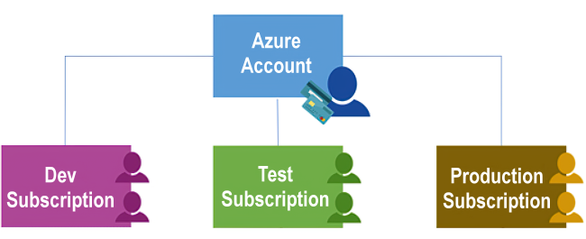
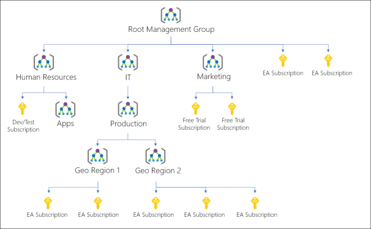

As Tailwind Traders gets started with Azure, one of your first steps will be to create at least one **Azure Subscription**, which you will use to create your cloud-based resources in Azure.

> [!NOTE]
>
> An Azure *resource* is a manageable item that is available through Azure. Virtual machines, storage accounts, web apps, databases, and virtual networks are all examples of resources.

## Azure Subscriptions

Using Azure requires an Azure subscription which provides you with authenticated and authorized access to Azure products and services and allows you to provision resources. An Azure subscription is a logical unit of Azure services that links to an Azure account, which is an identity in Azure Active Directory (Azure AD) or in a directory that an Azure AD trusts.

An account can have one subscription or multiple subscriptions that have different billing models and to which you apply different access-management policies. You can use Azure subscriptions to define boundaries around Azure products, services, and resources. There are two types of subscription boundaries that you can use, including:

- **Billing boundary**. This subscription type determines how an Azure account is billed for using Azure. You can create multiple subscriptions for different types of billing requirements, and Azure will generate separate billing reports and invoices for each subscription so that you can organize and manage costs.

- **Access control boundary**. Azure will apply access-management policies at the subscription level, and you can create separate subscriptions to reflect different organizational structures. An example is that within a business, you have different departments to which you apply distinct Azure subscription policies. This allows you to manage and control access to the resources that users provision with specific subscriptions.

### Create additional Azure subscriptions

You might want to create additional subscriptions for resource or billing management purposes. For example, you might choose to create additional subscriptions to separate:

- **Environments:** When managing your resources, you can choose to create subscriptions to set up separate environments for development and testing, security, or to isolate data for compliance reasons. This is particularly useful because resource access control occurs at the subscription level.

- **Organizational structures:** You can create subscriptions to reflect different organizational structures. For example, you could limit a team to lower-cost resources, while allowing the IT department a full range. This design allows you to manage and control access to the resources that users provision within each subscription.

- **Billing:** You might want to also create additional subscriptions for billing purposes. Because costs are first aggregated at the subscription level, you might want to create subscriptions to manage and track costs based on your needs. For instance, you might want to create a subscription for your production workloads and another subscription for your development and testing workloads.

You might also need additional subscriptions due to:

- **Subscription limits:** Subscriptions are bound to some hard limitations. For example, the maximum number of Express Route circuits per subscription is 10. Those limits should be considered as you create subscriptions on your account. If there is a need to go over those limits in particular scenarios, then you might need additional subscriptions.

### Customize billing to meet your needs

If you have multiple subscriptions, you can organize them into invoice sections. Each invoice section is a line item on the invoice that shows the charges incurred that month. For example, you might need a single invoice for your organization but want to organize charges by department, team, or project.

Depending on your needs, you can set up multiple invoices within the same billing account. To do this, create additional billing profiles. Each billing profile has its own monthly invoice and payment method.

The following diagram shows an overview of how billing is structured. If you've previously signed up for Azure or if your organization has an Enterprise Agreement, your billing might be set up differently.

## Azure Management Groups

If your organization has many subscriptions, you may need a way to efficiently manage access, policies, and compliance for those subscriptions. Azure management groups provide a level of scope above subscriptions. You organize subscriptions into containers called "management groups" and apply your governance conditions to the management groups. All subscriptions within a management group automatically inherit the conditions applied to the management group. Management groups give you enterprise-grade management at a large scale no matter what type of subscriptions you might have. All subscriptions within a single management group must trust the same Azure Active Directory tenant.

For example, you can apply policies to a management group that limits the regions available for virtual machine (VM) creation. This policy would be applied to all management groups, subscriptions, and resources under that management group by only allowing VMs to be created in that region.

### Hierarchy of management groups and subscriptions

You can build a flexible structure of management groups and subscriptions to organize your resources into a hierarchy for unified policy and access management. The following diagram shows an example of creating a hierarchy for governance using management groups.

You can create a hierarchy that applies a policy, for example, which limits VM locations to the US West Region in the group called "Production". This policy will inherit onto all the Enterprise Agreement (EA) subscriptions that are descendants of that management group and will apply to all VMs under those subscriptions. This security policy cannot be altered by the resource or subscription owner allowing for improved governance.

Another scenario where you would use management groups is to provide user access to multiple subscriptions. By moving multiple subscriptions under that management group, you can create one role-based access control (RBAC) assignment on the management group, which will inherit that access to all the subscriptions. One assignment on the management group can enable users to have access to everything they need instead of scripting RBAC over different subscriptions.

### Important facts about management groups

- 10,000 management groups can be supported in a single directory.

- A management group tree can support up to six levels of depth. (This limit doesn't include the Root level or the subscription level.)

- Each management group and subscription can only support one parent.

- Each management group can have many children.

- All subscriptions and management groups are within a single hierarchy in each directory.
