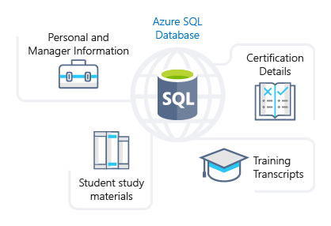

:::row:::
  :::column span="3":::
Azure SQL Database is a relational database that is based on the latest stable version of the Microsoft SQL Server database engine. SQL Database is a high-performance, reliable, fully managed and secure database. You can use it to build data-driven applications and websites in the programming language of your choice without needing to manage infrastructure.
  :::column-end:::
  :::column:::
    :::image type="icon" source="../media/azure-sql-db.png" border="false":::
  :::column-end:::
:::row-end:::

## SQL Features

Azure SQL Database is a fully managed platform as a service (PaaS) database engine that handles most of the database management functions such as upgrading, patching, backups, and monitoring without user involvement. Azure SQL Database is always running on the latest stable version of the SQL Server database engine and patched OS with 99.99% availability. PaaS capabilities that are built into Azure SQL Database enable you to focus on the domain-specific database administration and optimization activities that are critical for your business. SQL Database is a fully managed service that has built-in high availability, backups, and other common maintenance operations. Microsoft handles all patching and updating of the SQL and operating system code; you don't have to manage the underlying infrastructure.

With Azure SQL Database, you can create a highly available and high-performance data storage layer for the applications and solutions in Azure. SQL Database can be the right choice for a variety of modern cloud applications because it enables you to process both relational data and non-relational structures, such as graphs, JSON, spatial, and XML.

Since Azure SQL Database is based on the latest stable version of the Microsoft SQL Server database engine, you can use advanced query processing features, such as high-performance in-memory technologies and intelligent query processing. In fact, the newest capabilities of SQL Server are released first to SQL Database, and then to SQL Server itself. You get the newest SQL Server capabilities with no overhead for patching or upgrading, tested across millions of databases.

## SQL Migration

Tailwind Traders currently utilizes several on-premises SQL servers, which provide data storage for your public-facing website (e.g. customer data, order history, product catalogs, etc.). In addition, your on-premises SQL servers also provide data storage for your internal-only training portal website (e.g. study materials, certification details, training transcripts, etc.) The following illustration shows the types of data that your company might store in the Azure SQL database training portal website.

You can migrate your existing SQL Server databases with minimal downtime using the Azure Database Migration Service. The service uses the Microsoft Data Migration Assistant to generate assessment reports that provide recommendations to help guide you through required changes prior to performing a migration. Once you assess and perform any remediation required, you're ready to begin the migration process. The Azure Database Migration Service performs all of the required steps. You just change the connection string in your apps.
