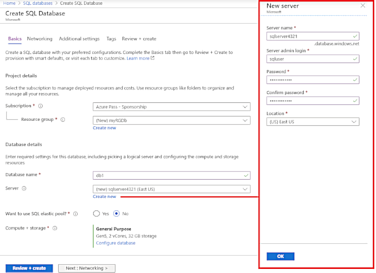
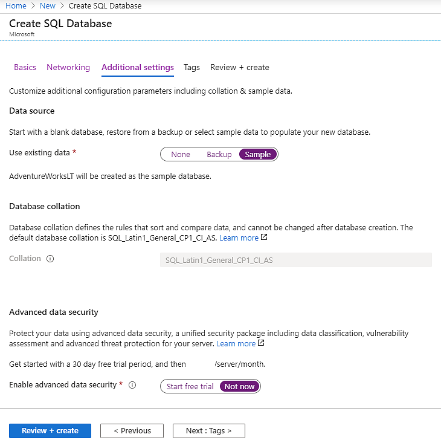
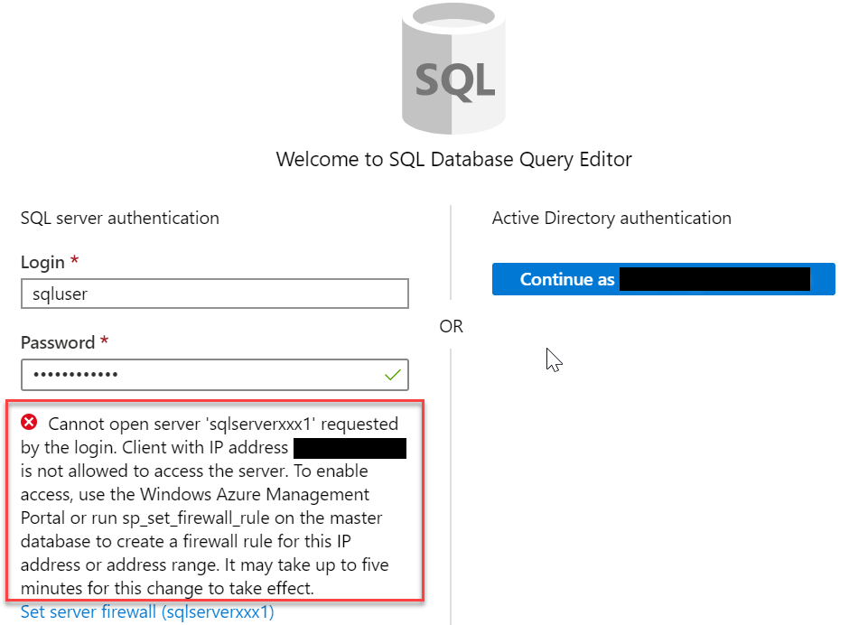
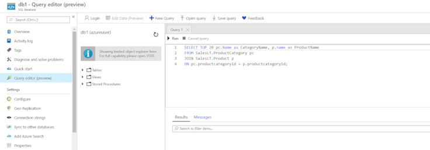

Tailwind Traders has chosen Azure SQL Database for part of their migration. You have been tasked with creating the database.

In this exercise, you'll create a SQL database in Azure and then query the data in that database.

## Task 1: Create the database

In this task, we will create a SQL database based on the _AdventureWorksLT_ sample database. 

1. Sign in to the [Azure portal (https://portal.azure.com)](https://portal.azure.com?azure-portal=true).

1. Click **Create a resource**, then click **Databases**, and then select **SQL database**. 

1. On the **Basics** tab, fill in this information.  

    | Setting | Value | 
    | --- | --- |
    | Subscription | Choose **Concierge Subscription** |
    | Resource group | Choose **<rgn>[sandbox resource group name]</rgn>** |
    | Database name| **db1** | 

1. For the **Server**, click **Create new**.

    1. Enter the following information (replace **nnnn** in the name of the storage account with letters and digits such that the name is globally unique).

        | Setting | Value | 
        | --- | --- |
        | Server name | **sqlservernnnn** (must be unique) | 
        | Server admin login | **sqluser** |
        | Password | **Pa$$w0rd1234** |
        | Location | **(US) East US** |

        [](../media/server-pane.png#lightbox)

    1. Click **OK** when you have finished.

1. Select the **Networking** tab, and configure the following settings (leave others with their defaults).

    | Setting | Value | 
    | --- | --- |
    | Connectivity method | **Public endpoint** |    
    | Allow Azure services and resources to access this server | **Yes** |
    | Add current client IP address | **No** |
    
    

1. Select the **Additional settings** tab, and configure the following settings.

    | Setting | Value | 
    | --- | --- |
    | Use existing data | **Sample** (this will create the _AdventureWorksLT_ sample database) |
    | Collation | ***use default*** |
    | Enable advanced data security | **Not now** |

    

1. Click **Review + create** and then click **Create** to deploy the server and database.

It can take approximately 2 to 5 minutes to create the server and deploy the sample database.

## Task 2: Test the database.

In this task, we will configure the SQL server and run a SQL query. 

1. From the **All services** pane, search and select **SQL databases** and ensure your new database was created. You may need to **Refresh** the page.

    [](../media/sql-database.png#lightbox)

1. Click the **db1** entry representing the SQL database you created, and then click **Query editor (preview)**.

1. Login as **sqluser** with the password **Pa$$w0rd1234**.

1. You will not be able to login. Read the error closely and make note of the IP address that needs to be allowed through the firewall. 

    

1. Click **Overview**, and then click **Set server firewall**.

1. Click **Add client IP** to add the IP address referenced in the error, then click **Save**. 

    [](../media/sql-server-firewall-settings.png#lightbox)

1. Return to your SQL database and the Query Editor (Preview) login page. Try to login again as **sqluser** with the password **Pa$$w0rd1234**. This time you should succeed. It may take a couple of minutes for the new firewall rule to be deployed. 

1. Once you log in successfully the query pane appears, enter the following query into the editor pane.

    ```SQL
    SELECT TOP 20 pc.Name as CategoryName, p.name as ProductName
    FROM SalesLT.ProductCategory pc
    JOIN SalesLT.Product p
    ON pc.productcategoryid = p.productcategoryid;
    ```

    

1. Click **Run**, and then review the query results in the **Results** pane. The query should run successfully.

    [](../media/database-query-editor-pane.png#lightbox)

Congratulations! You've created a SQL database in Azure and successfully queried the data in that database.
