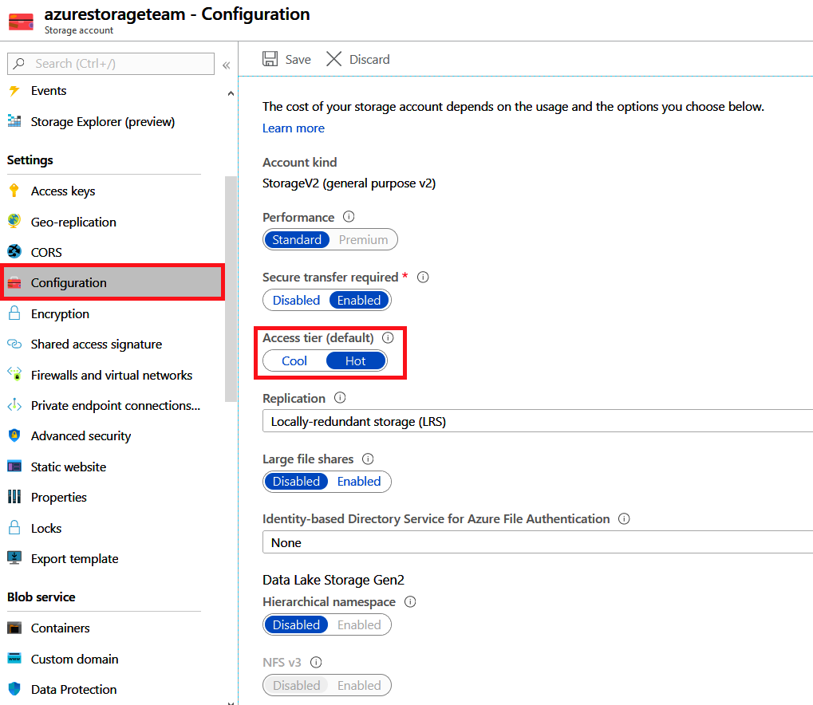

:::row:::
  :::column span="3":::
Data stored in the cloud can grow at an exponential pace. To manage costs for your expanding storage needs, it's helpful to organize your data based on attributes like frequency-of-access and planned retention period to optimize costs. Data stored in the cloud can be different based on how it's generated, processed, and accessed over its lifetime. Some data is actively accessed and modified throughout its lifetime. Some data is accessed frequently early in its lifetime, with access dropping drastically as the data ages. Some data remains idle in the cloud and is rarely, if ever, accessed after it's stored. To accommodate these different access needs, Azure provides several _access tiers_, which you can use to balance your storage costs with your access needs.
  :::column-end:::
  :::column:::
    :::image type="icon" source="../media/icon-storage-tiers.png" border="false":::
  :::column-end:::
:::row-end:::

Azure storage offers different access tiers for your blob and file storage, which allow you to store object data in the most cost-effective manner. The available access tiers include:

- *Hot storage tier*: optimized for storing data that is accessed frequently. (For example: images for your website.)

- *Cool storage tier*: optimized for data that is infrequently accessed and stored for at least 30 days. (For example: invoices for your customers.)

- *Archive storage tier*: for data that is rarely accessed and stored for at least 180 days with flexible latency requirements. (For example: long-term backups.)

The following considerations apply to the different access tiers:

- Only the hot and cool access tiers can be set at the account level. The archive access tier isn't available at the account level.

- Hot, cool, and archive tiers can be set at the blob level during upload or after upload.

- Data in the cool access tier can tolerate slightly lower availability, but still requires high durability, retrieval latency, and throughput characteristics similar to hot data. For cool data, a slightly lower availability service-level agreement (SLA) and higher access costs compared to hot data are acceptable trade-offs for lower storage costs.

- Archive storage stores data offline and offers the lowest storage costs but also the highest data rehydrate and access costs.

The following illustration demonstrates choosing between the Hot and Cool storage tiers on a general purpose storage account.

