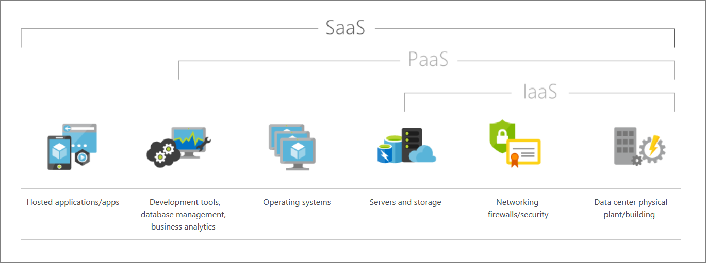

## What are cloud service models?

Clouding computing falls into one of the following computing models. If you've been around cloud computing for a while, you've probably seen the *PaaS*, *IaaS*, and *SaaS* acronyms for the different *cloud service models*, which define the different level of shared responsibility that a cloud provider and cloud tenent are responsible for.

| | Definition | Description |
| --- | --- | --- |
| **IaaS** | <nobr>*Infrastructure-as-a-Service*</nobr> | This cloud service model is the closest to managing physical servers; a cloud provider will keep the hardware up-to-date, but operating system maintenance and network configuration is left to the cloud tenent. For example: Azure Virtual Machines are fully operational virtual compute devices running in Microsoft's datacenters. An advantage of this cloud service model is rapid deployment of new compute devices; setting up a new virtual machine is considerably faster than procuring, installing, and configuring a physical server. |
| **PaaS** | <nobr>*Platform-as-a-Service*</nobr> | This cloud service model is a managed hosting environment, where the cloud provider manages the virtual machines and networking resources, and the cloud tenent deploys their applications into the managed hosting environment. For example: Azure App Services provides a managed hosting environment where developers can upload their web applications, without having to worry about dealing with the physical hardware and software requirements. |
| **SaaS** | <nobr>*Software-as-a-Service*</nobr> | In this cloud service model, the cloud provider manages all aspects of the application environment - virtual machines, networking resources, data storage, applications, etc. - and the cloud tenent only needs to provide their data to the application managed by the cloud provider. For example: Microsoft Office 365 provides a fully working version of Microsoft Office that runs in the cloud; all that you need to do is create your content, and Office 365 takes care of everything else. |

The following illustration demonstrates the services that might run in each of the cloud service models.

Each of these three models will be compared in the following sections.

### Infrastructure-as-a-Service (IaaS)

IaaS is the most flexible category of cloud services. It aims to give you complete control over the hardware that runs your application. Instead of buying hardware, with IaaS, you rent it.

:::row:::
  :::column:::
#### Advantages
  :::column-end:::
  :::column:::
#### Disadvantages
  :::column-end:::
:::row-end:::
:::row:::
  :::column:::
**No CapEx**. Users have no upfront costs.

**Agility**. Applications can be made accessible quickly, and deprovisioned whenever needed.
  :::column-end:::
  :::column:::
**Management**. The shared responsibility model applies; the user manages and maintains the services they have provisioned, and the cloud provider manages and maintains the cloud infrastructure.
  :::column-end:::
:::row-end:::
:::row:::
  :::column:::
**Consumption-based model**. Organizations pay only for what they use and operate under an OpEx model.
  :::column-end:::
  :::column:::
  :::column-end:::
:::row-end:::
:::row:::
  :::column:::
**Skills**. No deep technical skills are required to deploy, use, and gain the benefits of a public cloud. Organizations can leverage the skills and expertise of the cloud provider to ensure workloads are secure, safe, and highly available.
  :::column-end:::
  :::column:::
  :::column-end:::
:::row-end:::
:::row:::
  :::column:::
**Cloud benefits**. Organizations can leverage the skills and expertise of the cloud provider to ensure workloads are made secure and highly available.
  :::column-end:::
  :::column:::
  :::column-end:::
:::row-end:::
:::row:::
  :::column:::
**Flexibility**. IaaS is the most flexible cloud service as you have control to configure and manage the hardware running your application.
  :::column-end:::
  :::column:::
  :::column-end:::
:::row-end:::

### Platform-as-a-Service (PaaS)

PaaS provides the same benefits and considerations as IaaS, but there some additional benefits.

:::row:::
  :::column:::
#### Advantages
  :::column-end:::
  :::column:::
#### Disadvantages
  :::column-end:::
:::row-end:::
:::row:::
  :::column:::
**No CapEx**. Users have no upfront costs.

**Agility**. PaaS is more agile than IaaS, and users do not need to configure servers for running applications.
  :::column-end:::
  :::column:::
**Platform limitations**. There may be some limitations to a cloud platform that could affect how an application runs. Any limitations should be taken into consideration when considering which PaaS platform is best suited for a workload.
  :::column-end:::
:::row-end:::
:::row:::
  :::column:::
**Consumption-based model**. Users pay only for what they use, and operate on an OpEx model.
  :::column-end:::
  :::column:::
  :::column-end:::
:::row-end:::
:::row:::
  :::column:::
**Skills**. No deep technical skills are required to deploy, use, and gain the benefits of PaaS.
  :::column-end:::
  :::column:::
  :::column-end:::
:::row-end:::
:::row:::
  :::column:::
**Cloud benefits**. Users can leverage the skills and expertise of the cloud provider to ensure their workloads are made secure and highly available. In addition, users can gain access to more cutting-edge development tools and toolsets. They then can apply these tools and toolsets across an application's lifecycle.
  :::column-end:::
  :::column:::
  :::column-end:::
:::row-end:::
:::row:::
  :::column:::
**Productivity**. Users can focus on application development only, as all platform management is handled by the cloud provider. Working with distributed teams as services is easier, as the platform is accessed over the internet and can be made globally available more easily.
  :::column-end:::
  :::column:::
  :::column-end:::
:::row-end:::

### Software-as-a-Service (SaaS)

SaaS is software that is centrally hosted and managed for the end customer. It is usually based on an architecture where one version of the application is used for all customers, and licensed through a monthly or annual subscription

SaaS provides the same benefits as IaaS, but again there some additional benefits.

:::row:::
  :::column:::
#### Advantages
  :::column-end:::
  :::column:::
#### Disadvantages
  :::column-end:::
:::row-end:::
:::row:::
  :::column:::
**No CapEx**. Users have no upfront costs.

**Agility**. Users can provide staff with access to the latest software quickly and easily.
  :::column-end:::
  :::column:::
**Software  limitations**. There may be some limitations to a software application that might affect how users work. Since you are using as-is software you don't have direct control of features. Any business needs and software limitations should be taken into consideration when considering which SaaS platform is best suited for a workload.
  :::column-end:::
:::row-end:::
:::row:::
  :::column:::
**Pay-as-you-go pricing model**. Users pay for the software they use on a subscription model, typically monthly or yearly, regardless of how much they use the software.
  :::column-end:::
  :::column:::
  :::column-end:::
:::row-end:::
:::row:::
  :::column:::
**Skills**. No deep technical skills are required to deploy, use, and gain the benefits of PaaS.
  :::column-end:::
  :::column:::
  :::column-end:::
:::row-end:::
:::row:::
  :::column:::
**Flexibility**. Users can access the same application data from anywhere.
  :::column-end:::
  :::column:::
  :::column-end:::
:::row-end:::

## What is serverless computing?

Overlapping with PaaS, serverless computing enables developers to build applications faster by eliminating the need for them to manage infrastructure. With serverless applications, the cloud service provider automatically provisions, scales, and manages the infrastructure required to run the code. Serverless architectures are highly scalable and event-driven, only using resources when a specific function or trigger occurs.

In understanding the definition of serverless computing, it's important to note that servers are still running the code. The serverless name comes from the fact that the tasks associated with infrastructure provisioning and management are invisible to the developer. This approach enables developers to increase their focus on the business logic and deliver more value to the core of the business. Serverless computing helps teams increase their productivity and bring products to market faster, and it allows organizations to better optimize resources and stay focused on innovation.
