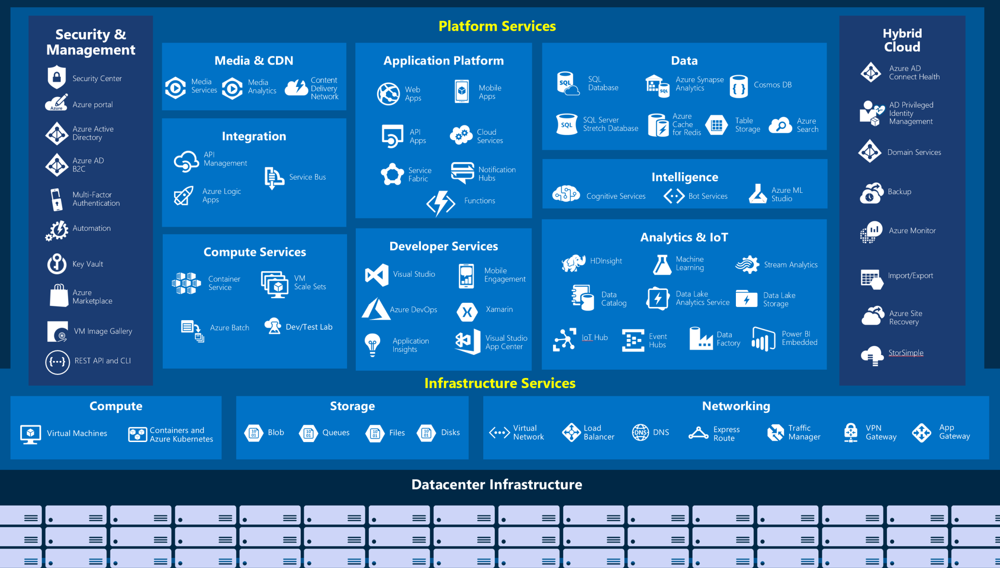

# Design Document

## Title

Introduction to Azure Fundamentals

## Role(s)

- Administrator
- Developer
- Solution Architect

## Level

- Beginner

## Product(s)

- Microsoft Azure

## Prerequisites

- You should be familiar with basic computing concepts and terminology
- Familiarity with cloud computing is helpful, but isn't necessary

## Summary

This module introduces you to the basics of Microsoft Azure. You'll learn about the various Azure services that are available, different ways to create an Azure account, and how to get started on the path to completing the AZ-900 exam certification.

## Learning objectives

Upon completion of this module, the learner will be able to:

- Describe the basic concepts of cloud computing
- Explain what Azure has to offer for cloud computing customers
- Differentiate between the different methods of creating an Azure subscription
- Explain the basic requirements for the Azure Fundamentals AZ-900 exam

## Chunk your content into subtasks

Identify the subtasks of *Introduction to Azure Fundamentals*

| Subtask | How will you assess it: **Exercise or Knowledge check**? | Which learning objective(s) does this help meet?
|---|---|---|---|---|
| Learn basic cloud computing concepts | Knowledge check | 1 |
| Learn basic cloud computing terms | Knowledge check | 1 |
| Learn Azure concepts | Knowledge check | 2 |
| Learn about different Azure accounts | Knowledge check | 3 |
| Learn about the AZ-900 exam | Knowledge check | 4 |

## Outline the units

1. **Introduction**

    Microsoft Azure is a cloud computing platform with an ever expanding set of services to help you build solutions to meet your business goals. Azure services range from simple web services for hosting your business presence in the cloud, to running fully virtualized computers for you to run your custom software solutions. Azure provides a wealth of cloud-based services like remote storage, database hosting, centralized account management, and new capabilities like Artificial Intelligence and Internet of Things (IoT).

    In this module, you'll take an entry level end-to-end look at Azure and its capabilities, which will provide you with a solid foundation for completing the available learning paths for Azure Fundamentals. Additionally, as you learn about Azure, you will also be preparing yourself for the Azure Fundamentals (AZ-900) certification.

    **Prerequisites**

    - You should be familiar with basic computing concepts and terminology
    - Familiarity with cloud computing is helpful, but isn't necessary

    **Learning objectives**

    - Describe the basic concepts of cloud computing
    - Determine whether Azure is the right solution for their business needs
    - Differentiate between the different methods of creating an Azure subscription
    - Explain the basic requirements for the Azure Fundamentals AZ-900 exam

    > [!NOTE]
    >
    > TODO: The [Core Cloud Services - Introduction to Azure](https://docs.microsoft.com/learn/modules/welcome-to-azure/) module has several videos that we could steal wholesale and incorporate them into this module.
    >

    > [!NOTE]
    >
    > TODO: For that matter, we should serious consider if we should just supercede the existing [Core Cloud Services - Introduction to Azure](https://docs.microsoft.com/learn/modules/welcome-to-azure/) module with this module.
    >

1. **What is cloud computing?**

    If you've ever wondered, "What is cloud computing?", it is the delivery of computing services - including servers, storage, databases, networking, software, analytics, and intelligence - over the Internet ("the cloud"). Cloud computing offers faster innovation, flexible resources, and economies of scale.

    > [!NOTE]
    >
    > TODO: We need some images and perhaps a video. We *could* steal what's available in the existing [What is Azure?](https://docs.microsoft.com/learn/modules/welcome-to-azure/2-what-is-azure) unit.
    >

    Cloud computing is the delivery of computing services over the Internet using a *pay-as-you-go pricing* model. You typically pay only for cloud services you use, which helps you lower your operating costs, run your infrastructure more efficiently, and scale as your business needs change. To put that another way, cloud computing is a way to rent compute power and storage from someone else's data center. You can treat cloud resources like you would your resources in your own data center. When you're done using them, you give them back. You're billed only for what you use.

    Instead of maintaining CPUs and storage in your data center, you rent them for the time that you need them. The cloud provider takes care of maintaining the underlying infrastructure for you. While this approach is great, the real value of the cloud is that it enables you to quickly solve your toughest business challenges and bring cutting edge solutions to your users.

    **Why should I move to the cloud?**

    The cloud helps you move faster and innovate in ways that were once nearly impossible.

    In our ever-changing digital world, two trends emerge:

    - Teams are delivering new features to their users at record speeds.
    - End users expect an increasingly rich and immersive experience with their devices and with software.

    Software releases were once scheduled in terms of months or even years. Today, teams are releasing features in smaller batches. Releases are now often scheduled in terms of days or weeks. Some teams even deliver software updates continuously - sometimes with multiple releases within the same day.

    Think of all the ways you interact with devices that you couldn't do just a few years ago. Many devices can recognize your face and respond to voice commands. Augmented reality changes the way you interact with the physical world. Household appliances are even beginning to act intelligently. These technologies are just a few examples, many of which are powered by the cloud.

    To power your services and deliver innovative and novel user experiences more quickly, the cloud provides on-demand access to:

    - A nearly limitless pool of raw compute, storage, and networking components.
    - Speech recognition and other cognitive services that help make your application stand out from the crowd.
    - Analytics services that enable you to make sense of telemetry data coming back from your software and devices.

    There are several benefits that a cloud environment has over a physical environment. For example, cloud-based applications achieve a high rate of availability through a myriad of related strategies:

    - **Scalability** - applications in the cloud can be scaled two ways:
       - *Vertically* - computing capacity can be increased by adding additional RAM or CPUs to a virtual machine
       - *Horizontally* - computing capacity can be increased by adding instances of a resource, such as adding additional virtual machines to your configuration
    - **Elasticity** - cloud-based applications can be configured to take advantage of autoscaling, so your applications will always have the resources they need
    - **Agility** - cloud-based resources can be deployed and configured quickly as your application requirements change
    - **Geo-distribution** - applications and data can be deployed to regional data centers around the globe, thereby ensuring that your customers always have the best performance in their region
    - **Disaster Recovery** - by taking advantage of cloud-based backup services, data replication, and geo-distribution, you can deploy your applications with the confidence that comes from knowing that your data is safe in the event that disaster should occur

    **Public, Private, and Hybrid clouds**

    There are three deployment models for cloud computing: *public cloud*, *private cloud*, and *hybrid cloud*. Each deployment model has different aspects that you should consider as you migrate to the cloud.

    | Deployment Model | Description |
    | --- | --- |
    | <nobr>**Public cloud**</nobr> | Services are offered over the public internet and available to anyone who wants to purchase them. Cloud resources - such as servers and storage - are owned and operated by a third-party cloud service provider, and delivered over the internet. |
    | <nobr>**Private cloud**</nobr> | A private cloud consists of computing resources used exclusively by users from one business or organization. A private cloud can be physically located at your organization's on-site datacenter, or it can be hosted by a third-party service provider. |
    | <nobr>**Hybrid cloud**</nobr> | A hybrid cloud is a computing environment that combines a public cloud and a private cloud by allowing data and applications to be shared between them. |

    **PaaS, IaaS, and SaaS**

    If you've been around cloud computing for a while, you've probably seen these acronyms for the different *cloud service models*, which define the different level of shared responsibility that a cloud provider and cloud tenent are responsible for.

    | | Definition | Description |
    | --- | --- | --- |
    | **IaaS** | <nobr>*Infrastructure-as-a-Service*</nobr> | This cloud service model is the closest to managing physical servers; a cloud provider will keep the hardware up-to-date, but operating system maintenance and network configuration is left to the cloud tenent. For example: Azure Virtual Machines are fully operational virtual compute devices running in Microsoft's datacenters. An advantage of this cloud service model is rapid deployment of new compute devices; setting up a new virtual machine is considerably faster than procuring, installing, and configuring a physical server. |
    | **PaaS** | <nobr>*Platform-as-a-Service*</nobr> | This cloud service model is a managed hosting environment, where the cloud provider manages the virtual machines and networking resources, and the cloud tenent deploys their applications into the managed hosting environment. For example: Azure App Services provides a managed hosting environment where developers can upload their web applications, without having to worry about dealing with the physical hardware and software requirements. |
    | **SaaS** | <nobr>*Software-as-a-Service*</nobr> | In this cloud service model, the cloud provider manages all aspects of the application environment - virtual machines, networking resources, data storage, applications, etc. - and the cloud tenent only needs to provide their data to the application managed by the cloud provider. For example: Microsoft Office 365 provides a fully working version of Microsoft Office that runs in the cloud; all that you need to do is create your content, and Office 365 takes care of everything else. |

    The following chart illustrates the various levels of responsibility between a cloud provider and a cloud tenent.

    
   
1. **What is Microsoft Azure?**

    Azure is a continually expanding set of cloud services that help your organization meet your current and future business challenges. Azure gives you the freedom to build, manage, and deploy applications on a massive global network using your favorite tools and frameworks.

    **What does Azure offer?**

    With help from Azure, you have everything you need to build your next great solution. You can easily **Invent with purpose**.

    | Azure Benefits | |
    | --- | --- |
    | **Be future ready** - Continuous innovation from Microsoft supports your development today, and your product visions for tomorrow. |  |
    |  | **Build on your terms** - You have choices. With a commitment to open source, and support for all languages and frameworks, build how you want, and deploy where you want to. |
    | **Operate hybrid seamlessly** - On-premises, in the cloud, and at the edge - we'll meet you where you are. Integrate and manage your environments with tools and services designed for hybrid cloud. |  |
    |  | **Trust your cloud** - Get security from the ground up, backed by a team of experts, and proactive compliance trusted by enterprises, governments, and startups. |

    **What can I do with Azure?**

    Azure provides over 100 services that enable you to do everything from running your existing applications on virtual machines to exploring new software paradigms such as intelligent bots and mixed reality.

    Many teams start exploring the cloud by moving their existing applications to virtual machines that run in Azure. While migrating your existing apps to virtual machines is a good start, the cloud is more than just "a different place to run your virtual machines".

    For example, Azure provides AI and machine-learning services that can naturally communicate with your users through vision, hearing, and speech. It also provides storage solutions that dynamically grow to accommodate massive amounts of data. Azure services enable solutions that are not feasible without the power of the cloud.

    The following illustration provides a big-picture view for some of the services and features that are available in Azure.

    

1. **Getting started with Azure accounts**

    To create and use Azure services, you need an Azure subscription. When you are completing modules on Microsoft Learn, most of the time a temporary subscription is created for you, which runs in an environment called the *Microsoft Learn Sandbox*. However, when you are working with your own applications and business needs, you need to create an Azure account, and a subscription will be created for you. Once you have created an Azure account, you are free to create additional subscriptions; for example: your company might use a single Azure account for your business, and separate subscriptions for development, marketing, and sales departments.

    If you're new to Azure, you can sign up for a free account on the Azure website to start exploring at no cost to you. Once you're ready, you can choose to upgrade your free account and create a new subscription that enables you to start paying for Azure services you need to use that are beyond the limits of a free account.

    **How to create an Azure account**

    You can purchase Azure access directly from Microsoft by signing up on the [Azure website](https://azure.microsoft.com/), or through a Microsoft representative. You can also purchase Azure access through a Microsoft partner. Cloud Solution Provider partners offer a range of complete managed-cloud solutions for Azure.

    For more information on creating an Azure account, see the [Create an Azure account](https://docs.microsoft.com/learn/modules/create-an-azure-account/) learning module.

    **What is the Microsoft Learn Sandbox?**

    Many of the exercises on Microsoft Learn use a technology called the "Sandbox," which creates a temporary subscription that is added to your Azure account. This temporary subscription allows you to create Azure resources for the duration of a learning module, and Microsoft Learn will automatically clean up the temporary resources for you when you have completed the module.

    When you are completing a Microsoft Learn module, you are welcome to use your personal subscription to complete the exercises in a module, but the sandbox is the preferred method to use since it allows you to create and test Azure resources at no cost to you.

    **What is the Azure free account?**

    The Azure free account includes free access to popular Azure products for 12 months, a credit to spend for the first 30 days, and access to more than 25 products that are always free. The Azure free account is an excellent way for new users to get started and explore. To sign up, you need a phone number, a credit card, and a Microsoft or GitHub account. The credit card information is used for identity verification only; you won't be charged for any services until you upgrade to a paid subscription.

1. **Azure Fundamentals AZ-900 Exam**

    The [AZ-900, Microsoft Azure Fundamentals](https://docs.microsoft.com/learn/certifications/exams/az-900?azure-portal=true), certification exam is designed for candidates looking to demonstrate foundational level knowledge of cloud services and how those services are provided with Microsoft Azure. The exam is intended for candidates with non-technical backgrounds, such as candidates involved in selling or purchasing cloud-based solutions and services. It is also designed for candidates have some involvement with cloud-based solutions and services, as well as candidates with a technical background who have a need to validate their foundational level knowledge around cloud services. Technical IT experience is not required; however, some general IT knowledge or experience would be beneficial.

    

    The AZ-900 exam can be taken as an optional first step in learning concepts about cloud services and how those concepts are exemplified by Microsoft Azure. It can be taken as a precursor to Microsoft Azure or Microsoft cloud services exams. While it would be a beneficial first step in validating foundational level knowledge, taking this exam is not a pre-requisite for taking any other Azure-based certifications.

    **What's measured on the Azure Fundamentals (AZ-900) exam**

    The exam measures your cloud skills in several study areas, which are listed in the following table. The percentages indicate the relative weight of each area on the exam. The higher the percentage, the more questions the exam will contain. Be sure to read the exam page for specifics about what skills are covered in each area.

    | AZ-900 Study Areas| Weights |
    | --- | --- |
    | Describe cloud concepts| 20-25% |
    | Describe core Azure services| 15-20% |
    | Describe core solutions and management tools on Azure | 10-15% |
    | Describe general security and network security features | 10-15% |
    | Describe identity, governance, privacy, and compliance features | 20-25% |
    | Describe Azure cost management and service level agreements | 10-15% |

    **Available learning paths for Azure Fundamentals (AZ-900)**

    This set of learning paths will take you step by step through the fundamentals of the Azure platform, and prepare you to start building solutions.

    - [TODO: LP1: Fundamental Cloud Concepts and Core Azure Services](https://ceapex.visualstudio.com/Microsoft%20Learn/_workitems/edit/264941)
    - [TODO: LP2: Fundamental Azure Core Solutions and Management Tools](https://ceapex.visualstudio.com/Microsoft%20Learn/_workitems/edit/264945)
    - [TODO: LP3: Fundamental Security, Identity, Governance, Privacy and Compliance Features, Cost Management, and SLA](https://ceapex.visualstudio.com/Microsoft%20Learn/_workitems/edit/264960)

1. **Case study introduction**

    Throughout the Azure Fundamentals Learning Paths, we will be working with a fictional company named *Tailwind Traders*, which manufactures hardware products. For the purposes of discussion, let's suppose that you work as an Information Technology (IT) specialist for the company.

    

    Your company currently manages an on-premises datacenter that hosts your company's retail website, and stores that data and streaming video for your applications. Your IT department is currently responsible for all of management tasks for your computing hardware and software; for example: your IT team handles the procurement process to buy new hardware, installs and configures software, and deploys everything throughout your datacenter.

    However, these management responsibilities create numerous obstacles for delivering your applications to your users in a timely fashion. As a technology professional, you realize that it would be advantageous to have servers, storage, databases, and other services immediately available when developing and deploying applications. You should be able to click a button to start up a new server or add services to your solutions.

    As you have seen in the other units of this learning module, your company's needs can be addressed through various cloud-based services. With that in mind, the services that are available through Microsoft Azure can help your company conduct its business more efficiently.
    
    As you complete the various modules in the Azure Fundamentals Learning Paths, we will analyze the various challenges that Tailwind Traders is facing, and how you can Microsoft Azure services to address each of those issues as they arise. When you have completed each of the modules, the knowledge that you will have gained from resolving the hypothetical problems that the fictional Tailwind Traders company was encountering should benefit you in your real world environments, and help to prepare you for the Azure Fundamentals AZ-900 exam.

1. **Knowledge Check**

    - Q: Which of the following statements is not true about cloud computing?

    - Q: What is Microsoft Azure?

    - Q: True or False: You need to purchase an Azure account before using any Azure resources.

    - Q: True or False: In an Infrastructure-as-a-Service environment, the cloud tenent is responsible for routine hardware maintenance.

    - **TODO**: *Need a question about the AZ-900 exam.*

1. **Summary**

    **Learn more**

    - [Azure Free Account FAQ](https://azure.microsoft.com/free/free-account-faq/)
    - [Create an Azure account](https://docs.microsoft.com/learn/modules/create-an-azure-account/)
    - [Align requirements with cloud types and service models in Azure](https://docs.microsoft.com/learn/modules/align-requirements-in-azure/)
    
## Notes

N/A
