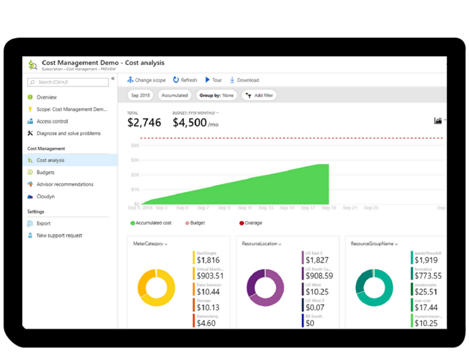

As a home improvement retailer, the proverb "measure twice, cut once" is fitting for the team at Tailwind Traders.

Here are some recommended practices that can help you minimize your costs.

## Perform cost analysis before you deploy

To help you plan your solution on Azure, carefully consider the products, services, and resources you need, and read the relevant documentation to understand how each of your choices are metered and billed.

Calculate your projected costs by using the Pricing calculator and the Total Cost of Ownership (TCO) calculator. Only add the products, services, and resources that you need for your solution.

## Use Azure Advisor to monitor your usage

Ideally, you want your provisioned resources to match your actual demand.

Azure Advisor identifies unused or under-utilized resources, and recommendation unused resources that you can remove. This helps you configure your resources to match your actual demand.

TODO: Image is a bit blurry.

TODO: Can we show a better example and tie it to a specific recommendation? Looking at a recommendation around what you did in the prior exercises would be ideal ;)

## Use spending limits to prevent accidental spending

If you have a Free Trial or a credit-based Azure subscription, you can use spending limits to prevent accidental overrun.

For example, when you spend all the credit included with your Azure free account, Azure resources that you deployed are removed from production and your Azure virtual machines are stopped and de-allocated. The data in your storage accounts are available as read-only. At this point, you can upgrade your Free Trial subscription to a Pay-As-You-Go subscription.

If you have a credit-based subscription and you reach your configured spending limit, Azure suspends your subscription until a new billing period begins.

A related concept is _quotas_, or limits on the number of similar resources you can provision within your subscription. For example, you can allocate up to 25,000 virtual machines per region. While these limits mainly help Microsoft plan their datacenter capacity, they also help protect you from accidentally provisioning more than you intended.

TODO: Sonia, per our discussion, remove this paragraph ^ if it's out of place or we don't want to talk about it.

## Use Azure Reservations to pre-pay in advance

Azure Reservations offers discounted prices on certain Azure services. To receive a discount, you reserve services and resources by paying in advance.

For example, you can pre-pay for one year or three years of use of virtual machines, database compute capacity, database throughput, and other Azure resources.

Azure Reservations are available to customers with an Enterprise Agreement, Cloud Solution Providers, and Pay-As-You-Go subscriptions.

## Choose low-cost locations and regions

The cost of Azure products, services, and resources can vary across locations and regions, and if possible, you should use them in those locations and regions where they cost less.

But remember, some resources are metered and billed according to how much outgoing (egress) network bandwidth they consume. You should provision connected resources that are metered by bandwidth in the same Azure region to reduce egress traffic between them.

## Research available cost-saving offers

Keep up-to-date with the latest Azure customer and subscription offers, and switch to offers that provide the greatest cost-saving benefit.

## Apply tags to identify cost owners

_Tags_ help you manage costs associated with the different groups of Azure products and resources.  You can apply tags to groups of Azure products and resources to organize billing data.

For example, if you run several virtual machines for different teams, you can use tags to categorize costs by department, such as Human Resources, Marketing, or Finance, or by environment, such as Test or Production.

Tags make it easier to identify groups that generate the biggest Azure costs, which can help you adjust your spending accordingly.

## Azure Cost Management + Billing

Azure Cost Management + Billing is a free service that helps you understand your Azure bill, manage your account and subscriptions, monitor and control Azure spending, and optimize resource use.

Azure Cost Management + Billing features include:

+ **Reporting**

    Use historical data to generate reports and forecast future usage and expenditure.

+ **Data enrichment**

    Improve accountability by categorizing resources with tags that correspond to real-world business and organizational units.

+ **Budgets**

    Create and manage cost and usage budgets by monitoring resource demand trends, consumption rates, and cost patterns.

+ **Alerting**

    Get alerts based on your cost and usage budgets.

+ **Recommendations**

    Receive recommendations to eliminate idle resources and to optimize the Azure resources you provision.
