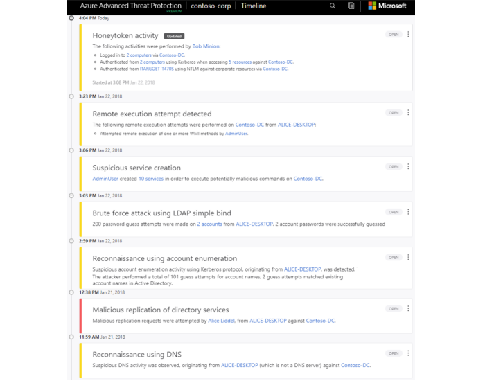

[Azure Advanced Threat Protection](https://azure.microsoft.com/features/azure-advanced-threat-protection?azure-portal=true) is a cloud-based security solution that identifies, detects, and helps you investigate advanced threats, compromised identities, and malicious insider actions directed at your organization. Azure ATP is capable of detecting known malicious attacks and techniques, security issues, and risks against your network.

## Azure Advanced Threat Protection components

+ **Azure Advanced Threat Protection (ATP) portal**. Azure ATP has its own portal, through which you can monitor and respond to suspicious activity. The Azure ATP portal allows you to create your Azure ATP instance, and view the data received from Azure ATP sensors. You can also use the portal to monitor, manage, and investigate threats in your network environment. 

+ **Azure Advanced Threat Protection (ATP) sensor**. Azure ATP sensors are installed directly on your domain controllers. The sensor monitors domain controller traffic without requiring a dedicated server or configuring port mirroring.

+ **Azure Advanced Threat Protection (ATP) cloud service**. Azure ATP cloud service runs on Azure infrastructure and is currently deployed in the United States, Europe, and Asia. Azure ATP cloud service is connected to Microsoft's intelligent security graph.

## How to purchase

Azure Advanced Threat Protection is available as part of the Enterprise Mobility + Security 5 suite (EMS E5), and as a standalone license. You can acquire a license directly from the [Enterprise Mobility Security Pricing Options](https://www.microsoft.com/cloud-platform/enterprise-mobility-security-pricing?azure-portal=true) page, or through the Cloud Solution Provider (CSP) licensing model. It is not available to purchase via the Azure portal.

