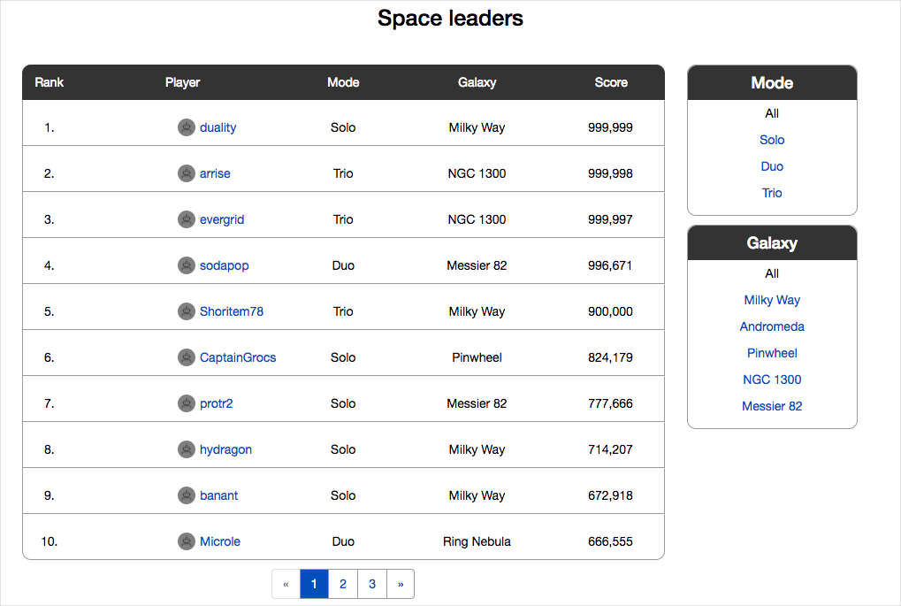

Tailspin Toys, or Tailspin for short, is a video game company. Tailspin hosts its game servers and web sites in an on-prem datacenter. The company just celebrated the release of a new racing game and will be releasing a space-shooter game, called _Space Game_, in the coming months.

The team that you'll be working with builds web sites to support new game titles. These web sites provide information about the game, ways to get it, and leaderboards that show top scores. The team often faces pressure because each web site must go live the same day the game is released.

_Space Game_'s web site is a .NET Core app written in C# that's deployed to Linux. The web site isn't finished yet, but here's what it looks like right now.

And here's what the leaderboard looks like.

You can filter the leaderboard by mode or by game map. You can also click on a player name to see his or her profile and game achievements.

<!-- TODO: Host this under our team account. -->

<!-- TODO: Throw a fake DNS name in front of this to hide the fact we're hosting it on Azure - the fictitious team isn't there yet. -->

> [!NOTE]
> Although the game and the web site aren't yet finished, you can [check out the web site now](http://tailspin-spacegame-web.azurewebsites.net?azure-portal=true) to get a sense of how it works.

Here are your team members.

<!-- TODO: We need final graphics for the team members. -->

<!-- TODO: Fix this layout to make it more pleasing. -->

:::row:::
  :::column span="2":::
     
  :::column-end:::
  :::column:::
Bob is a developer who's been working with computers since he was a kid. His hobby is working on open source projects with other programmers from all over the world.
  :::column-end:::
:::row-end:::

:::row:::
  :::column:::
Carol is in QA. She's calm, which helps with some temperamental developers. She's good at organizing and setting priorities and lives to find edge cases.
  :::column-end:::
  :::column span="2":::
 
  :::column-end:::
:::row-end:::

:::row:::
  :::column span="2":::
     
  :::column-end:::
  :::column:::
Ted is in operations. He likes practical solutions and he's very cautious (although some people might use the word "paranoid"), which makes sense because he's the person who gets the 3 AM call when something goes wrong.
  :::column-end:::
:::row-end:::

:::row:::
  :::column:::
Alice is new. She just joined Tailspin as a developer because she likes games and she thought a smaller company would have lots of opportunity for innovation. She's a big fan of DevOps.
  :::column-end:::
  :::column span="2":::
 
  :::column-end:::
:::row-end:::

## Good morning

The team's product manager has called everyone into a meeting and he's in a bad mood. The leaderboard for the racing game was just updated with several new features and he showed it at a Meetup group. Players' reactions were disappointing, to say the least. He reads off a list of the top problems:

* Some features only work correctly for some game modes.
* Updating the leaderboard takes too long, even with a small number of players.
* Multiple scores per player show up as multiple players.
* The new ranking feature returns incorrect results.
* There's no way to group scores according to a specific date or game session.
* It took months to get the new release (and it's broken).

He demands, "How long before these problems are fixed?"

Bob thinks: I bet it takes me a month to write that code.

Carol thinks: It'll take me at least a week to test this and I can't start until Bob is finished and he always wants to sneak in new code.

Ted thinks: It will take me at least a week to set up the environments and deploy this to production. I can't start until Carol is finished and she's never willing to call something a release candidate.

Alice wonders: Was taking this job a mistake?

Bob looks around at his team mates and says, "We'll get back to you."
