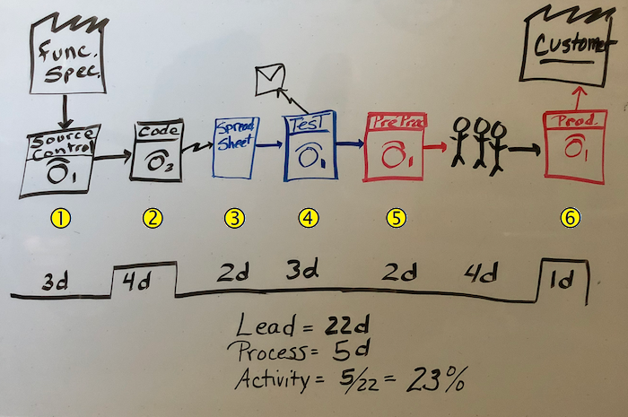

Creating a *value stream map*, or VSM, helps you analyze your current release cycle process. The purpose of a VSM is to visually show where in the process a team creates value and where there's waste. The goal, of course, is to arrive at a process that delivers maximum value to the customer with minimum waste. A VSM can help you pinpoint those areas that either don't contribute any value or that actually reduce the value of the product.

Let's see how Tailspin measures up.

Mara, who's new to the team, is going to create a VSM to help her understand the existing process. With a VSM, she'll get a sense of where the team fits into the DevOps maturity model. As it turns out, more mature teams typically release faster, with greater confidence, and with fewer bugs than less mature teams.

Mara knows she doesn't understand everything yet. So she's going to create a quick VSM on the whiteboard in the meeting room. There will be some gaps and unanswered questions, but that's okay. It's a start. When she's done as much as she can, she'll share it with the team. The VSM will give everyone a common starting point for identifying the first steps toward improving how Tailspin develops and releases its websites.

Let's take a look at her map.

## Understand the current process

Mara gathers the team in the meeting room to present her VSM.

**Mara:** A VSM helps us measure where a process has value to the customer and where it's eating up time without producing any value. Our map begins on the upper left with the functional specification for the software. We'll follow just one feature to see how it moves through our current release cycle.

*Some people roll their eyes, but Mara presses on.*

### Development processes

Creating a new feature currently starts with creating a label in source control . We have one person who can create labels, and that's Andy. We request a label by email. We use a centralized version control system, so Andy waits until all the existing code is checked in and stable before he creates the label. After the label is created, we get an email saying we can begin work. This process takes up to three days and has no value to the customer. Things with no value to the customer should take as little time as possible.

Coding a feature takes about four days for one person once we get access to all the files we need . We have to be on the corporate network in order to access source control. This time has value to the customer. They want this feature.

### Test processes

After we decide that we have a stable build, we update a spreadsheet to tell Amita that there's a build ready for testing and where to find it . It takes her two days to get notified.

Amita manually tests the build . This process gets longer as the codebase grows. For now, let's say three days. She then emails Andy with bug reports. Testing doesn't add value, but it's necessary.

Andy then has to take time to triage the bugs and assign work . It can take another three days for Andy to understand the issues and get them to the right developers.

### Operations processes

When Amita approves a build, she hands it off to Tim. Tim needs to deploy this build to the pre-production servers for more testing. Often, the pre-production servers are out of sync with the latest patches and updates that are needed to run the website. It takes Tim about two days to deploy to pre-production and run some tests. Again, while deploying to pre-production doesn't add value, it's necessary .

After a build is ready for production, leadership needs to approve the release before it can be deployed. This happens in a meeting. It takes four days to get leadership to meet and review the release.

Eventually, Tim deploys the feature and the feature makes it to the customer here on the upper right of the VSM. If the production server configuration has drifted so it's out of sync with pre-production, Tim first needs to update it, and this takes one day .

### Calculate the customer value metrics

Now we can look at the key performance metrics and see how we measure up.

*Total lead time* is the time it takes for a feature to make it to the customer. Here, the total time is 22 days. *Process time* is the time spent on a feature that has value to the customer. Here, the process time includes four days for coding plus one day to deploy the feature, which gives a total of five days.

The *activity ratio* is process time divided by total lead time:

$${Activity\ ratio = }{\dfrac{Process\ time}{Total\ lead\ time}}$$

This is our **efficiency**. Multiply efficiency by 100 to get a percentage. The result is greater than 0% and typically less than 100%. A higher percentage indicates greater efficiency.

Substitute our numbers and we get:

$${Activity\ ratio\ =\ }{\dfrac{5\ days}{22\ days}}{ = .23}$$

Multiply the result by 100 and you get **23%**.

As you can see, we have a lot of room for improvement. And taking 22 days to develop a feature is too long.

**Tim:** So how does this help us?

## Where do we go from here?

**Mara:** It helps to see where we are now so that we can pinpoint the areas where there's waste. We want to minimize the time we spend that has no value to the customer. I believe we can really improve our efficiency by adopting a DevOps approach. For one thing, we can automate a lot of these steps, and that will definitely cut down on the time.

I'm not suggesting we drop our current processes, but I think we can work toward a more efficient process in small increments without disrupting what we currently have in place.

Let's look at just a couple of areas where we can improve.

**Andy:** We might as well start at the beginning. It takes me a long time to get a label on the code so we can start the new feature. I have to walk around to the developers and ask them to check in what they have so we can build and test. If you can figure out how to speed that up, you'll have my attention.

Also, I noticed that you don't have time in there for the build itself. That takes half a day right now. It would be nice to see that time improve.

**Amita:** And dev doesn't always update the spreadsheet to let me know there's a new build that needs testing. It would save time if there was some way to make sure that part gets done.

**Mara:** Great! I think DevOps can help us out with all of these concerns.

**Andy:** We don't have time to change the process now. You heard Irwin. We're in crisis mode here!

**Mara:** I understand. For now, let's do what we always do. But we can all think about our part in the process and how we can improve. We can start making small changes in parallel to our current processes. That will let us see if DevOps will help us without disrupting what we have. I'll keep this map and the performance metrics. If we end up adopting Azure DevOps practices, then we can revisit the numbers. Maybe we can update the VSM at some point.