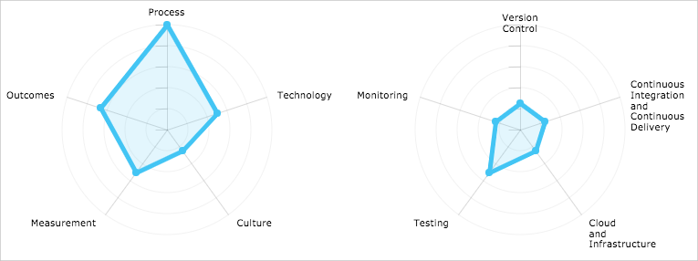

[Here, the fictitious team takes the Microsoft DevOps Self-Assessment and identifies the first place to start making recommendations and improvements. We invite the learner to take it as well.]

[Sample talk track:

* The team decides to take the [Microsoft DevOps Self-Assessment](https://devopsassessment.net).
* You should take it too. The notes you've taken well-prepare you to take it.
* In fact, it follows along the same lines as we discussed here &ndash; process, technology, culture, measurement, and outcomes.
* There's a longer form and a shorter form. (Perhaps nudge them to the longer form - it didn't take me very long and the learner already has some notes.)
* Explain the process and what you get in the end. Remind the learner they'll also get a copy over email to review with their team.
]

Here are the team's results (Explain what the diagram means. The final version should support the conclusions we're about to show.)

[Make the case for DevOps. Talk about how you don't need to throw everything away. Rather, you can migrate and consolidate your existing assets into a better workflow and culture.]

[You can't implement a DevOps program overnight. It involves planning and iteration. One methodology is to improve things gradually, starting with your most painful or pressing issue and gradually improving in other areas.]

The team made some key decisions as to what they'll tackle first:

* Release faster (provide iterative value to customers more quickly.)
* Raise the quality bar. (here I'm thinking code quality.)
* Begin deploying to the cloud to achieve better scale while managing costs.

Here, perhaps challenge the user to think about where they might start based on their DevOps Self-Assessment results.

(Maybe call out that cloud != DevOps, and that you can implement DevOps in any environment, including hybrid environments (Maybe the team decides to go with a hybrid approach? That might help ease the transition and call out when a hybrid approach is useful or necessary)).