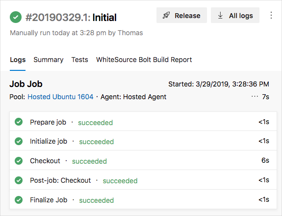
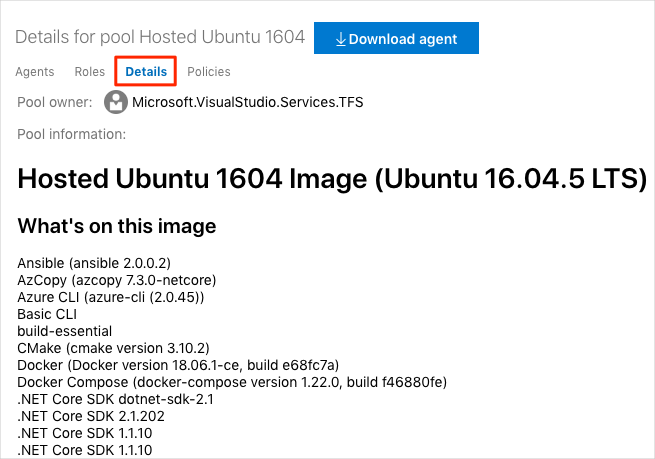

In Unit 4, you saw Mara define a build for _Space Game_. Now it's your turn. You're going to create a pipeline and produce your first build artifact. 

As you saw, Mara uses a YAML file to define the build. When you create a pipeline, the process asks you for your YAML file. The project doesn't have this file yet.

An easy way to get started is to create a Git branch that contains a basic YAML file, use that branch to set up the pipeline, and then iteratively add tasks to your pipeline and test them out. (Again, if you're new to Git don't worry. We'll show you what to do.)

A branch is a good way to experiment because it isolates your changes and doesn't affect the `master` branch or break anything the team is working on. Once you have things working, you can merge your change into the `master` branch so everyone can push code into the pipeline.

At a minimum, the YAML file needs to define the image pool to use. Here you'll use the Ubuntu 16.04 image that's hosted by Microsoft. <!-- Should this be agent pool? Add definition: The Microsoft-hosted agent pool provides 6 virtual machine images to choose from:--> That's where we'll start.

## Configure the basic pipeline

1. From Visual Studio Code, navigate to the integrated terminal and run this `git checkout` command to create a branch named **build-pipeline**.

    ```bash
    git checkout -b build-pipeline
    ```

  

1. From the integrated terminal, run the following command to create a file named **azure-pipelines.yml** in your project's root directory.

    **PowerShell**

    ```powershell
    TBD
    ```

    **Bash**

    ```bash
    touch azure-pipelines.yml
    ```

    <!-- TODO: Add PowerShell equivalent -->

1. In **azure-pipelines.yml**, add the Ubuntu 16.04 image pool, then save the file.

    ```yml
    pool:
      vmImage: 'Ubuntu-16.04'
    ```

1. From the integrated terminal, run `git status`.

    ```bash
    git status
    ```

    You see that **azure-pipelines.yml** is untracked. New files are untracked until you add them to Git's index, or staging area.

1. Run `git add` to add the file to the index.

    ```bash
    git add azure-pipelines.yml
    ```

1. Run `git commit` to commit the change to your branch.

    ```bash
    git commit -m "Initial"
    ```

1. Run `git push` to push, or upload, your branch (including your changes) to your GitHub repository.

    ```bash
    git push origin build-pipeline
    ```

## Create the pipeline

1. From Azure DevOps, navigate to the **SpaceGame-Web** project.
1. Select **Pipelines**, either from the project page or from the menu on the left.
1. Click **New pipeline**.
1. From the **Select a source** pane, select **GitHub**, then click **Authorize using OAuth**.
    1. Sign in to GitHub from the window that appears.
    1. Specify your repository by clicking **...** and then selecting your **mslearn-tailspin-spacegame-web** repository.
    1. Select **build-pipeline** as your default branch.
1. From the **Select a template** pane, select **YAML** and then click **Apply**.
1. Fill in the final settings.
    1. For **Agent pool**, select **Hosted Ubuntu 1604**.
    1. For **YAML file path**, click **...** and select **azure-pipelines-yml**.
1. Click **Save & queue** to save your changes and start the build. From the window that appears, click **Save & queue** a second time.
1. At the top of the page, you see a message that resembles this one.

    

    Click the link to go to your build.

## Watch the pipeline run

From the build screen, trace the build process through each of the steps.

Recall that at this point your build definition specifies only the VM image to use. It doesn't yet specify any of the tasks needed to build your app.

Here you see the minimum number of steps needed to prepare the VM, fetch the latest source code from GitHub, and clean up.



This configuration is a great first start because now you have a starting point for adding build tasks.

> [!TIP]
> Check your email. You may have already received a build notification with the results of your run. You can use this to let your team members know when builds complete and whether each build passed or failed.

As an optional step, right click the link to **Hosted Ubuntu 1604** and open it in a new tab.


Then click **Details**.



You see all the software that's available on the VM, including .NET Core, Docker, and many other development tools and compilers.

## Add build tasks

Now that you have a working build process, you can begin to add build tasks.

Recall that you're working from the `build-pipeline` branch. This gives you a place to experiment and get your build completely working without affecting the rest of the team.

You can add build tasks to **azure-pipelines.yml** directly from Azure DevOps. But here you'll modify **azure-pipelines.yml** locally and upload up your changes to practice your Git skills and watch the pipeline automatically start build the application when you push up changes.

In practice, you might add build tasks one at at time, push up your changes, and see it run. For learning purposes, here you'll add all of the build tasks we identified previously.

1. From Visual Studio Code, modify **azure-pipelines.yml** like this.

    ```yml
    pool:
      vmImage: 'Ubuntu-16.04'
      demands:
        - npm

    steps:
    - task: Npm@1
      displayName: 'npm install'
      inputs:
        verbose: false

    - script: './node_modules/.bin/node-sass Tailspin.SpaceGame.Web/wwwroot --output Tailspin.SpaceGame.Web/wwwroot'
      displayName: 'node-sass Tailspin.SpaceGame.Web/wwwroot'

    - task: gulp@1
      displayName: 'gulp'

    - script: 'echo "$(Build.DefinitionName), $(Build.BuildId), $(Build.BuildNumber)" > buildinfo.txt'
      workingDirectory: Tailspin.SpaceGame.Web/wwwroot
      displayName: 'output build info'

    - task: DotNetCoreCLI@2
      inputs:
        command: 'restore'
        projects: '**/*.csproj'

    - task: DotNetCoreCLI@2
      displayName: 'dotnet build Release'
      inputs:
        command: 'build'
        arguments: '--no-restore --configuration Release'
        projects: '**/*.csproj'
    ```

    The `demands` section beneath `pool` specifies that we need npm, the Node.js package manager, installed on the build system.

    Under the `steps` section, you see the build task that maps to each of the script commands that we identified earlier.

    Azure Pipelines provides a built-in build task that maps to many common build activities. For example, the `DotNetCoreCLI@2` task maps to the `dotnet` command-line utility. The pipeline uses `DotNetCoreCLI@2` two times &mdash; one time to restore, or install, the project's dependencies and one time to build the project.

    But not all build activities map to a built-in task. For example, there is no built-in task that runs the `node-sass` utility or write build info to a text file. To run general system commands, you use the `CmdLine@2` or `script` task. The pipeline uses the `script` task because it's a common shortcut for `CmdLine@2`.

    In the build step that writes information about the build to file, notice these elements:

    * `$(Build.DefinitionName)`
    * `$(Build.BuildId)`
    * `$(Build.BuildNumber)`

    These are built-in variables that the system provides that you can use in your pipeline.

    * `$(Build.DefinitionName)` specifies the name of the build pipeline, such as "SpaceGame-Web-CI".
    * `$(Build.BuildId)` is a numeric identifier for the completed build, such as 115.
    * `$(Build.BuildNumber)` is name of the completed build. You can configure the format, but by default the build number includes the current date followed by the build number for that day. An example build number is "20190329.1".

    You can also define your own variables, which you'll do shortly.

<!-- TODO: Do we need to drill in to how the YAML is written? It's a complete language, so it might be difficult to define comprehensively. One thing that sticks out is the `-` syntax to delimit array elements.

Perhaps we need a knowledge section around YAML syntax (perhaps keep it light and just highlight what's common or what's used in this module), OR we just point to the "Learn YAML in Y minutes" article at the end.
-->

1. Similar to what you did earlier, run the following Git commands from the integrated terminal to add **azure-pipelines.yml** to the index, commit the change, and push the change up to GitHub.

    > [!TIP]
    > Remember to save **azure-pipelines.yml** before running these Git commands.

    ```bash
    git add azure-pipelines.yml
    git commit -m "Add build tasks"
    git push origin build-pipeline
    ```

1. From Azure DevOps, trace the build process through each of the steps.
    * **TODO**: Might have to re-orient the learner as to where to pick up the build in the UI. Also, talk about anything interesting you see (especially the last step, as it relates to the next section.)

## Publish the build result

At this point, you're able to build the _Space Game_ web project through the pipeline.

But where do the results of the build go? Right now, the output of the build remains on the temporary build server. You can store build artifacts in Azure Pipelines so that they're available to others on your team.

In .NET Core, you can package your application as a .zip file. You can then use the built-in `PublishBuildArtifacts@1` task to publish the .zip file to Azure Pipelines.

1. From Visual Studio Code, modify **azure-pipelines.yml** like this.

    ```yml
    pool:
      vmImage: 'Ubuntu-16.04'
      demands:
        - npm

    variables:
      buildConfiguration: 'Release'

    steps:
    - task: Npm@1
      displayName: 'npm install'
      inputs:
        verbose: false

    - script: './node_modules/.bin/node-sass Tailspin.SpaceGame.Web/wwwroot --output Tailspin.SpaceGame.Web/wwwroot'
      displayName: 'node-sass Tailspin.SpaceGame.Web/wwwroot'

    - task: gulp@1
      displayName: 'gulp'

    - script: 'echo "$(Build.DefinitionName), $(Build.BuildId), $(Build.BuildNumber)" > buildinfo.txt'
      workingDirectory: Tailspin.SpaceGame.Web/wwwroot
      displayName: 'output build info'

    - task: DotNetCoreCLI@2
      inputs:
        command: 'restore'
        projects: '**/*.csproj'

    - task: DotNetCoreCLI@2
      displayName: 'dotnet build Release'
      inputs:
        command: 'build'
        arguments: '--no-restore --configuration Release'
        projects: '**/*.csproj'

    - task: DotNetCoreCLI@2
      displayName: 'dotnet publish Release'
      inputs:
        command: 'publish'
        projects: '**/*.csproj'
        publishWebProjects: false
        arguments: '--no-build --configuration Release --output $(Build.ArtifactStagingDirectory)/Release'
        zipAfterPublish: true

    - task: PublishBuildArtifacts@1
      condition: succeeded()
      displayName: 'Publish Artifact: drop'
    ```

    This version of **azure-pipelines.yml** resembles the previous version, but adds two additional tasks.

    The first task uses the `DotNetCoreCLI@2` task to _publish_, or package, the application's build results (including its dependencies) into a folder. The `zipAfterPublish` argument specifies to add the built results to a .zip file.

    The second task uses the `PublishBuildArtifacts@1` task to publish the .zip file to Azure Pipelines. The `condition` argument specifies to run the task only when the previous task succeeds. `succeeded()` is the default condition, so you don't need to specify it. But we show it here to illustrate its use.

1. From the integrated terminal, add **azure-pipelines.yml** to the index, commit the change, and push the change up to GitHub.

    > [!TIP]
    > Remember to save **azure-pipelines.yml** before running these Git commands.

    ```bash
    git add azure-pipelines.yml
    git commit -m "Add publish tasks"
    git push origin build-pipeline
    ```

1. From Azure DevOps, trace the build through each of the steps.
    When the build completes, you see the **Artifacts** button appear.
    <!-- TODO: SCREENSHOT -->

1. Click the **Artifacts** button, then click **drop**. The **Artifacts explorer** appears.
1. From the **Artifacts explorer**, expand the **drop** folder.
    You see a .zip file that contains your built application and its dependencies.
    <!-- TODO: Optionally, download and explore it? -->

## Define variables to enhance readability

Variables enable you to define values one time and refer to those values throughout your pipeline. The system replaces each variable with its current value when the pipeline runs.

Just like with other programming languages, variables enable you to:

* Define values that may change from run to run of your pipeline.
* Store information that's repeated throughout your pipeline, such as a version number or a file path, in one place. That way, you don't need to update all occurrences when your needs change.

Azure Pipelines provides a number of built-in variables which describe aspects of the build process such as the build identifer and the directory names where your software is built and staged.

You can also define your own variables. Here's an example that shows a variable named `buildConfiguration` that defines the Release build configuration.

```yml
variables:
  buildConfiguration: 'Release'
```

Use variables when you repeat the same value multiple times or when a value, such as a dependency version, might change.

You don't need to create a variable for every piece of your build configuration. In fact, too many variables can make your pipeline code harder for others to read and understand.

Take a moment to examine **azure-pipelines.yml**. Notice that these values are repeated.

* The build configuration, **Release**
* The location of the **wwwroot** directory, **Tailspin.SpaceGame.Web/wwwroot**

Here you'll use variables to define these values one time, and then reference these variables throughout the pipeline.

1. From Visual Studio Code, modify **azure-pipelines.yml** like this.

    ```yml
    pool:
      vmImage: 'Ubuntu-16.04'
      demands:
        - npm

    variables:
      buildConfiguration: 'Release'
      wwwrootDir: 'Tailspin.SpaceGame.Web/wwwroot'

    steps:
    - task: Npm@1
      displayName: 'npm install'
      inputs:
        verbose: false

    - script: './node_modules/.bin/node-sass $(wwwrootDir) --output $(wwwrootDir)'
      displayName: 'node-sass $(wwwrootDir)'

    - task: gulp@1
      displayName: 'gulp'

    - script: 'echo "$(Build.DefinitionName), $(Build.BuildId), $(Build.BuildNumber)" > buildinfo.txt'
      workingDirectory: $(wwwrootDir)
      displayName: 'output build info'

    - task: DotNetCoreCLI@2
      inputs:
        command: 'restore'
        projects: '**/*.csproj'

    - task: DotNetCoreCLI@2
      displayName: 'dotnet build $(buildConfiguration)'
      inputs:
        command: 'build'
        arguments: '--no-restore --configuration $(buildConfiguration)'
        projects: '**/*.csproj'

    - task: DotNetCoreCLI@2
      displayName: 'dotnet publish $(buildConfiguration)'
      inputs:
        command: 'publish'
        projects: '**/*.csproj'
        publishWebProjects: false
        arguments: '--no-build --configuration $(buildConfiguration) --output $(Build.ArtifactStagingDirectory)/$(buildConfiguration)'
        zipAfterPublish: true

    - task: PublishBuildArtifacts@1
      condition: succeeded()
      displayName: 'Publish Artifact: drop'
    ```

    Notice the `variables` section, which defines `buildConfiguration` to specify the build configuration and `wwwrootDir` to specify the path to the **wwwroot** directory.

    To reference these variables, you use the `$()` syntax just as you reference built-in variables. Here's the step that runs node-sass to convert Sass files to CSS. It references the `wwwrootDir` variable to obtain the path to the **wwwroot** directory.

    ```yml
    - script: './node_modules/.bin/node-sass $(wwwrootDir) --output $(wwwrootDir)'
      displayName: 'node-sass $(wwwrootDir)'
    ```

    The script command uses this variable to define both the source directory for Sass files and the directory to write CSS files. It also uses this variable to define the task name that's shown in the user interface.

1. From the integrated terminal, add **azure-pipelines.yml** to the index, commit the change, and push the change up to GitHub.

    ```bash
    git add azure-pipelines.yml
    git commit -m "Refactor common variables"
    git push origin build-pipeline
    ```

1. From Azure DevOps, trace the build through each of the steps. As before, you see the **Artifacts** button appear when the build completes.

<!-- TODO: We chose `build-pipeline` as the "default" branch initially, but I don't know where this is used. And I don't see a way to set it to `master`. Let's follow-up on this - if you can set it, let's. -->

Congratulations! You've successfully used Azure Pipelines and created your first build artifact.