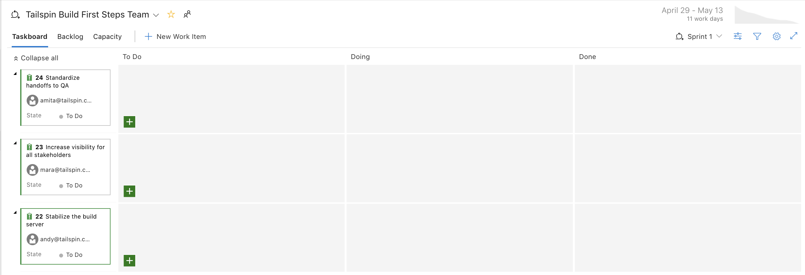
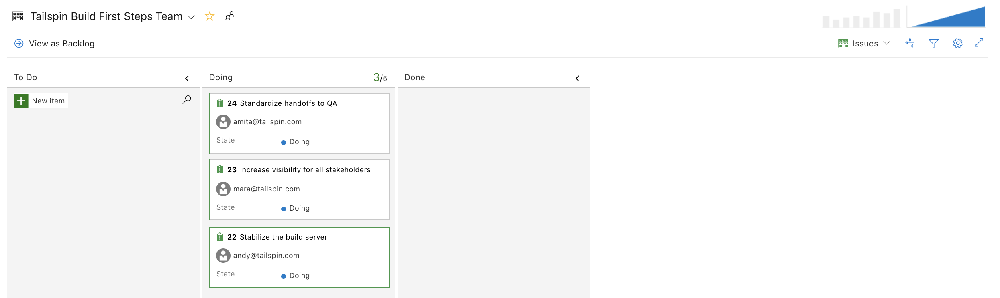

Mara created her own Azure Board using the Basic process. It shows the problems in the build process that she and Andy identified.

She's gotten the team together to take a look at all the problems to see if there's a few that they can address.

Amita: Wow, that's a lot of problems. How are we ever going to fix all those? Anyways, there's not much about testing in there.

Tim: This doesn't have much to do with me, either. These are mostly dev problems.

Mara: I know it's not complete. And some of these problems really need to get broken down into smaller tasks. But DevOps is about everyone on the team working together. Even if you don't see anything that affects you now, that'll change. And we all need to understand the process.

I want to pick just a few items from this board and use another board to define work items.

Andy: And a work item is?

Mara: Work items help us plan and manage a project. A work item can track all kinds of activities. Maybe it's a task to do, a bug to fix, or some other issue. We can assign them to people and keep track of their progress. I'll show you when we set up an Azure board. We'll use tasks.

Amita: Is the Basic board the best way to look at our issues? Maybe there's a better way.

Mara: There are four processes to choose from. We can use:

* **Capability Maturity Model Integration (CMMI)**. This is really for large organizations and it's pretty complicated so I didn't use it.
* **Scrum**. Scrum depends on a Scrum master who leads the Scrum team. The Scrum master makes sure everybody understands Scrum theory, practicies and rules. We don't have a Scrum master, who's usually received some training and certification so I didn't pick that one either.
* **Agile**. This seemed like the obvious choice since I'm always talking about Agile but it has a few more things to consider than the simplest option.
* **Basic**. Basic is, well, basic. It's simple but gives us enough power to start doing effective planning right away. That's why I picked it.

Amita: OK, lets use it to get started. We can switch to something else, right?

Mara: Right! So, let's pick three issues we think we can fix in a couple weeks.

There's a lot of arguing, but the team decides to take on these three issues:

* **Issue 12**. Stabilize the build server.
* **Issue 14**. Standardize handoffs to QA.
* **Issue 16**. Increase visibility for all stakeholders.

These seem the easiest issues to take on.

Mara: OK. Lets set up a project, a team, set up a sprint, and then decide who'll do what?

Tim: What's a sprint?

Mara: It's the time we'll allows ourselves to fix those three problems.

Everyone looks nervous.

Mara: Don't worry. We're still learning. We can always change it. Let's give ourselves two weeks and see how it goes.

Andy volunteers to set up the Azure Basic board while everyone watches.

## Set up an Azure board using the Basic process

It these procedures, you'll set up an Azure Board for the Tailspin team.

### Create the project

In this procedure, you create an Azure DevOps project.

1. Sign into your account at [dev.azure.com](https://dev.azure.com).
1. Click **+ Create project**.
1. The **Create new project window** opens.
1. In the **Project name** field, type **Tailspin Build First Steps**.
1. In the **Description** field, type **First steps to fixing the build process!**.
1. Click **Advanced**.
1. From the work item process drop-down box, select **Basic**.
1. Click **Create**.

### Create a team

In this procedure, you create a team for the project.

1. Click **Project settings** in the bottom left-hand corner.
2. The Project details page opens
3. Under **General**, select **Teams**. The Teams page opens.
4. Click **New team**. The **Create new team** window opens.
5. In the **Team name** field, type **Space Game**.
6. In the **Description** field, type **This team works on the Space Game project and the build process.**
7. Click **Create team**.

### Add team members

In this procedure, you add members to the team.

1. Click **Project Settings** if you're not on that page.
1. Click **Security**.
1. Click **Members**, in the right-hand column. You'll see your own name listed.
1. Click **Add**.
1. Enter **andy@tailspin.com** and click **Save changes**. In a few moments, Andy's name appears.
1. Do the same for amita@tailspin.com, mara@tailspin.com and tim@tailspin.com.

### Create the board

In this procedure, you add three work items to the board.

1. In the left hand column, point to **Boards** and select **Boards** from the menu.
1. Click **Tailspin Build First Steps Team boards**. A blank Basic board appears.
1. In the To Do column, Click the **green + sign** next to the **New item** field.
1. Enter Stabilize the build server and then return.
1. Click the **ellipses(…)**.
1. Click **Open**.
1. In the Description field, enter: **The build server keeps falling over. The OS (Ubuntu 16.04) requires security patches and updates. It's also a challenge to keep build tools and other software up to date.**
1. Click **Save & Close**. The task appears on the board. 
1. Follow the same steps for the two other items.
    a. Create a work item called **Increase visibility for all stakeholders**. The description is **The product manager is constantly asking for updates. It's difficult to report status on what each member is doing.  Planning documents quickly go out of date**.
    b. Create a work item called **Standardize handoffs to QA**. The description is **QA doesn't always know when a new build is available. The team tries to schedule handoffs up front but things slip (for example, the build is late or QA forgets).**

Mara: Great. Let's define a sprint.

Tim: What's a sprint?

Mara: Good question. A sprint is the amount of time we have to complete our work items.

Everyone looks nervous.

Mara: We're still learning. Let's just say two weeks and see how that goes.

### Define a sprint
1. In the left-hand column, click Sprints.
1. Click **Set dates** in the upper-right-hand corner.
1. Leave the Iteration name as Sprint 1.
1. In the Start date field, click the calendar and pick a date.
1. In the End date field, click the calendar and pick a date two weeks later than the start date.
1. Click **Save and close**.

Finally, after a lot of discussion, Mara, Amita and Andy each take on one of the work items.

### Assign tasks

In this procedure, you assign tasks to team members.

1. Open the **Standardize handoffs to QA** work item.
1. Click the **ellipses (...)**.
1. Click **Open**.
1. Click **Unassigned**.
1. Enter amita@tailspin.com (or select it from the drop-down box).
1. Click **Save and close**.
1. Do the same for the Increase visibility work item and assign it to Mara.
1. Do the same for the Stabilize build server work item and assign it to Andy.

The board now looks something like this:

Mara: We did it! We created our first Azure Board and we identified the first tasks we'll take on. It's great! Now, Andy, for each item click **To Do** and pick **Doing** from the drop-down menu. Andy does, and the final board looks like this.

Everyone looks even more nervous.