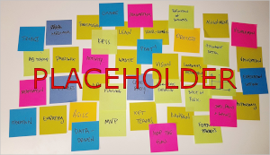
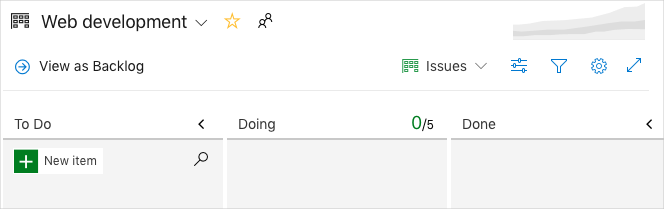
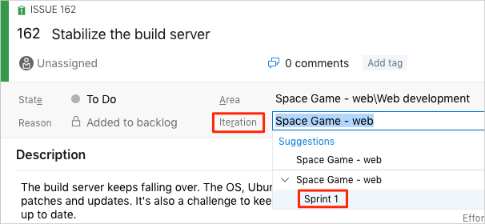
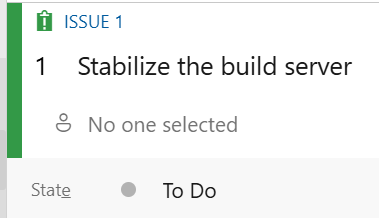

Mara created her own Azure Board using the Basic process. It shows the problems in the build process that she and Andy identified. Mara gets the team together for a quick demo.

**Mara**: Hi everyone. I set up Azure Boards and wanted to show you some work items I came up with.

**Andy**: What's a work item?

**Mara**: Work items help us plan and manage a project. A work item can track all kinds of activities. Maybe it's a task to do, a bug to fix, or some other issue. We can assign them to people and keep track of their progress.

Perhaps it's easier to show you. Here's Azure Boards using the Basic process.

**Amita**: Tell us about the Basic process. Are there other options?

**Mara**: There are four processes to choose from. We can use:

* **Capability Maturity Model Integration (CMMI)**. This is really for large organizations and it's pretty complicated so I didn't use it.
* **Scrum**. Scrum depends on a Scrum master who leads the Scrum team. The Scrum master makes sure everybody understands Scrum theory, practices and rules. We don't have a Scrum master, who's usually received some training and certification so I didn't pick that one either.
* **Agile**. This seemed like the obvious choice since I'm always talking about Agile but it has a few more things to consider than the simplest option.
* **Basic**. Basic is, well, basic. It's simple but gives us enough power to start doing effective planning right away, and that's why I picked it. The Basic workflow is pretty simple; you move work from **To Do** to **Doing** to **Done**.

**Amita**: OK, let's use it to get started. We can switch to something else, right?

**Mara**: Right! So, let's pick a few work items we think we can fix in a couple weeks.

Andy can identify with these issues, but the rest of the team has questions.

**Tim**: These are mostly dev problems. But while we're on the subject, other teams are talking about code vulnerabilities, and I've been asked to show that our code is secure. Is there a way we can add that?

**Mara**: I know it's not complete. These are problems Andy and I talked about earlier. And some of these problems really need to get broken down into smaller tasks. But DevOps is about everyone on the team working together. For now, I wanted us all to understand the process. But this is a perfect time to discuss what's on your minds.

The team likes seeing a central place to keep track of what they need to do.

:::row:::
  :::column span="4":::
Each team member shares what they're working on and other concerns they have. As a brainstorming activity, they add sticky notes to a whiteboard. Their whiteboard fills up quickly.
  :::column-end:::
  :::column:::

  :::column-end:::
:::row-end:::

Eventually they settle on seven top issues. Andy volunteers to add tasks to Azure Boards while everyone watches. Here's what the board looks like.

**Amita**: Wow, that's a lot of problems. How are we ever going to fix all those?

**Mara**: We don't have to fix them all right away. For now, we've identified a _backlog_, or list of work we could pull from. When we plan work, we get to choose what's most urgent or important.

After some more discussion, the team decides to take on the three issues Mara originally proposed:

* **Stabilize the build server**
* **Create a Git-based workflow**
* **Create unit tests**

**Mara**: These seem the easiest issues to take on, and they address some recent challenges that came up. Let's set up a project, a team, and a sprint. Then we can decide who does what.

## Set up Azure Boards using the Basic process

In this part, you'll set up an Azure DevOps project and Azure Boards for the Tailspin team.

### Create the project

Here you'll create an Azure DevOps project.

1. Sign into your account at [dev.azure.com](https://dev.azure.com).
1. Click **+ Create project**.
1. The **Create new project window** opens.
1. In the **Project name** field, type **Space Game - web**.
1. In the **Description** field, type **The Space Game web site**.
1. Click **Advanced**.
1. From the work item process drop-down box, select **Basic**.
1. Click **Create**.

After just a few moments, you're taken to your new project.

### Create a team

Here you'll create a team for the project.

1. Click **Project settings** in the bottom left-hand corner.
1. From the **Project details** page, under **General**, select **Teams**.
1. Click **New team**.
1. From the **Create new team** window, in the **Team name** field, type **Web development**.
1. In the **Description** field, type **The Tailspin web development team.**
1. Click **Create team**.

### Add team members

Here you'll add members to the **Web development** team.

1. Click **Project Settings** if you're not on that page.
1. Under **General**, click **Security**.
1. Click **Members**, in the right-hand column. You see your own name listed.
1. Click **+ Add**.
1. Enter "andy@tailspin.com" and click **Save changes**. In a few moments, Andy's name appears.
1. Do the same for "amita@tailspin.com", "mara@tailspin.com", and "tim@tailspin.com".

> [!TIP]
> For learning purposes, here you added fictitious team members. In practice, you might manage your team through an identity and access management service such as Azure Active Directory and set the appropriate permission levels for each team member. We'll point you to more resources at the end of this module.

### Create the board

Although Mara and her team identified a number of issues, here you'll add  the three work items Mara originally proposed to your board to practice the process.

1. In the left hand column, point to **Boards** and select **Boards** from the menu that appears.
1. Click **Web development boards**. A blank board appears.

    

    Recall that you're using the Basic process. The Basic process involves three task states &mdash; **To Do**, **Doing**, and **Done**.

    If you choose a different process, such as Scrum, you would see a layout that supports that process.

1. In the **To Do** column, click the green **+** button next to the **New item** field.
1. Enter **Stabilize the build server** and then hit <kbd>Enter</kbd>.
1. Click the ellipses (**...**), then click **Open**.
1. In the **Description** field, enter this text:

    > The build server keeps falling over. The OS, Ubuntu 16.04, requires security patches and updates. It's also a challenge to keep build tools and other software up to date.

1. Click **Save & Close**.
1. Follow the same steps for the next two items.

    | Title                       | Description                                                      |
    |-----------------------------|------------------------------------------------------------------|
    | Create a Git-based workflow | Migrate source code to GitHub and define how we'll collaborate.  |
    | Create unit tests           | Add unit tests to the project so help minimize regression bugs.  |

1. Drag **Stabilize the build server** to the top of the stack. Then drag **Create a Git-based workflow** to become the second item. Your final board looks like this.

    

### Define a sprint

**Mara**: This is looking great. Now let's define a sprint.

**Tim**: What's a sprint?

**Mara**: Good question. A sprint is the amount of time we have to complete our tasks. Sprints help keep us focused. At the end, we can have a short retrospective meeting to share what we've accomplished. After that, we can plan the next one.

Everyone looks nervous.

**Mara**: We're still learning. A sprint is typically 2-4 weeks long. Let's just say two weeks and see how that goes. These are mostly tasks Andy and I can tackle. We'll share our progress as we go. Then we can find ways to include everybody.

When you create an Azure Boards project, you get an initial sprint called **Sprint 1**. All you need to do is assign dates to the sprint and add tasks. Here's how to follow along with the team.

1. In the left-hand column, click **Sprints**.
1. Click **Set dates** from the **Sprint Dates** column.
1. Leave the name as **Sprint 1**.
1. In the **Start** date field, click the calendar and pick today's dates.
1. In the **End** date field, click the calendar and pick a date two weeks from today.
1. Click **Save**.

### Assign tasks and set the iteration

An _iteration_ is another name for a sprint.

You have an initial set of work items and a timeline for your first sprint. Here you'll connect work items to your sprint and assign the tasks to yourself.

1. Under **Boards**, selecet **Work items**.
1. Select **Stabilize the build server**.
1. From the **Iteration** drop-down, select **Sprint 1**.

    
1. From the same window, click **Unassigned** and set yourself as the task owner.

    
1. Repeat the process for the other two work items.

    * **Create a Git-based workflow**
    * **Create unit tests**

**Mara**: We did it! We created our first Azure Board and we identified the first tasks we'll take on. It's great! As Andy and I do this work, we'll move each work item to the **Doing** state.

**Amita**: Sounds good. I enjoyed discussing what's important to us right now. And now we have a way to see everything all in one place.