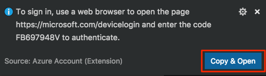

In this exercise, you run an Ansible playbook that configures user accounts on Linux VMs running on Azure. By the end, you'll have two Linux VMs that are configured in the exact same way.

During the process, you:

> [!div class="checklist"]
> * Walk through a basic Ansible playbook so that you understand what each piece does.
> * Create two VMs on Azure to configure.
> * Create a dynamic Ansible inventory that includes your VMs.
> * Run an ad-hoc configuration command and then a more complete configuration that's defined in a playbook.
> * Verify the configuration and then run the playbook a second time and see that 

## Define your requirements

The first step when working with any configuration management tool is to first define your requirements. You then map those requirements to configuration code.

Let's join Tim and Andy as they define the requirements for their prototype.

**Tim:** Before we run anything in Azure Pipelines, I'd like to work through the process by hand. What's the easiest way to get started?

**Andy:** Although we could install Ansible on our development systems, we can also use Cloud Shell. Ansible comes pre-configured on Cloud Shell, so there's nothing to set up. What's something that you commonly need to configure?

**Tim:** We run services on VMs that perform billing and other functions. We run these services under service accounts.

**Andy:** That sounds like a great place to start. Tell me more about what you need.

_Tim moves to the whiteboard._

**Tim:** A service account is a user account that provides a security context for services. On Linux, a service account typically:

* Provides no home directory for the user.
* Provides no login shell.
* Provides no password or way to sign in as that user.

I say we define two users for our test "testuser1" and "testuser2".

Tim and Andy discover documentation for the [user](https://docs.ansible.com/ansible/latest/modules/user_module.html?azure-pipelines=true) module. The `user` module enables you to manage user accounts, including service accounts.

They define this configuration in Ansible:

```yml
---
- hosts: all
  tasks:
  - name: Add service accounts
    user:
      name: "testuser1"
      comment: service account
      create_home: no
      shell: /usr/sbin/nologin
      password: '*'
      state: present
```

TODO: DESCRIBE.

TODO:
The `hosts` attribute blah blah. TODO: For each play in a playbook, you get to choose which machines in your infrastructure to target and what remote user to complete the steps (called tasks) as.

TODO:
tasks. Indicates the start of the modules where the actual configuration is defined.


Notice that this configuration creates just one user: "testuser1". Although you could add a second task that performs the same function, you can use the `loop` keyword to repeat the task multiple times.

Tim and Andy update their configuration, like this:

```yml
---
- hosts: all
  tasks:
  - name: Add service accounts
    user:
      name: "{{ item }}"
      comment: service account
      create_home: no
      shell: /usr/sbin/nologin
      password: '*'
      state: present
    loop:
    - testuser1
    - testuser2
```

The `loop` block applies the configuration for each item in the list. The `name` attribute uses the `{{ }}` syntax to interpolate, or replace, the value with the current element in the list.

Next, Tim and Andy need to consider under which user account the configuration will run. When they create their VMs on Azure, they'll specify "azureuser" as the administrator name. They update their configuration like this:

```yml
---
- hosts: all
  remote_user: azureuser
  become: yes
  tasks:
  - name: Add service accounts
    user:
      name: "{{ item }}"
      comment: service account
      create_home: no
      shell: /usr/sbin/nologin
      password: '*'
      state: present
    loop:
    - testuser1
    - testuser2
```

TODO: Describe this.
Here, `remote_user` specifies the user to use to connect to complete the tasks.

`become` 

## Bring up Cloud Shell through the Visual Studio Code

TODO: In previous modules...

Here, you bring up Cloud Shell through the Azure portal so that you can work with Ansbile code and run your configuration. We use Cloud Shell here because it comes with Ansible already set up for you.

You can also install and run Ansible locally from a terminal or Visual Studio Code. Later, you'll run Ansible from Azure Pipelines.

### Install the Azure Account extension

TODO: WHY

The **Azure Account** extension is not installed by default in Visual Studio Code. Let's start by installing it:

1. In VS Code, on the **View** menu, select **Extensions**.
1. In the **Search Extensions in Marketplace** textbox, enter *Azure Account*, and then select the **Azure Account** extension.

    

1. Select **Install**.
1. Select **Reload** to activate the extension.

### Sign in to Azure

TODO

1. In VS Code, press <kbd>F1</kbd> or select **View > Command Palette** to access the command palette.
1. In the command palette, enter *Azure: Sign In*.

    A window appears that instructs you to authenticate from a web browser.

    

1. Select **Copy & Open**.

    A browser window appears. Your authentication code is automatically copied to the clipboard.
1. Paste your authentication code into the text box in your browser.
1. Select your Microsoft account that's associated with your Azure subscription. Then follow the steps to sign in.

### Bring up Cloud Shell

1. In VS Code, press <kbd>F1</kbd> or select **View > Command Palette** to access the command palette.
1. In the command palette, enter *Azure: Open Bash in Cloud Shell*.

    You see Cloud Shell open in the terminal.

    

## Create a working directory

Here, you create a directory to hold your Ansible playbook. Doing so helps keep your Ansible code separate from your other work.

1. In Cloud Shell, create a directory named *mslearn-ansible*.

    ```bash
    mkdir ~/mslearn-ansible
    ```

1. Move to the *mslearn-ansible* directory.

    ```bash
    cd ~/mslearn-ansible
    ```

## Create Linux VMs to manage

Here you create two Linux VMs that you'll later use to configure user accounts by using Ansible. Although you could use an infrastructure tool such as Terraform or even Ansible to bring up your VMs, for learning purposes, here you use the Azure CLI.

### Select an Azure region

A _region_ is one or more Azure datacenters within a specific geographic location. East US, West US, and North Europe are examples of regions. Every Azure resource, including an App Service instance, is assigned a region.

To make the commands easier to run, start by selecting a default region. After you specify the default region, later commands use that region unless you specify a different region.

1. From Cloud Shell, run the following `az account list-locations` command to list the regions that are available from your Azure subscription.

    ```azurecli
    az account list-locations \
      --query "[].{Name: name, DisplayName: displayName}" \
      --output table
    ```

1. From the **Name** column in the output, choose a region that's close to you, for example, **eastasia** or **westus2**.

1. Run `az configure` to set your default region. Replace **\<REGION>** with the name of the region you chose for your database.

    ```azurecli
    az configure --defaults location=<REGION>
    ```

    Here's an example that sets **northeurope** as the default region.

    ```azurecli
    az configure --defaults location=northeurope
    ```

### Create a resource group

A _resource group_ holds related Azure resources. Here, you create a resource group that holds your Linux VMs.

Run the following `az group create` command to create a resource group that's named **learn-ansible-rg**.

```azurecli
az group create --name learn-ansible-rg
```

### Create an SSH key

When connecting to Linux VMs, you can use _password authentication_ or _key-based authentication_.

With key-based authentication, there are two keys. The public key is stored on the host, in this case your VMs. You hold the private key, which enables you to securely connect. The private key is sensitive information, and should be treated as you would a password.

Here, we use key-based authentication because it's generally more secure than using passwords. Although you might create separate SSH keys for each VM you create, here you create one SSH that you share with each of them to make the process easier to follow.

In Cloud Shell, run the following `ssh-keygen` command to create an SSH public/private keypair.

```bash
ssh-keygen -t rsa -b 2048 -C "azureuser@azure" -f ~/.ssh/id_ansible-vm -N ""
```

This command creates two files in Cloud Shell:

* The public key, *~/.ssh/id_ansible-vm.pub*.
* The private key, *~/.ssh/id_ansible-vm*.

### Create the virtual machines

Here you create two virtual machines, each running Ubuntu.

1. Run the following `az vm create` command to create a virtual machine that's named **vm1**:

    ```azurecli
    az vm create \
      --resource-group learn-ansible-rg \
      --name vm1 \
      --admin-username azureuser \
      --image UbuntuLTS \
      --tags Ansible=mslearn \
      --ssh-key-values ~/.ssh/id_ansible-vm.pub
    ```

    This command specifies "azureuser" as the administrator user.

    The `--ssh-key-values` argument specifies your SSH public key. The VM stores this file, which you later use to connect.

    The `--tags` argument specifies a tag to apply to the VM. Think of a tag as metadata that helps you logically organize your resources. This syntax creates the tag as a key-value pair, where "Ansible" is the key and "mslearn" is its value. You'll use this tag later to create a dynamic inventory in Ansbile.

1. Run `az vm create` a second time to create a VM that's named **vm2**:

    ```azurecli
    az vm create \
      --resource-group learn-ansible-rg \
      --name vm2 \
      --admin-username azureuser \
      --image UbuntuLTS \
      --tags Ansible=mslearn \
      --ssh-key-values ~/.ssh/id_ansible-vm.pub
    ```

1. Run the following `az vm list` command to verify that your VMs were successfully created:

    ```azurecli
    az vm list \
      --resource-group learn-ansible-rg \
      --query [].{Name:name} \
      --output table
    ```

    You see this:

    ```output
    Name
    ------
    vm1
    vm2
    ```

## Create the Ansible configuration file

Ansible reads configuration settings from *~/ansible.cfg*. Here, you add settings that:

* Hide warnings that you don't need to understand yet.
* Disables host key checking so that you're not prompted to verify the authenticity of your servers.

1. In Cloud Shell, run this `code` command to open *~/ansible.cfg* in the editor:

    ```bash
    code ~/ansible.cfg
    ```

1. Add these contents to the file:

    ```ini
    [defaults]
    deprecation_warnings = False
    host_key_checking = False
    ```

1. Save the file and then close the code editor.

1. Run the following `ansible-config` command to verify your settings:

    ```bash
    ansible-config view
    ```

    You see this:

    ```output
    [defaults]
    deprecation_warnings = False
    host_key_checking = False
    ```

### Create the inventory file

Here, you specify your machine inventory. Recall that the _inventory_ is a list of managed nodes. You typically describe your inventory in an *.ini* file or a YAML file.

For your VM deployment on Azure, you could define your inventory file similar to this:

```yml
hosts:
  vm1:
    ansible_host: 13.79.22.89
 vm2:
    ansible_host: 40.87.135.194
```

If these IP addresses change, or if you add or remove systems, you would need to update this inventory file over time.

A more flexible approach is to use a _dynamic inventory_. A dynamic inventory enables Ansible to discover which systems to configure at run time.

The format of the dynamic inventory file depends on your environment. Ansible provides inventory plugins for Azure and other cloud providers, as well as environments such as Docker, Kubernetes, and VMware.

Here's the dynamic inventory file you're going to use:

```yml
plugin: azure_rm
include_vm_resource_groups:
- learn-ansible-rg
auth_source: auto
keyed_groups:
- prefix: tag
  key: tags
```

TODO: keyed_groups is wrong. Fix it or remove it.

Here's what each part means:

* `plugin` tells Ansible that the inventory is stored on Azure.
* `include_vm_resource_groups` specifies the list of resource groups to search for virtual machines.
* `auth_source` specifies how to authenticate with Azure. Here, we specify `auto` to use Ansible's default precedence for authenticating with Azure. You can configure Ansible to authenticate by using an Azure CLI profile, environment variables, or a credentials file.
* `keyed_groups` specifies filters Ansible should use to select which virtual machines to configure. This configuration filters VMs by tag name. When you run Ansible, you specify which tags to include. You can filter by other tags as well, such as a VMs location in Azure.

1. In Cloud Shell, run this `code` command to open *azure_rm.yml* in the editor:

    ```bash
    code azure_rm.yml
    ```

1. Add these contents to the file:

    ```yml
    plugin: azure_rm
    include_vm_resource_groups:
    - learn-ansible-rg
    auth_source: auto
    keyed_groups:
    - prefix: tag
      key: tags
    ```

    > [!NOTE] When using a dynamic inventory with Azure, this file must end with the name *azure_rm.yml* or *azure_rm.yaml*.

1. Run the following `ansible-inventory` command to verify that Ansible can discover your inventory.

    ```bash
    ansible-inventory --inventory azure_rm.yml --graph
    ```

    Your output resembles this:

    ```output
    @all:
      |--@tag_Ansible_mslearn:
      |  |--vm1_1bbf
      |  |--vm2_867a
      |--@ungrouped:
    ```

## Run the ping module on your VMs

Although you typically write _playbooks_ to express your desired configurations, you can also run Ansible commands directly.

To verify that Ansible can apply configuration changes to your inventory, here you run the `ping` module directly to ensure that your VMs are discoverable and that Ansbile can connect to each VM.

The `ping` module doesn't connect over ICMP. Think of this module as a way to verify that Ansbile can connect and that Python is correctly installed on each node. You typically wouldn't use this module in a playbook.

To run the `ping` module directly, run this `ansible` command:

```bash
ansible \
  --inventory azure_rm.yml \
  --user azureuser \
  --private-key ~/.ssh/id_ansible-vm \
  --module-name ping \
  tag_Ansible_mslearn
```

The `tag_Ansible_mslearn` argument relates to the `keyed_groups` section in your inventory file. It ensures that the `ping` module is run only on the VMs that are tagged in your resource group.

Recall that when you created your VMs, you provided the `--tags Ansible=mslearn` to create a tag named "Ansbile" whose value is "mslearn". In the `tag_Ansible_mslearn` argument:

* `tag` maps to the feature you're grouping by.
* `Ansible` maps to the tag name.
* `mslearn` maps to the tag's value.

You see this JSON output:

```json
vm2_867a | SUCCESS => {
    "ansible_facts": {
        "discovered_interpreter_python": "/usr/bin/python"
    },
    "changed": false,
    "ping": "pong"
}
vm1_1bbf | SUCCESS => {
    "ansible_facts": {
        "discovered_interpreter_python": "/usr/bin/python"
    },
    "changed": false,
    "ping": "pong"
}
```

You see "SUCCESS" as well as "pong" in the output, which tell you that the command succeeded.

## Run the users playbook on your VMs

Now that you've verified that your VMs are connectable through Ansible, here you apply a playbook that configures service accounts on your VMs. You reviewed this playbook in the previous unit.

1. In Cloud Shell, open *users.yml* in the editor:

    ```bash
    code users.yml
    ```

1. Add these contents to the file:

    ```yml
    ---
    - hosts: all
      remote_user: azureuser
      become: yes
      tasks:
      - name: Add service accounts
        user:
          name: "{{ item }}"
          comment: service account
          create_home: no
          shell: /usr/sbin/nologin
          password: '*'
          state: present
        loop:
        - testuser1
        - testuser2
    ```

1. Save the file and then close the code editor.

1. Run the following `ansible-playbook` command to apply your playbook:

    ```bash
    ansible-playbook \
      --inventory azure_rm.yml \
      --user azureuser \
      --private-key ~/.ssh/id_ansible-vm \
      users.yml
    ```

    You see from the output that both user accounts were added to each VM in your inventory:

    ```output
    PLAY [all] *******************************************************************************************************************************************************************

    TASK [Gathering Facts] *******************************************************************************************************************************************************
    ok: [vm2_867a]
    ok: [vm1_1bbf]

    TASK [Add service accounts] **************************************************************************************************************************************************
    changed: [vm2_867a] => (item=testuser1)
    changed: [vm1_1bbf] => (item=testuser1)
    changed: [vm2_867a] => (item=testuser2)
    changed: [vm1_1bbf] => (item=testuser2)

    PLAY RECAP *******************************************************************************************************************************************************************
    vm1_1bbf                   : ok=2    changed=1    unreachable=0    failed=0    skipped=0    rescued=0    ignored=0
    vm2_867a                   : ok=2    changed=1    unreachable=0    failed=0    skipped=0    rescued=0    ignored=0
    ```

## Verify the configuration

The output shows that the Ansible playbook succeeded, but let's double-check the configuration.

It can be useful to verify the result as you develop your configuration code to ensure that your code correctly expresses your needs. But once you have a working configuration in place, you don't need to verify the results each time.

On Linux, you can use the `getent passwd` command to get information about a user. One way to run this command is over SSH.

As an optional step, run these commands from Cloud Shell:

```azurecli
IP_ADDRESS=$(az vm list-ip-addresses \
  --resource-group learn-ansible-rg \
  --name vm1 \
  --query [0].virtualMachine.network.publicIpAddresses[0].ipAddress \
  --output tsv)


ssh -i ~/.ssh/id_ansible-vm azureuser@$IP_ADDRESS "/usr/bin/getent passwd testuser1"
```

You see this:

```output
testuser1:x:1001:1001:service account:/home/testuser1:/usr/sbin/nologin
```

Here's how to read each field:

```output
testuser1:x:1001:1001:service account:/home/testuser1:/usr/sbin/nologin
|         |  |    |           |             |                |
|         |  |    |           |             |                Login shell
|         |  |    |           |             Home directory
|         |  |    |           Description
|         |  |    Group ID
|         |  User ID
|         Encrypted password
Username
```

You see that the account is set up as you specified. Although the `getent passwd` command shows */home/testuser1* as the home directory, the directory does not actually exist on the VM. That's because you specified `create_home: no`.

This command tests only one VM. But say you had dozens or hundreds of VMs that you want to verify. You can use Ansible to run the same command on each of your VMs.

To do that, run the following `ansible` command:

```bash
ansible \
  --inventory azure_rm.yml \
  --user azureuser \
  --private-key ~/.ssh/id_ansible-vm \
  --args "/usr/bin/getent passwd testuser1" \
  tag_Ansible_mslearn
```

The `--args` argument specifies the command to run on each VM.

You see that both VMs are configured identically with the "testuser1" service account.

```output
vm2_867a | CHANGED | rc=0 >>
testuser1:x:1001:1001:service account:/home/testuser1:/usr/sbin/nologin

vm1_1bbf | CHANGED | rc=0 >>
testuser1:x:1001:1001:service account:/home/testuser1:/usr/sbin/nologin
```

## Run the Ansible playbook a second time

Ansible is idempotent. That means you can run it as many times as you'd like. Ansible applies configuration changes only when your playbook changes or the state of your systems don't match what's in your playbook.

1. Run the following `ansible-playbook` command to apply your playbook a second time:

    ```bash
    ansible-playbook \
      --inventory azure_rm.yml \
      --user azureuser \
      --private-key ~/.ssh/id_ansible-vm \
      users.yml
    ```

    You this this:

    ```output
    PLAY [all] **********************************************************************************************************************************************************************

    TASK [Gathering Facts] **********************************************************************************************************************************************************
    ok: [vm2_867a]
    ok: [vm1_1bbf]

    TASK [Add service accounts] *****************************************************************************************************************************************************
    ok: [vm2_867a] => (item=testuser1)
    ok: [vm1_1bbf] => (item=testuser1)
    ok: [vm2_867a] => (item=testuser2)
    ok: [vm1_1bbf] => (item=testuser2)

    PLAY RECAP **********************************************************************************************************************************************************************
    vm1_1bbf                   : ok=2    changed=0    unreachable=0    failed=0    skipped=0    rescued=0    ignored=0
    vm2_867a                   : ok=2    changed=0    unreachable=0    failed=0    skipped=0    rescued=0    ignored=0
    ```

    As you would expect, Ansible does not apply any changes. The `changed=0` part of the output tells you this.

    That's because your Ansible playbook did not change and you haven't modified any of your Azure resources.

    Later, you'll see the benefit of this behavior when you configure your infrastructure in Azure Pipelines by running the same Ansible playbook.

Keep your Cloud Shell session in VS Code open for the next exercise.