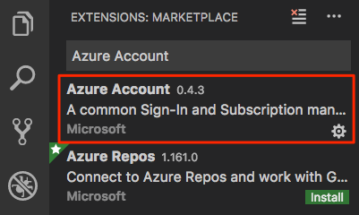
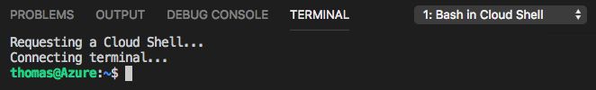
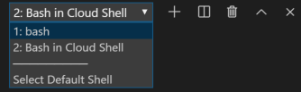

Andy and Tim have decided to try Ansible. Before they set anything up in Azure Pipelines, they'll first run Ansible directly in Azure Cloud Shell, and then locally from Visual Studio Code by using the Ansible extension.

First, they need to set up their local development environment. Here, you'll do the same. By the end of this module, you'll have an Ansible playbook in a Git repository that you connect to Azure Pipelines.

In this exercise, you:

> [!div class="checklist"]
> * Create a local Git repository.
> * Connect to your Azure subscription and bring up Cloud Shell through Visual Studio Code.
> * Create an SSH key pair and upload your key pair to Cloud Shell.

## Create a Git repository

Here, you create a working directory, configure Git, and then create a local Git repository. Later, you'll upload your repository to GitHub so that you can run configure VMs from Azure Pipelines.

### Add Visual Studio Code to your system PATH

Before you set up Git, add Visual Studio Code to your system PATH. This step makes it easier to set up projects through Visual Studio Code from the integrated terminal.

1. Open Visual Studio Code.
1. In Visual Studio Code, select <kbd>F1</kbd> or select **View** > **Command Palette** to access the command palette.
1. In the command palette, enter *Shell Command: Install 'code' command in PATH*.

### Create a working directory

Here, you create a directory to hold your Git repository.

1. On the **View** menu, select **Terminal**.
1. In the drop-down list, select **bash**:

    

    The terminal window lets you choose any shell that's installed on your system, like Bash, Zsh, and PowerShell.

    Here you'll use Bash. Git for Windows provides Git Bash, which makes it easy to run Git commands.

    [!include[](../../shared/includes/troubleshoot-code-terminal.md)]

1. Run the `cd` command to go to the directory you want to work from, like your home directory (`~`). You can choose a different directory if you want.

    ```bash
    cd ~
    ```

1. Create a directory to hold your work, and then move to that directory.

    ```bash
    mkdir mslearn-ansible
    cd mslearn-ansible
    ```

### Configure Git

If you're new to Git and GitHub, you first need to run a few commands to associate your identity with Git and authenticate with GitHub.

[Set up Git](https://help.github.com/articles/set-up-git?azure-portal=true) explains the process in greater detail.

At a minimum, you'll need to complete the following steps. Run these commands from the integrated terminal in Visual Studio Code:

1. [Set your username](https://help.github.com/articles/setting-your-username-in-git?azure-portal=true).
1. [Set your commit email address](https://help.github.com/articles/setting-your-commit-email-address-in-git?azure-portal=true).
1. [Cache your GitHub password](https://help.github.com/articles/caching-your-github-password-in-git?azure-portal=true).

> [!NOTE]
> If you're already using two-factor authentication with GitHub, [create a personal access token](https://help.github.com/articles/creating-a-personal-access-token-for-the-command-line?azure-portal=true) and use your token in place of your password when prompted later.
>
> Treat your access token like you would a password. Keep it in a safe place.

### Create the Git repository

Run `git init` to create your Git repository. Later, you'll upload your local repository to GitHub.

```bash
git init
```

In practice, you might add your Ansible playbooks to an existing Git repository that contains your application code.

### Open the project in Visual Studio Code

Currently, Visual Studio Code isn't pointing to the directory that contains your Git repository. Reopen Visual Studio Code to point to the current directory in your terminal.

1. In the terminal, run the following command to reopen Visual Studio Code in the current directory.

    ```bash
    code -r .
    ```

    From the files pane, you see that there are no files listed. You'll add an Ansible inventory file and an Ansible playbook shortly.

1. Reopen the integrated terminal.

## Connect to your Azure subscription through Visual Studio Code

This step enables you to run commands through Cloud Shell in your Azure subscription.

### Install the Azure Account extension

The Azure Account extension enables you to connect to your Azure subscription through Visual Studio Code.

The Azure Account extension isn't installed by default in Visual Studio Code. Let's start by installing it.

1. In Visual Studio Code, on the **View** menu, select **Extensions**.
1. In the **Search Extensions in Marketplace** text box, enter *Azure Account*, and then select the **Azure Account** extension.

    

1. Select **Install**.
1. Select **Reload** to activate the extension.

### Sign in to Azure

Now that you've installed the Azure Account extension, you can sign in to Azure through Visual Studio Code.

1. In Visual Studio Code, select <kbd>F1</kbd> or select **View** > **Command Palette** to access the command palette.
1. In the command palette, enter *Azure: Sign In*.
1. From the browser tab that opens, select the Microsoft account that's associated with your Azure subscription. Then follow the steps to sign in.

### Create an SSH key

When connecting to Linux VMs, you can use _password authentication_ or _key-based authentication_.

With key-based authentication, there are two keys. The public key is stored on the host, in this case your VMs. You hold the private key, which enables you to securely connect. The private key is sensitive information, and should be treated as you would a password.

Here, we use key-based authentication because it's generally more secure than using passwords. Although you might create separate SSH keys for each VM you create, here, to make the process easier to follow, you create one SSH key that you share with each of them.

In Visual Studio Code, go to the terminal, and run the following `ssh-keygen` command to create an SSH public/private key pair.

```bash
ssh-keygen -m PEM -t rsa -b 2048 -C "azureuser@azure" -f ~/.ssh/ansible_rsa -N ""
```

This command creates these two files in your *~./ssh* directory:

* The public key, *ansible_rsa.pub*.
* The private key, *ansible_rsa*.

Shortly, you'll create Linux VMs on Azure that use this SSH key pair to authenticate access.

### Bring up Cloud Shell through Visual Studio Code

Bring up Cloud Shell through Visual Studio Code, so that you can work with Ansible code and run your configuration. We use Cloud Shell here because it comes with Ansible already set up for you.

In practice, you can also install and run Ansible locally from a terminal or Visual Studio Code. Later, you'll run Ansible from Azure Pipelines.

1. In Visual Studio Code, select <kbd>F1</kbd> or select **View** > **Command Palette** to access the command palette.
1. In the command palette, enter *Azure: Open Bash in Cloud Shell*.

    > [!NOTE]
    > If prompted, follow the link to install Node.js. Then restart Visual Studio Code.

    You see Cloud Shell open in the terminal.

    

    You can use the drop-down menu to switch between your Cloud Shell session and your local shell.

    

### Upload your SSH key to Cloud Shell

Upload your SSH key pair to Cloud Shell, so that you can connect to your VMs from your Cloud Shell session.

1. In Visual Studio Code, switch from your Cloud Shell session to your Bash session. To do so, select **bash** in the terminal.

    

1. Select <kbd>F1</kbd> or select **View** > **Command Palette** to access the command palette.
1. In the command palette, enter *Azure: Upload to Cloud Shell*.
1. Select your SSH private key, *~/.ssh/ansible_rsa*.
1. Repeat the process to upload your SSH public key, *~/.ssh/ansible_rsa.pub*.
1. Switch from your Bash session to your Cloud Shell session. To do so, select **Bash in Cloud Shell** in the terminal.

    

1. In Cloud Shell, create the *~/.ssh* directory and move your SSH key files to that directory:

    ```bash
    mkdir ~/.ssh
    mv ~/ansible_rsa ~/.ssh
    mv ~/ansible_rsa.pub ~/.ssh
    ```

1. Ensure that your SSH private key, *~/.ssh/ansible_rsa*, has the correct file mode.

    ```bash
    chmod 600 ~/.ssh/ansible_rsa
    ```

    Mode 600 means that the owner has read and write access to the file. No other users can access the file.

Leave your Cloud Shell session open for the next part.