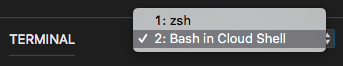

In this exercise, you run an Ansible playbook that configures user accounts on Linux VMs running on Azure. By the end, you'll have two Linux VMs that are configured in the exact same way.

During the process, you:

> [!div class="checklist"]
> * Run an ad-hoc configuration command and then a more complete configuration that's defined in a playbook.

TODO: You create files locally because you'll use them later in Azure Pipelines. Here, you create them locally and them upload them to Cloud Shell so that you can run Ansible.

## Create the Ansible configuration file

Ansible reads configuration settings from *~/ansible.cfg*. Here, you add settings that:

* Hide warnings that you don't need to understand yet.
* Disables host key checking so that you're not prompted to verify the authenticity of your servers.

1. In VS Code, select **New File** from the files pane. Name the file *ansible.cfg*.

1. Add these contents to *ansible.cfg* and then save the file:

    ```ini
    [defaults]
    deprecation_warnings = False
    host_key_checking = False
    ```

### Create the inventory file

Here, you specify your machine inventory. Recall that the _inventory_ is a list of managed nodes. You typically describe your inventory in an *.ini* file or a YAML file.

For your VM deployment on Azure, you *could* define each VM and its IP address, similar to this:

```yml
hosts:
  vm1:
    ansible_host: 13.79.22.89
  vm2:
    ansible_host: 40.87.135.194
```

If these IP addresses change, or if you add or remove systems, you would need to update this inventory file over time.

A more flexible approach is to use a _dynamic inventory_. A dynamic inventory enables Ansible to discover which systems to configure at run time.

The format of the dynamic inventory file depends on your environment. Ansible provides inventory plugins for Azure and other cloud providers, as well as environments such as Docker, Kubernetes, and VMware.

Here's the dynamic inventory file you're going to use:

```yml
plugin: azure_rm
include_vm_resource_groups:
- learn-ansible-rg
auth_source: auto
keyed_groups:
- prefix: tag
  key: tags
```

TODO: keyed_groups is wrong. Fix it or remove it.

Here's what each part means:

* `plugin` tells Ansible that the inventory is stored on Azure.
* `include_vm_resource_groups` specifies the list of resource groups to search for virtual machines.
* `auth_source` specifies how to authenticate with Azure. Here, we specify `auto` to use Ansible's default precedence for authenticating with Azure. You can configure Ansible to authenticate by using an Azure CLI profile, environment variables, or a credentials file.
* `keyed_groups` specifies filters Ansible should use to select which virtual machines to configure. This configuration filters VMs by tag name. When you run Ansible, you specify which tags to include. You can filter by other tags as well, such as a VMs location in Azure.

1. In VS Code, select **New File** from the files pane. Name the file *azure_rm.yml*.

1. Add these contents to *azure_rm.yml* and then save the file:

    ```yml
    plugin: azure_rm
    include_vm_resource_groups:
    - learn-ansible-rg
    auth_source: auto
    keyed_groups:
    - prefix: tag
      key: tags
    ```

    > [!NOTE] When using a dynamic inventory with Azure, this file must end with the name *azure_rm.yml* or *azure_rm.yaml*.

## Upload files to Cloud Shell

TODO: Uploaded to home dir

1. In VS Code, select <kbd>F1</kbd> or select **View > Command Palette** to access the command palette.
1. In the command palette, enter *Azure: Upload to Cloud Shell*.
1. Select *ansible.cfg*.
1. Repeat the process to upload *azure_rm.yml*.

## Verify the files in Cloud Shell

1. In VS Code, switch from your Bash session to your Cloud Shell session. To do so, select **Bash in Cloud Shell** in the terminal.

    

1. Run the following `ls` command to verify that your Ansible inventory and your Ansible configuration were successfully uploaded to Cloud Shell:

    ```bash
    ls azure_rm.yml ansible.cfg
    ```

1. Run the following `ansible-config` command to verify your settings:

    ```bash
    ansible-config view
    ```

    You see this:

    ```output
    [defaults]
    deprecation_warnings = False
    host_key_checking = False
    ```

1. Run the following `ansible-inventory` command to verify that Ansible can discover your inventory.

    ```bash
    ansible-inventory --inventory azure_rm.yml --graph
    ```

    Your output resembles this:

    ```output
    @all:
      |--@tag_Ansible_mslearn:
      |  |--vm1_1bbf
      |  |--vm2_867a
      |--@ungrouped:
    ```

## Run the ping module on your VMs

Although you typically write _playbooks_ to express your desired configurations, you can also run Ansible modules directly.

To verify that Ansible can apply configuration changes to your inventory, here you run the `ping` module directly to ensure that your VMs are discoverable and that Ansible can connect to each VM.

Unlike what the name suggests, the `ping` module doesn't connect over ICMP. Rather, it connects over SSH just like every other Ansible module. Think of this module as a way to verify that Ansible can connect and that Python is correctly installed on each node. You typically wouldn't use this module in a playbook.

To run the `ping` module directly, run this `ansible` command:

```bash
ansible \
  --inventory azure_rm.yml \
  --user azureuser \
  --private-key ~/.ssh/ansible_rsa \
  --module-name ping \
  tag_Ansible_mslearn
```

The `tag_Ansible_mslearn` argument relates to the `keyed_groups` section in your inventory file. It ensures that the `ping` module is run only on the VMs that are tagged in your resource group.

Recall that when you created your VMs, you provided the `--tags Ansible=mslearn` to create a tag named "Ansible" whose value is "mslearn". In the `tag_Ansible_mslearn` argument:

* `tag` maps to the feature you're grouping by.
* `Ansible` maps to the tag name.
* `mslearn` maps to the tag's value.

You see this JSON output:

```json
vm2_867a | SUCCESS => {
    "ansible_facts": {
        "discovered_interpreter_python": "/usr/bin/python"
    },
    "changed": false,
    "ping": "pong"
}
vm1_1bbf | SUCCESS => {
    "ansible_facts": {
        "discovered_interpreter_python": "/usr/bin/python"
    },
    "changed": false,
    "ping": "pong"
}
```

You see "SUCCESS" as well as "pong" in the output, which tell you that the command succeeded.

TODO: Talk about how Ansible requires Python on the node; `discovered_interpreter_python` shows the path where Python is found.

Keep your Cloud Shell session in VS Code open for the next exercise.