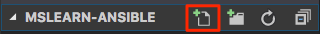
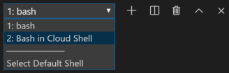

In this exercise, you create an Ansible configuration file and the inventory file. Then you run an Ansible module that verifies that Ansible can connect to your VMs.

You start by creating these files locally. You then upload the files to Azure Cloud Shell so that you can run Ansible. By storing these files locally, you build out a Git repository that you later push to GitHub and then connect to Azure Pipelines.

## Create the Ansible configuration file

Ansible reads configuration settings from *~/ansible.cfg*. Here, you add settings that:

* Hide warnings that you don't yet need to understand.
* Disable host key checking, so that you're not prompted to verify the authenticity of your servers.

1. In Visual Studio Code, select **New File** from the files pane. Name the file *ansible.cfg*.

    

1. Add these contents to *ansible.cfg*, and then save the file:

    ```ini
    [defaults]
    deprecation_warnings = False
    host_key_checking = False
    ```

## Create the inventory file

Specify your machine inventory. Recall that the inventory specifies the list of nodes under management. In this module, you define a dynamic inventory to enable Ansible to discover your nodes at runtime.

1. In Visual Studio Code, select **New File** from the files pane. Name the file *azure_rm.yml*.

    

1. Add these contents to *azure_rm.yml*, and then save the file:

    ```yml
    plugin: azure_rm
    include_vm_resource_groups:
    - learn-ansible-rg
    auth_source: auto
    keyed_groups:
    - prefix: tag
      key: tags
    ```

    > [!NOTE]
    > When using a dynamic inventory with Azure, you must ensure that this file ends with the name *azure_rm.yml* or *azure_rm.yaml*.

## Upload files to Cloud Shell

Upload your Ansible configuration file and your inventory file to the home directory in Cloud Shell.

Remember that we use Cloud Shell in this module because it comes with Ansible already set up for you.

1. In Visual Studio Code, select <kbd>F1</kbd> or select **View** > **Command Palette** to access the command palette.
1. In the command palette, enter *Azure: Upload to Cloud Shell*.
1. Select *ansible.cfg*.
1. Repeat the process to upload *azure_rm.yml*.

## Verify the files in Cloud Shell

1. In Visual Studio Code, switch from your Bash session to your Cloud Shell session. To do so, select **Bash in Cloud Shell** in the terminal.

    

1. Run the following `ls` command to verify that your Ansible configuration file and your inventory file were successfully uploaded to Cloud Shell:

    ```bash
    ls azure_rm.yml ansible.cfg
    ```

    You see both files listed.

1. Run the following `ansible-config` command to verify your configuration settings:

    ```bash
    ansible-config view
    ```

    You see this:

    ```output
    [defaults]
    deprecation_warnings = False
    host_key_checking = False
    ```

1. Run the following `ansible-inventory` command to verify that Ansible can discover your inventory.

    ```bash
    ansible-inventory --inventory azure_rm.yml --graph
    ```

    Your output resembles this:

    ```output
    @all:
      |--@tag_Ansible_mslearn:
      |  |--vm1_1bbf
      |  |--vm2_867a
      |--@ungrouped:
    ```

## Run the ping module on your VMs

Although you typically write _playbooks_ to express your desired configurations, you can also run Ansible modules directly.

To verify that Ansible can apply configuration changes to your inventory, run the `ping` module directly. This ensures that your VMs are discoverable and that Ansible can connect to each VM.

Unlike what the name suggests, the `ping` module doesn't connect over the ICMP protocol. Rather, it connects over SSH, just like every other Ansible module. Think of the `ping` module as a way to verify that Ansible can connect, and that Python is correctly installed on each node. You don't typically use this module in a playbook.

To run the `ping` module directly, run this `ansible` command from Cloud Shell:

```bash
ansible \
  --inventory azure_rm.yml \
  --user azureuser \
  --private-key ~/.ssh/ansible_rsa \
  --module-name ping \
  tag_Ansible_mslearn
```

The `tag_Ansible_mslearn` argument relates to the `keyed_groups` section in your inventory file. Recall that when you created your VMs, you provided the `--tags Ansible=mslearn` argument, to create a tag named "Ansible" whose value is "mslearn". In the `tag_Ansible_mslearn` argument:

* `tag` maps to the feature you're grouping by. Here, you're grouping by resource tag.
* `Ansible` maps to the tag name.
* `mslearn` maps to the tag's value.

You see this JSON output:

```json
vm2_867a | SUCCESS => {
    "ansible_facts": {
        "discovered_interpreter_python": "/usr/bin/python"
    },
    "changed": false,
    "ping": "pong"
}
vm1_1bbf | SUCCESS => {
    "ansible_facts": {
        "discovered_interpreter_python": "/usr/bin/python"
    },
    "changed": false,
    "ping": "pong"
}
```

You see "SUCCESS" and "pong" in the output, which tell you that the command succeeded.

The `discovered_interpreter_python` part shows the path where Python is found on each node. The Ubuntu image on Azure comes with Python installed. If Python were not to be installed, you'd see an error message that reminds you to install Python on each node.

Your Cloud Shell session is all set up to run Ansible on your VMs. Keep your Cloud Shell session in Visual Studio Code open for the next exercise.
