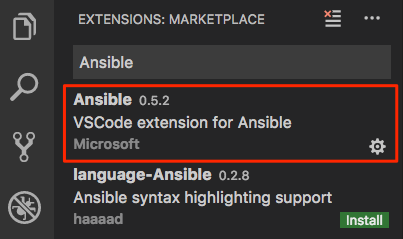
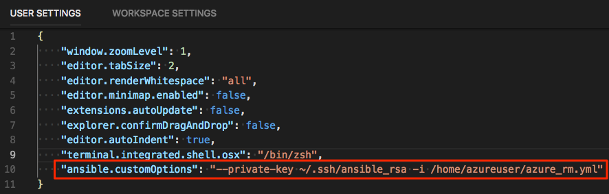

In this exercise, you set up a control machine and run your Ansible playbook from the control machine. You run the playbook on the control machine by using a Visual Studio Code extension.

In the last part, you ran Ansible commands from Azure Cloud Shell, to get a sense for how Ansible works.

But in practice, you typically use a _control machine_ to manage your systems. A control machine includes the Ansible software, Python, your inventory file, and the playbooks you need to run.

You can set up a control machine manually, either in the cloud or in your datacenter. If you need multiple control machines, you can create an image that has everything configured.

You can set up a control machine on most popular Linux distributions. Here, you create a control machine VM on CentOS and install the required software by running the Custom Script Extension. Recall that the Custom Script Extension is a way to download and run scripts on your Azure VMs. You can run the extension when you create a VM, or any time after the VM is in use.

To enable the VM to authenticate with Azure, you create a service principal. A _service principal_ is an identity with a limited role that can access Azure resources. Think of a service principal as a service account that can perform automated tasks on your behalf. You create a service principal in Cloud Shell, and then add details about your service principal to a credentials file that you upload to your control machine.

## Create a service principal

Here, you create the service principal. During the process, you collect information about your service principal that you add to a credentials file, named *credentials*.

A service principal's name must be unique across Azure. Here, you use a random number to make your service principal's name unique. In practice, you'd give your service principal a name that reflects the purpose of the application or service that you're building.

1. In Visual Studio Code, go to your Cloud Shell session.
1. Create a unique identifier.

    ```bash
    UNIQUE_ID=$RANDOM
    ```

1. Run the following `az account list` to get your Azure subscription ID, and save it as a Bash variable named `ARM_SUBSCRIPTION_ID`.

    ```azurecli
    ARM_SUBSCRIPTION_ID=$(az account list \
      --query "[?isDefault][id]" \
      --all \
      --output tsv)
    ```

1. Run the following `az ad sp create-for-rbac` command to create a service principal.

    ```azurecli
    ARM_CLIENT_SECRET=$(az ad sp create-for-rbac \
      --name http://ansible-sp-$UNIQUE_ID \
      --role Contributor \
      --scopes "/subscriptions/$ARM_SUBSCRIPTION_ID" \
      --query password \
      --output tsv)
    ```

    The service principal's name begins with "http://ansible-sp-", and ends with your unique ID.

    **Contributor** is the default role for a service principal. This role has full permissions to read and write to an Azure subscription.

    The output from this command is your only opportunity to retrieve the generated password for the service principal. The `--query` argument reads the password field from the output. The output is assigned to the Bash variable named `ARM_CLIENT_SECRET`.

1. Run the following `az ad sp show` command to get your service principal's client ID, and assign the result to a Bash variable named `ARM_CLIENT_ID`.

    ```azurecli
    ARM_CLIENT_ID=$(az ad sp show \
      --id http://ansible-sp-$UNIQUE_ID \
      --query appId \
      --output tsv)
    ```

1. Run the following `az ad sp show` command to get your service principal's tenant ID, and assign the result to a Bash variable named `ARM_TENANT_ID`.

    ```azurecli
    ARM_TENANT_ID=$(az ad sp show \
      --id http://ansible-sp-$UNIQUE_ID \
      --query appOwnerTenantId \
      --output tsv)
    ```

1. Run the following `az ad sp list` command to list the service principals in your Azure subscription.

    ```azurecli
    az ad sp list --show-mine --query [].servicePrincipalNames
    ```

    Your SP name begins with **http://ansible-sp-**, and ends with your unique ID. Here's an example:

    ```json
    [
      [
        "http://ansible-sp-24382",
        "961badb1-8005-45ae-89da-c1583f58ead5"
      ]
    ]
    ```

    Save your name somewhere safe for later.

1. Print each of the Bash variables you collected in this part to verify their contents.

    ```bash
    echo $ARM_SUBSCRIPTION_ID
    echo $ARM_CLIENT_SECRET
    echo $ARM_CLIENT_ID
    echo $ARM_TENANT_ID
    ```

    Each value is a GUID or a long series of letters and numbers.

    Store these values somewhere safe for later.

1. Run the following `echo` and `tee` commands to create a credentials file that contains information about your service principal.

    ```bash
    echo "\
    [default]
    subscription_id=$ARM_SUBSCRIPTION_ID
    client_id=$ARM_CLIENT_ID
    secret=$ARM_CLIENT_SECRET
    tenant=$ARM_TENANT_ID" | tee credentials
    ```

1. Print out the credentials file to verify its contents.

    ```bash
    cat credentials
    ```

    Your output resembles this:

    ```output
    [default]
    subscription_id=00000000-1111-0000-0000-000000000000
    client_id=00000000-2222-0000-0000-000000000000
    secret=00000000-3333-0000-0000-000000000000
    tenant=00000000-4444-0000-0000-000000000000
    ```

## Create the control machine

Create the control machine by creating a CentOS VM on Azure and then running the Custom Script Extension on that VM. The Custom Script Extension runs a Bash script that we provide for you on GitHub.

1. In Visual Studio Code, go to your Cloud Shell session.
1. Run the following `az group create` command to create a resource group that's named **learn-ansible-control-machine-rg**.

    ```azurecli
    az group create --name learn-ansible-control-machine-rg
    ```

    Recall that your inventory file specifies that each VM in the `learn-ansible-rg` resource group belongs to the inventory. In the next step, you'll bring up your control machine under this new resource group so that the control machine doesn't configure itself when it runs Ansible on your inventory.

1. Run the following `az vm create` command to create a CentOS VM:

    ```azurecli
    az vm create \
     --resource-group learn-ansible-control-machine-rg \
     --name ansiblehost \
     --admin-username azureuser \
     --image OpenLogic:CentOS:7.7:latest \
     --ssh-key-values ~/.ssh/ansible_rsa.pub
    ```

    Just like when you set up your Ubuntu VMs to manage, the `--ssh-key-values` argument specifies your SSH public key. The VM stores this file. Later, you use the private key to connect.

1. Run the following `az vm extension set` command to run the Custom Script Extension. The script configures Ansible on your VM.

    ```azurecli
    az vm extension set \
      --resource-group learn-ansible-control-machine-rg \
      --vm-name ansiblehost \
      --name customScript \
      --publisher Microsoft.Azure.Extensions \
      --version 2.1 \
      --settings '{"fileUris":["https://raw.githubusercontent.com/MicrosoftDocs/mslearn-ansible-control-machine/master/configure-ansible-centos.sh"]}' \
      --protected-settings '{"commandToExecute": "./configure-ansible-centos.sh"}'
    ```

    The command can take a few minutes to run. While the command runs, you can [examine the Bash script](https://raw.githubusercontent.com/MicrosoftDocs/mslearn-ansible-control-machine/master/configure-ansible-centos.sh?azure-portal=true) from a separate browser tab if you'd like.

1. Run the following command to store your VM's public IP address in a Bash variable:

    ```azurecli
    IPADDRESS=$(az vm list-ip-addresses \
      --resource-group learn-ansible-control-machine-rg \
      --name ansiblehost \
      --query [0].virtualMachine.network.publicIpAddresses[0].ipAddress \
      --output tsv)
    ```

1. Run the following command to verify that Ansible is configured.

    ```bash
    ssh -i ~/.ssh/ansible_rsa -o StrictHostKeyChecking=no \
      azureuser@$IPADDRESS "which ansible"
    ```

    The `which ansible` command prints the path to the `ansible` executable file on your VM. You see this:

    ```output
    /usr/local/bin/ansible
    ```

## Get your control machine's public IP address

Earlier, you saved your control machine's public IP address to a Bash variable. Print this variable and save the output somewhere for later.

```bash
echo $IPADDRESS
```

## Copy files to your control machine

Copy the following information from your Cloud Shell session to your control machine:

* Your SSH private key, *ansible_rsa*. This enables your control machine to connect to your VMs under management.
* Your credentials file that provides details about your service principal.
* Your Ansible configuration file, *ansible.cfg*.
* Your Ansible inventory file, *azure_rm.yml*.
* Your Ansible playbook, *users.yml*.

1. In Cloud Shell, run this `ssh` command to create a directory named *.azure* in the home directory on your control machine:

    ```bash
    ssh -i ~/.ssh/ansible_rsa -o StrictHostKeyChecking=no \
      azureuser@$IPADDRESS 'mkdir -p /home/azureuser/.azure'
    ```

    You need this directory to hold your credentials file.

1. Run the following `scp` commands to copy the files listed earlier to your control machine:

    ```bash
    scp -i ~/.ssh/ansible_rsa -o StrictHostKeyChecking=no \
      ~/.ssh/ansible_rsa \
      azureuser@$IPADDRESS:/home/azureuser/.ssh

    scp -i ~/.ssh/ansible_rsa -o StrictHostKeyChecking=no \
      ~/credentials \
      azureuser@$IPADDRESS:/home/azureuser/.azure

    scp -i ~/.ssh/ansible_rsa -o StrictHostKeyChecking=no \
      ~/ansible.cfg \
      azureuser@$IPADDRESS:/home/azureuser

    scp -i ~/.ssh/ansible_rsa -o StrictHostKeyChecking=no \
      ~/azure_rm.yml \
      azureuser@$IPADDRESS:/home/azureuser

    scp -i ~/.ssh/ansible_rsa -o StrictHostKeyChecking=no \
      ~/users.yml \
      azureuser@$IPADDRESS:/home/azureuser
    ```

## Install the Ansible extension in Visual Studio Code

This extension enables you to run your Ansible playbook on your control machine from Visual Studio Code.

The Ansible extension isn't installed by default in Visual Studio Code. Let's start by installing it:

1. In Visual Studio Code, on the **View** menu, select **Extensions**.
1. In the **Search Extensions in Marketplace** text box, enter *Ansible*, and then select the **Ansible** extension.

    

1. Select **Install**.
1. Select **Reload** to activate the extension.

## Run Ansible from your control machine

Run Ansible from your control machine by using the Ansible extension in Visual Studio Code.

You run the Ansible extension from the command palette. The process prompts you for information, such as the playbook you want to run and your control machine's hostname.

### Specify additional options in your user settings

Before you run the extension, there are a few additional options that you need to specify, including the location of your SSH private key and the path to your inventory file. These options are stored in your Visual Studio Code user settings. Here's how to set that up:

1. In Visual Studio Code, select <kbd>F1</kbd> or select **View** > **Command Palette** to access the command palette.
1. In the command palette, enter *Preferences: Open User Settings*.

    A tab appears that displays your current settings.

1. Under the **User** tab, enter *Ansible: Custom Options* in the search box.
1. Under **Ansible: Custom Options**, enter the following option:

    ```bash
    --private-key ~/.ssh/ansible_rsa -i /home/azureuser/azure_rm.yml
    ```

    Both path names refer to locations on your control machine.

    Your settings resemble this:

    

    Visual Studio Code automatically saves your settings.

### Run Ansible

You're now ready to run Ansible from your control machine. To do that:

1. In Visual Studio Code, select **File** > **New File**. Then add these contents:

    ```json
    [
      {
        "host": "your host",
        "port": 22,
        "user": "azureuser",
        "key": "your private key"
      }
    ]
    ```

1. Replace `your host` with your Ansible control machine's public IP address, such as *40.113.7.63*.
1. Replace `your private key` with the full path to your SSH private key file, *ansible_rsa*, on your local computer.

    An easy way to get the full path is to run this command from your local Bash session:

    ```bash
    echo ~/.ssh/ansible_rsa
    ```

1. Save the file as *~/.ssh/servers.json*.

    Here's an example of the complete file:

    ```json
    [
      {
        "host": "40.113.7.63",
        "port": 22,
        "user": "azureuser",
        "key": "/Users/jane/.ssh/ansible_rsa"
      }
    ]
    ```

1. In Visual Studio Code, open your playbook file, *users.yml*.
1. Select <kbd>F1</kbd> or select **View** > **Command Palette** to access the command palette.
1. In the command palette, enter *Ansible: Run Ansible Playbook Remotely via ssh*.
1. When prompted, specify:

    * The full path to your playbook file, *users.yml*.
    * Your control machine's IP address, such as *40.113.7.63*.

    > [!NOTE]
    > In Visual Studio Code, if you see a prompt that asks "Copy workspace to remote host?", select **no, not show this again**.

    From the output, you see that the run succeeded, but Ansible made no changes to your VMs.

    ```output
    PLAY RECAP *********************************************************************************************************************************************************************************************
    vm1_1bbf                   : ok=2    changed=0    unreachable=0    failed=0    skipped=0    rescued=0    ignored=0
    vm2_867a                   : ok=2    changed=0    unreachable=0    failed=0    skipped=0    rescued=0    ignored=0
    ```

     This is expected. Earlier, you ran the same Ansible playbook on your VMs from Cloud Shell. The user accounts are already present on your VMs.