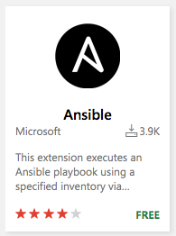
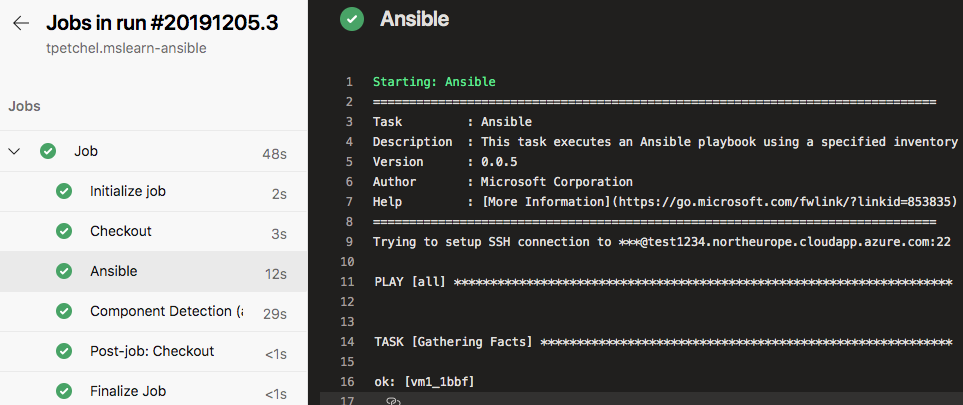
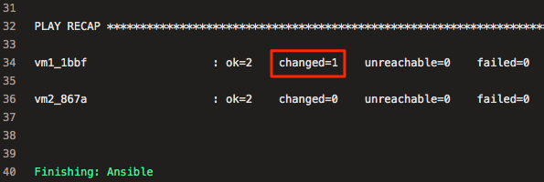

In this part, you run your Ansible playbook in Azure Pipelines. You configure the pipeline to run Ansible from your control machine, on the same Linux VMs that you set up earlier.

To do so, you:

> [!div class="checklist"]
> * Create a repository on GitHub, and then push your local Git repository to GitHub.
> * Create the project in Azure DevOps.
> * Create a service connection that enables Azure Pipelines to access your Azure subscription.
> * Install the Ansible extension for Azure Pipelines.
> * Create the pipeline in Azure Pipelines, and add a task that runs Ansible from your control machine.
> * Remove a user from one of your VMs, and then manually run the pipeline to see Ansible repair the configuration.

In previous modules, we provide a template that sets up a project in Azure DevOps for you. Here, you set up the project manually because you already have most of the pieces you need to run Ansible in Azure Pipelines.

The Ansible extension for Azure Pipelines provides the `Ansible@0` task, which simplifies the process of connecting to your control machine and running your Ansible playbook.

## Create your repository on GitHub

1. In a web browser, go to [GitHub](https://github.com?azure-portal=true) and sign in.
1. From the **Repositories** pane, select **New**.
1. Under **Repository name**, enter *mslearn-ansible*.
1. Select **Create repository**.

## Push your local Git repository to GitHub

Push your local Git repository to GitHub. To do so, you add a remote that points to your GitHub repository.

1. In Visual Studio Code, go to your Bash session.
1. Add and commit your inventory file, *azure_rm.yml*, and your playbook, *users.yml*, to your repository.

    ```bash
    git add azure_rm.yml users.yml
    git commit -m "Initial"
    ```

1. Add a remote named *origin* that points to your GitHub repository. Replace `<you>` with your GitHub username.

    ```bash
    git remote add origin https://github.com/<you>/mslearn-ansible.git
    ```

1. Push your `master` branch to GitHub.

    ```bash
    git push -u origin master
    ```

1. Refresh your repository on GitHub.

    You see *azure_rm.yml* and *users.yml* listed under your `master` branch.

## Create the project in Azure DevOps

1. Go to [Azure DevOps](https://dev.azure.com?azure-portal=true) and sign in.
1. Select your Azure DevOps organization.
1. Select **New project**.
1. Name your project *Microsoft Learn - Ansible*, and then select **Create**.

## Create a service connection

Create a service connection that enables Azure Pipelines to access your Azure subscription. Azure Pipelines uses this service connection to securely connect to your control machine.

1. In Azure DevOps, go to your **Microsoft Learn - Ansible** project.
1. Select **Project settings** from the bottom corner of the page.
1. Under **Pipelines**, select **Service connections**.
1. Select **Create service connection**, then choose **SSH**, then choose **Next**.

    The **New SSH service connection** dialog box appears.
1. In the dialog box, fill in these fields:

    | Field               | Value |
    |---------------------|-------|
    | **Host name**       | Your control machine's IP address, for example, *40.113.7.63* |
    | **Port number**     | *22* |
    | **Private key**     | The contents of your SSH private key, *ansible_rsa* |
    | **User name**       | *azureuser* |
    | **Password/Passphrase** | (Leave blank) |
    | **Connection name** | *SSH - Ansible VM* |

1. Ensure that **Grant access permission to all pipelines** is selected.
1. Select **OK**.

## Install the Ansible extension for Azure Pipelines

Here, you install an extension that provides access to the `Ansible@0` task in Azure Pipelines.

1. From a new browser tab, go to [marketplace.visualstudio.com](https://marketplace.visualstudio.com?azure-portal=true).
1. On the **Azure DevOps** tab, search for "Ansible."
1. Select the **Ansible** extension.

    
1. Select **Get it free**.
1. Select your Azure DevOps organization.
1. Select **Install**.

## Create the pipeline in Azure Pipelines

During this process, you create your pipeline configuration file, *azure-pipelines.yml*.

1. In Azure DevOps, go to your project.
1. Select **Pipelines**, either from the project page or from the left pane.
1. Select **Create Pipeline**.
1. On the **Connect** tab, select **GitHub**.

    If prompted, enter your GitHub credentials.
1. On the **Select** tab, select your **mslearn-ansible** repository.

    You might be redirected to GitHub to install the Azure Pipelines app. If so, select **Approve and install**.
1. On the **Configure** tab, select **Starter pipeline**.
1. On the **Review** tab, note the starter code for your pipeline configuration. Move your cursor to the bottom of the file.
1. On the **Review** tab, select **Show assistant**.
1. Select **Ansible** from the list of tasks shown. Then fill in these fields:

    * **Ansible location**: **Remote machine**
    * **Ansible SSH endpoint**: **SSH - Ansible VM**
    * **Playbook**:
      * **Source**: **Agent machine**
      * **Root**: *$(System.DefaultWorkingDirectory)*
      * **File path**: *users.yml*
    * **Inventory**:
      * **Inventory location**: **File**
      * **File source**: **Agent machine**
      * **File path**: *azure_rm.yml*
    * **Advanced**:
      * **Additional parameters**: *--private-key ~/.ssh/ansible_rsa*

1. Select **Add**.
1. As an optional step, remove the automatically generated comments and the tasks you don't need.

    Here's what the most basic configuration looks like:

    ```yml
    trigger:
    - master

    pool:
      vmImage: 'ubuntu-latest'

    steps:
    - task: Ansible@0
      inputs:
        ansibleInterface: 'remoteMachine'
        connectionOverSsh: 'SSH - Ansible VM'
        playbookSourceRemoteMachine: 'agentMachine'
        playbookRootRemoteMachine: '$(System.DefaultWorkingDirectory)'
        playbookPathLinkedArtifactOnRemoteMachine: 'users.yml'
        inventoriesRemoteMachine: 'file'
        inventoryFileSourceRemoteMachine: 'agentMachine'
        inventoryFileLinkedArtifactOnRemoteMachine: 'azure_rm.yml'
        args: '--private-key ~/.ssh/ansible_rsa'
    ```

1. Select **Save and run**. Then select **Save and run** again.

## Watch the pipeline run

On the build screen, select the job and trace the pipeline as it runs.

You see that the **Ansible** task runs, and produces the same output as before:



## See Ansible repair the configuration

Here, you remove the *testuser1* user from your VM named *vm1*. You then run the pipeline a second time to see Ansible repair the configuration on the VM.

This process helps you see how Ansible can repair your configuration if it's accidentally changed by an outside person or process.

1. In Visual Studio Code, switch to your Azure Cloud Shell session.
1. Get the IP address of your VM named *vm1*:

    ```azurecli
    IP_ADDRESS=$(az vm list-ip-addresses \
      --resource-group learn-ansible-rg \
      --name vm1 \
      --query [0].virtualMachine.network.publicIpAddresses[0].ipAddress \
      --output tsv)
    ```

1. Verify that the user *testuser1* exists on the VM:

    ```bash
    ssh -i ~/.ssh/ansible_rsa azureuser@$IP_ADDRESS "/usr/bin/getent passwd testuser1"
    ```

1. Remove the user *testuser1* from the VM:

    ```bash
    ssh -i ~/.ssh/ansible_rsa azureuser@$IP_ADDRESS "sudo /usr/sbin/userdel testuser1"
    ```

1. Verify that the user *testuser1* no longer exists on the VM:

    ```bash
    ssh -i ~/.ssh/ansible_rsa azureuser@$IP_ADDRESS "/usr/bin/getent passwd testuser1"
    ```

    You don't see any output, which tells you the user isn't present.

1. Manually run the pipeline. To do so, go to your pipeline in Azure Pipelines, and select **Run pipeline**. Make sure **master** is the selected branch, and then select **Run**.

    You see that the user is added again to the VM:

    

    Ansible doesn't make configuration changes to *vm2*, because you removed *testuser1* only from the first VM, *vm1*.

    As an optional step, return to Cloud Shell and verify that the user *testuser1* exists on *vm1*.
