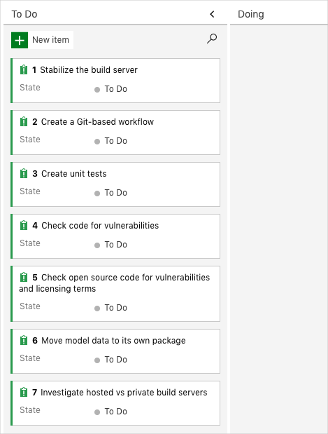
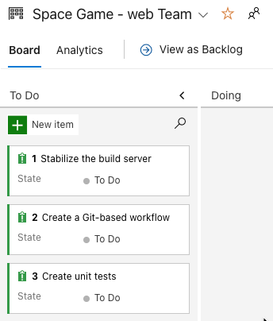

In the [Evolve your DevOps practices](/learn/paths/evolve-your-devops-practices?azure-portal=true) learning path, you helped the Tailspin team start their DevOps journey by evaluating their current processes and technologies, and then planning their initial set of tasks on Azure Boards.

In this module, you help the team with their first task: setting up a continuous integration (CI) pipeline for their app.

The Tailspin web team is being pulled in many directions. Andy, the lead dev, is running from one meeting to another and never has any time. Amita, the QA person, is helping a tester on another team. Tim, who's in Ops, is upgrading his servers and hasn't been seen for days. Mara's dream of a true DevOps team is stalled (again).

But she isn't giving up. She remembers that she and the team used Azure Boards to create a backlog of issues with the build process:

She also remembers that they picked three of the issues to fix within the next two weeks. (Of course, everyone else has forgotten about them.)

Mara decides to take an initial pass on the biggest issue, **Stabilize the build server**, herself. She won't try to fix everything. Instead, she's going to see if she can use Microsoft Azure Pipelines to replicate the current build process. She's convinced that Azure Pipelines provides enough benefits to improve the process. If she's right, she'll show her version to the team to see if she can make them more enthusiastic.

## Learning objectives

In this module, you will:

- Create a build pipeline in Azure Pipelines.
- Map the manual build steps to automated build tasks.
- Publish your builds so others can access them.
- Use templates to build multiple configurations.

## Prerequisites

The modules in this learning path and previous learning path form a progression.

To follow the progression from the beginning, be sure to first complete the [Evolve your DevOps practices](/learn/paths/evolve-your-devops-practices?azure-portal=true) learning path.

If you want to start with this learning path, you need to set up a development environment on your Windows, macOS, or Linux system. You need:

* An [Azure DevOps organization](https://dev.azure.com?azure-portal=true)
* A [GitHub](https://github.com/join?azure-portal=true) account
* [Visual Studio Code](https://code.visualstudio.com?azure-portal=true)
* [.NET Core 3.1 SDK](https://dotnet.microsoft.com/download/dotnet-core/3.1?azure-portal=true)
* [Git](https://git-scm.com/downloads?azure-portal=true)

If your company's policy doesn't allow you to create an Azure DevOps organization, you can create your own personal account. You can get started with Azure DevOps for free.

This environment lets you complete the exercises in this and future modules. You can also use it to apply your new skills to your own projects.

[!include]

## Meet the team

You met the *Space Game* web team at Tailspin Toys in previous modules. As a refresher, here's who you'll work with in this module:

:::row:::

[!include]

[!include]

[!include]

:::row-end:::

Mara has prior experience with DevOps, and is helping the team adopt a more streamlined process by using Microsoft Azure DevOps.