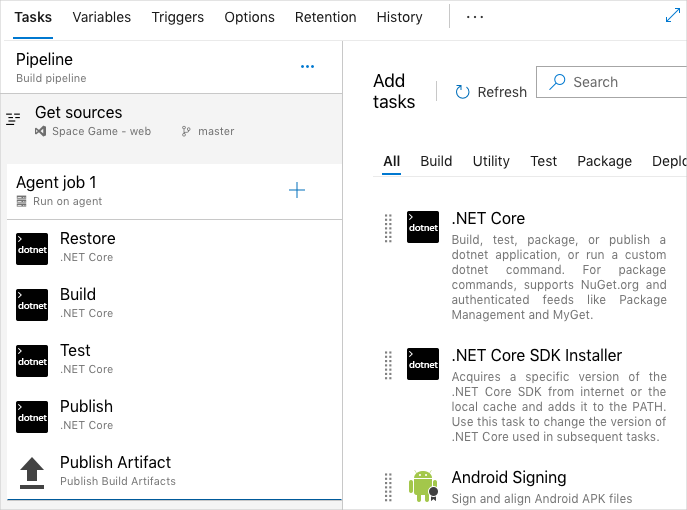

Mara now has a copy of the *Space Game* code on her local machine. She's going to build it by using Microsoft Azure Pipelines instead of the existing Ubuntu 18.04 build server. Before she can do that, she needs to think about the existing build scripts. Follow along as she maps the existing scripts to Azure Pipelines tasks. Think about how you can do the same with your own build process.

Here are some notes that Mara collected when she talked to Andy, the dev lead:

* The build machine is running Ubuntu 18.04.
* The build machine includes build tools like:
  * npm, the package manager for Node.js.
  * NuGet, the package manager for .NET.
  * .NET Core SDK.
* The project uses Sass to make it easier to author cascading style sheets (CSS) files.
* The project uses gulp to minify JavaScript and CSS files.

A minified asset excludes unneeded data like whitespace and shortens variable names to help it download faster.

Here are the steps that happen during the build process:

1. To install the Node.js packages defined in `package.json`, run `npm install`.
1. To convert Sass (.scss) files to CSS (.css) files, run `node-sass`.
1. To minify JavaScript and CSS files, run `gulp`.
1. To help the QA team identify the build number and date, print build info to the `wwwroot` directory.
1. To install the project's dependencies, run `dotnet restore`.
1. To build the app under both Debug and Release configurationsRun `dotnet build`.
1. To package the application as a .zip file and copy the results to a network share for the QA team to pick up, run `dotnet publish`.

Mara builds a shell script that performs the tasks she's identified. She runs it on her laptop.

> [!NOTE]
> You don't need to run this script or completely understand what it does. It's here to illustrate what a typical build script might do.

```bash
#!/bin/bash

# Install Node.js modules as defined in package.json.
npm install --quiet

# Compile Sass (.scss) files to standard CSS (.css).
node-sass Tailspin.SpaceGame.Web/wwwroot

# Minify JavaScript and CSS files.
gulp

# Print the date to wwwroot/buildinfo.txt.
echo `date` > Tailspin.SpaceGame.Web/wwwroot/buildinfo.txt

# Install the latest .NET packages the app depends on.
dotnet restore

# Build the app under the Debug configuration.
dotnet build --configuration Debug

# Publish the build to the /tmp directory.
dotnet publish --no-build --configuration Debug --output /tmp/Debug

# Build the app under the Release configuration.
dotnet build --configuration Release

# Publish the build to the /tmp directory.
dotnet publish --no-build --configuration Release --output /tmp/Release
```

The `/tmp` directory mimics the team's network share.

After she runs the script, Mara realizes that it's incomplete. For example, it doesn't deal with errors. It doesn't notify anyone if build errors occur. Even when there are errors, it keeps running. It also doesn't install the tools each step requires.

## What are Azure Pipelines tasks?

In Azure Pipelines, a _task_ is a packaged script or procedure that's been abstracted with a set of inputs.

An Azure Pipelines task abstracts away the underlying details. This abstraction makes it easier to run common build functions, like downloading build tools or packages your app depends on, or to build your project, running Visual Studio or Xcode.

To build a C# project that targets .NET Core, here's an example that uses the `DotNetCoreCLI@2` task.

```yml
task: DotNetCoreCLI@2
  displayName: 'Build the project'
  inputs:
    command: 'build'
    arguments: '--no-restore --configuration Release'
    projects: '**/*.csproj'
```

The pipeline might translate this task to this command:

```bash
dotnet build MyProject.csproj --no-restore --configuration Release
```

Let's break this task down a bit more:

* The `DotNetCoreCLI@2` task maps to the `dotnet` command.
* `displayName` defines the task name that's shown in the user interface. You'll see this in action soon.
* `inputs` defines arguments that are passed to the command.
  * `command` specifies to run the `dotnet build` subcommand.
  * `arguments` specifies additional arguments to pass to the command.
  * `projects` specifies which projects to build. This example uses the wildcard pattern `**/*.csproj`.
    Both `**` and `*.csproj` are examples of what are called *glob patterns*.
    The `**` part specifies to search the current directory and all child directories. The `*.csproj` part specifies any .csproj file.
    Wildcards let you act on multiple files without specifying each one. If you need to act on a specific file only, you can specify that file instead of using wildcards.

The "@" in the task name, for example `DotNetCoreCLI@2`, refers to the task's version. As new task versions become available, you can gradually migrate to the latest version to take advantage of new features.

## How are tasks used in a pipeline?

Next, Mara's going to map the existing script commands to Azure Pipelines tasks.

Mara can use one of two methods to configure her pipeline:

* The visual designer. Here, you drag tasks onto a form, and then configure each task to do exactly what you need.

    

* A YAML file. YAML is a compact format that makes it easy to structure the kind of data that's in configuration files. You typically maintain this YAML file directly with your app's source code.

Mara considers her options. She's used YAML previously to define similar build tasks and configurations. And she likes the idea of maintaining the build definition as code, just as she would any other part of her project.

_Pipeline as code_ refers to the concept of expressing your build definitions as code. In this short video, Abel explains the concept of pipeline as code.

**Ask Abel**

> [!VIDEO https://channel9.msdn.com/Blogs/One-Dev-Minute/What-is-Pipeline-as-Code--One-Dev-Question/player?format=ny]

To define her build, Mara chooses to use Visual Studio Code to create a YAML file. In it, she enters all the Azure Pipelines tasks that she'll use to replace the existing script commands.

> [!NOTE]
> The underlying process that Azure Pipelines uses is the same whether you use the visual designer or a YAML file. The difference is mainly in how you define your pipeline tasks.

## Map script commands to Azure Pipelines tasks

Now, you'll follow along as Mara maps commands from her script to Azure Pipelines tasks.

To map each command, Mara refers to the [reference documentation](https://docs.microsoft.com/azure/devops/pipelines/tasks/?view=azure-devops&azure-portal=true). The documentation categorizes tasks by function, like build or deploy.

For example, the [.NET Core task](https://docs.microsoft.com/azure/devops/pipelines/tasks/build/dotnet-core?view=azure-devops&azure-portal=true), `DotNetCoreCLI@2`, helps you run `dotnet` commands.

This table associates the script commands with the new Azure Pipelines tasks:

| Script command   | Azure Pipelines task |
|------------------|----------------------|
| `npm install`    | `Npm@1`              |
| `node-sass`      | `CmdLine@2`          |
| `gulp`           | `gulp@1`             |
| ``echo `date` `` | `CmdLine@2`          |
| `dotnet restore` | `DotNetCoreCLI@2`    |
| `dotnet build`   | `DotNetCoreCLI@2`    |
| `dotnet publish` | `DotNetCoreCLI@2`    |

There's no built-in task type that runs node-Sass or prints the date to a file. For those, Mara uses the `CmdLine@2` task, which lets her run any command that she wants.

More commonly, you'll see the `script` task, which is a shortcut for `CmdLine@2`. So Mara updates her table like this:

| Script command   | Azure Pipelines task |
|------------------|----------------------|
| `npm install`    | `Npm@1`              |
| `node-sass`      | `script`             |
| `gulp`           | `gulp@1`             |
| ``echo `date` `` | `script`             |
| `dotnet restore` | `DotNetCoreCLI@2`    |
| `dotnet build`   | `DotNetCoreCLI@2`    |
| `dotnet publish` | `DotNetCoreCLI@2`    |

You'll soon create a YAML file of your own that uses these tasks.