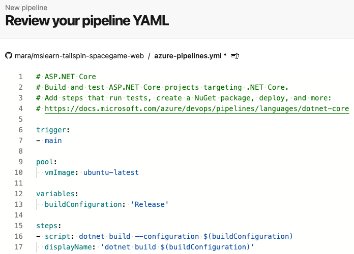
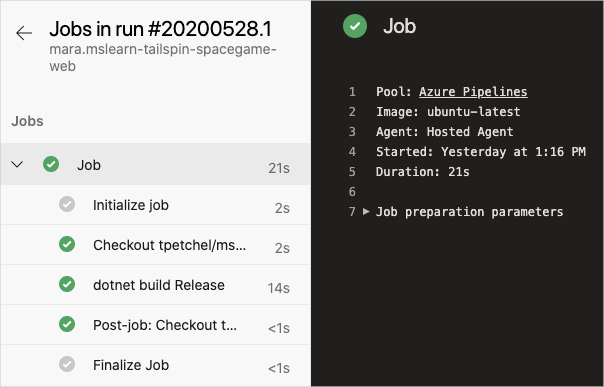
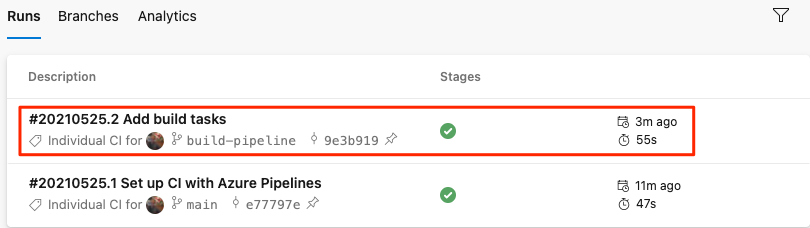
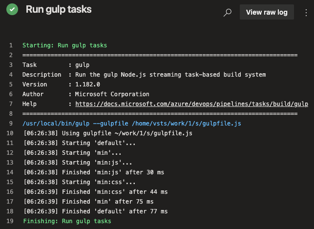
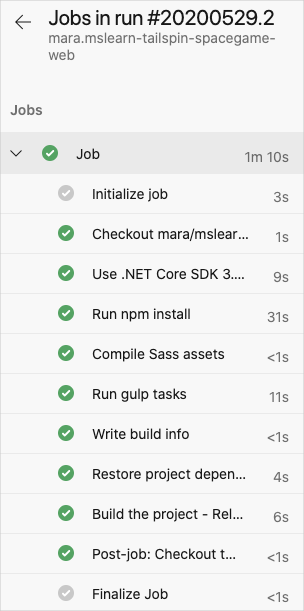
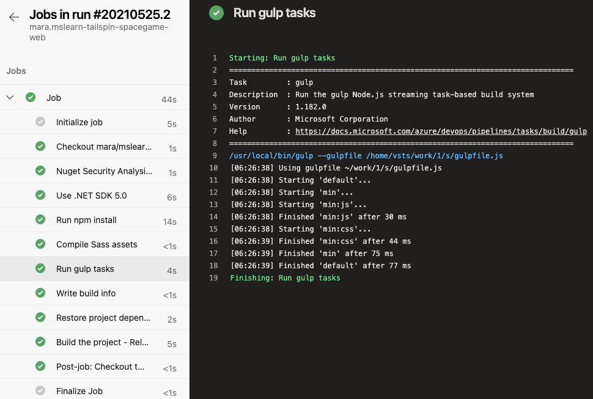

At this point, Mara has defined a build configuration for the *Space Game* website. Now it's your turn. You're going to create a pipeline and produce your first build artifact.

As you saw, Mara uses a YAML file to define the build. When you create a pipeline, the process prompts you for your YAML file. The project doesn't have this file yet.

When you don't provide an initial YAML file for your project, Azure Pipelines can create one for you based on your app type. Here, you build an ASP.NET Core app, but Azure Pipelines provides starter build configurations for other project types as well, including Java, Go, and more.

## Create the pipeline

1. In Azure DevOps, go to your project.

1. Either from the project page or from the left pane, select **Pipelines**.

1. Select **Create Pipeline**.

1. On the **Connect** tab, select **GitHub**.

    When prompted, enter your GitHub credentials.

1. On the **Select** tab, select your **mslearn-tailspin-spacegame-web** repository.

1. To install the Azure Pipelines app, you might be redirected to GitHub. If so, scroll to the bottom, and select **Approve and install**.

1. On the **Configure** tab, select **ASP.NET Core**.

    > [!NOTE]
    > If you don't see this option, select **Show more**. Don't select **ASP.NET Core (.NET Framework)**.

1. On the **Review** tab, note the initial build configuration.

    

    This is a very basic configuration that Azure DevOps provides for you based on your app type, ASP.NET Core. 

1. On the **Review** tab, select **Save and run**. Next, to commit your changes to GitHub and start the build, select **Save and run** a second time.

## Watch the pipeline run

Under **Jobs**, select **Job**. Next, trace the build process through each of the steps. Optionally, when the build completes, to see the job output as a text file, select **View raw log**.

Here, you see the steps that the build definition created. It prepares the VM, fetches the latest source code from GitHub, and then builds the app.



This configuration is a great start because now you have a place to add build tasks. However, it needs to be updated to meet the needs of the Tailspin team, such as to minify JavaScript and CSS files.

> [!TIP]
> Check your email. You might have already received a build notification with the results of your run. You can use these notifications to let your team members know when builds complete, and whether each build passed or failed.

## Add build tasks

Now that you have a working build process, you can start to add build tasks.

Remember that you're working from the `master` branch. To hold your work, you'll now create a branch named `build-pipeline`. The branch gives you a place to experiment, and get your build working completely without affecting the rest of the team.

You can add build tasks to *azure-pipelines.yml* directly from Azure Pipelines. Azure Pipelines will commit your changes directly to your branch. Here, you'll modify *azure-pipelines.yml* locally and push, or upload, your changes to GitHub. Doing it this way lets you practice your Git skills. Watch the pipeline automatically build the app when you push up changes.

In practice, you might add build tasks one at a time, push up your changes, and watch the build run. Here, you'll add all the build tasks we identified earlier at one time.

> [!NOTE]
> You're about to run a few Git commands. Don't worry if you're new to Git. We'll show you what to do. We'll also go into more detail about Git in future modules.

1. In Visual Studio Code, go to the integrated terminal.

1. To fetch the latest changes from GitHub and update your `master` branch, run this `git pull` command.

    ```bash
    git pull origin master
    ```

    You see from the output that Git fetches a file named *azure-pipelines.yml*. This is the starter pipeline configuration that Azure Pipelines created for you. When you set up the pipeline, Azure Pipelines adds this file to your GitHub repository.

1. To create a branch named `build-pipeline`, run this `git checkout` command.

    ```bash
    git checkout -b build-pipeline
    ```

1. In Visual Studio Code, modify *azure-pipelines.yml* as you see here:

    [!code-yml[](code/6-azure-pipelines.yml)]

    The `demands` section beneath `pool` specifies that you need npm, the Node.js package manager, installed on the build system.

    Under the `steps` section, you see the build tasks that maps to each of the script commands that we identified earlier.

    Azure Pipelines provides built-in build tasks that map to many common build activities. For example, the `DotNetCoreCLI@2` task maps to the `dotnet` command-line utility. The pipeline uses `DotNetCoreCLI@2` two times: one time to restore, or install, the project's dependencies, and one time to build the project.

    Remember that not all build activities map to a built-in task. For example, there's no built-in task that runs the node-Sass utility, or writes build info to a text file. To run general system commands, you use the `CmdLine@2` or `script` task. The pipeline uses the `script` task because it's a common shortcut for `CmdLine@2`.

    In the build step that writes information about the build to a file, notice these elements:

    * `$(Build.DefinitionName)`
    * `$(Build.BuildId)`
    * `$(Build.BuildNumber)`

    These elements are built-in variables that the system provides for use in your pipelines.

    * `$(Build.DefinitionName)` specifies the name of the build pipeline. For example, "SpaceGame-Web-CI."
    * `$(Build.BuildId)` is a numeric identifier for the completed build, like 115.
    * `$(Build.BuildNumber)` is name of the completed build. You can configure the format, but by default the build number includes the current date followed by the build number for that day. An example build number is "20190329.1."

    You can also define your own variables, which you'll do soon.

    You might have also noticed the `UseDotNet@2` task, which is the first build step. Mara remembered that her build script didn't install required build tools. Although the build agent comes with a number of .NET Core SDK versions, this task lets her easily specify the version she needs to use on the build agent.

1. From the integrated terminal, to add *azure-pipelines.yml* to the index, commit the change, and push the change up to GitHub, run the following Git commands. These steps are similar to steps you performed earlier.

    > [!TIP]
    > Before you run these Git commands, remember to save *azure-pipelines.yml*.

    ```bash
    git add azure-pipelines.yml
    git commit -m "Add build tasks"
    git push origin build-pipeline
    ```

    This time, you push the `build-pipeline` branch, not the `master` branch, to GitHub.

    Pushing the branch to GitHub triggers the build process in Azure Pipelines.

1. In Azure Pipelines, go to your build. To do so, on the side of the page, select **Pipelines**, and then select your pipeline. You see your commit message and that the build is running using the code from the `build-pipeline` branch.

    

    > [!TIP]
    > If you don't see the build right away, wait a few moments, or refresh the page.

1. Select your build and trace the build tasks as they run.

    For example, here's what happens when the `gulp@1` task runs to perform the gulp tasks that minify JavaScript and CSS assets:

    

    If any step fails, you'll see the error in the output so you can diagnose and repair the failure.

    Earlier, you ran a more minimal build configuration. This time, when the build is completed, you see a more complete set of tasks needed to build the app.

    

1. After your build is completed, select any of the steps to see the overall progression of the build. From there, you can jump to the build logs or the associated change on GitHub.

    
