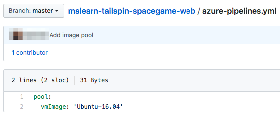
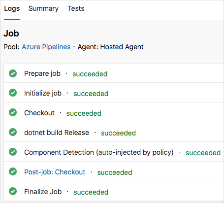
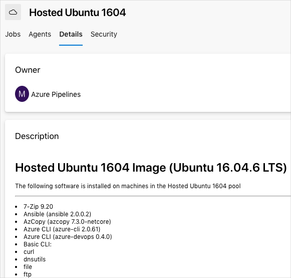

At this point, Mara has defined a build configuration for the *Space Game* web site. Now it's your turn. You're going to create a pipeline and produce your first build artifact.

As you saw, Mara uses a YAML file to define the build. When you create a pipeline, the process prompts you for your YAML file. The project doesn't have this file yet.

You'll begin by creating a starter YAML file that contains a basic build definition. You'll commit the file to your `master` branch on GitHub. You'll then choose this file when you set up your pipeline.

> [!NOTE]
> Again, don't worry if you're new to Git. We'll show you what to do. We'll also go into more detail about Git in future modules.

At a minimum, the YAML file needs to define the agent to use. Remember that a *build agent* builds or deploys the code. For this project, you'll use the Ubuntu 16.04 agent that's hosted by Microsoft. That's where we'll start.

## Configure the basic pipeline

1. In Visual Studio Code, select **File > New File**. Then select **File > Save** to save the blank file as **azure-pipelines.yml** in your project's root directory (for example, `~/mslearn-tailspin-spacegame-web`).

    > [!IMPORTANT]
    > On Windows, be sure to select **YAML** in the **Save as type** list.

1. In **azure-pipelines.yml**, specify the Ubuntu 16.04 image pool and save the file.

    ```yml
    pool:
      vmImage: 'Ubuntu-16.04'
    ```

1. From the integrated terminal, run `git status`:

    ```bash
    git status
    ```

    You see that **azure-pipelines.yml** is untracked. New files are untracked until you add them to Git's index, or staging area.

1. Run `git add` to add the file to the index:

    ```bash
    git add azure-pipelines.yml
    ```

1. Run `git commit` to commit the change to the `master` branch:

    ```bash
    git commit -m "Add image pool"
    ```

1. Run `git push` to push, or upload, your `master` branch (including your changes) to your GitHub repository:

    ```bash
    git push origin master
    ```

    If this is your first time running `git push`, you'll be prompted to enter your GitHub credentials. Remember, if you're using two-factor authentication with GitHub, enter your personal access token instead of your password.

If you return to your repo on GitHub and refresh the page, you'll see that **azure-pipelines.yml** is part of your `master` branch. You can select the file to verify its contents.



## Create the pipeline

1. In Azure DevOps, navigate to the **SpaceGame-Web** project.
1. Select **Pipelines**, either from the project page or from the left pane.
1. Select **Create pipeline**.
1. On the **Connect** tab, select **GitHub**.

    When prompted, enter your GitHub credentials.
1. On the **Select** tab, select your **mslearn-tailspin-spacegame-web** repository.
1. You might be redirected to GitHub to install the Azure Pipelines app. If so, select **Approve and install**.
1. On the **Review** tab, note the initial build configuration.

    

    This is the configuration you pushed to GitHub earlier.

    > [!NOTE]
    > For learning purposes, here you build your pipeline configuration one step at a time, starting with just the build agent.
    > In practice, you can skip the creation of the initial *azure-pipelines.yml* file and let Azure Pipelines create it for you.
    > Azure Pipelines can detect your project type, such as ASP.NET Core, Java, or Go, and provide an initial pipeline configuration for that app type.

1. On the **Review** tab, select **Run** to save your changes and start the build.

## Watch the pipeline run

On the build screen, trace the build process through each of the steps.

Remember that at this point your build definition specifies only the VM image to use. It doesn't yet specify any of the tasks that are needed to build your app.

Here you see the minimum number of steps needed to prepare the VM, fetch the latest source code from GitHub, and clean up:



This configuration is a great start because now you have a starting point for adding build tasks.

> [!TIP]
> Check your email. You might have already received a build notification with the results of your run. You can use these notifications to let your team members know when builds complete and whether each build passed or failed.

Optionally, right-click the link to **Hosted Ubuntu 1604** and open the link in a new tab:


Then select **Details**.



You see all the software that's available on the VM, including .NET Core, Docker, and many other development tools and compilers.

## Add build tasks

Now that you have a working build process, you can start to add build tasks.

Remember that you're working from the `master` branch. You'll now create a branch named `build-pipeline` to hold your work. The branch gives you a place to experiment and get your build working completely without affecting the rest of the team.

You can add build tasks to **azure-pipelines.yml** directly from Azure Pipelines. Azure Pipelines will commit your changes directly to your branch. But here you'll modify **azure-pipelines.yml** locally and upload your changes. Doing it this way lets you practice your Git skills watch the pipeline automatically build the application when you push up changes.

In practice, you might add build tasks one at a time, push up your changes, and watch the build run. Here, you'll add all the build tasks we identified earlier at one time.

1. In Visual Studio Code, navigate to the integrated terminal and run this `git checkout` command to create a branch named `build-pipeline`:

    ```bash
    git checkout -b build-pipeline
    ```

1. In Visual Studio Code, modify **azure-pipelines.yml** as you see here:

    ```yml
    pool:
      vmImage: 'Ubuntu-16.04'
      demands:
        - npm

    steps:
    - task: DotNetCoreInstaller@0
      displayName: 'Use .NET Core SDK 2.1.505'
      inputs:
        version: 2.1.505

    - task: Npm@1
      displayName: 'Run npm install'
      inputs:
        verbose: false

    - script: './node_modules/.bin/node-sass Tailspin.SpaceGame.Web/wwwroot --output Tailspin.SpaceGame.Web/wwwroot'
      displayName: 'Compile Sass assets'

    - task: gulp@1
      displayName: 'Run gulp tasks'

    - script: 'echo "$(Build.DefinitionName), $(Build.BuildId), $(Build.BuildNumber)" > buildinfo.txt'
      displayName: 'Write build info'
      workingDirectory: Tailspin.SpaceGame.Web/wwwroot

    - task: DotNetCoreCLI@2
      displayName: 'Restore project dependencies'
      inputs:
        command: 'restore'
        projects: '**/*.csproj'

    - task: DotNetCoreCLI@2
      displayName: 'Build the project - Release'
      inputs:
        command: 'build'
        arguments: '--no-restore --configuration Release'
        projects: '**/*.csproj'
    ```

    The `demands` section beneath `pool` specifies that we need npm, the Node.js package manager, installed on the build system.

    Under the `steps` section, you see the build tasks that maps to each of the script commands that we identified earlier.

    Azure Pipelines provides built-in build tasks that map to many common build activities. For example, the `DotNetCoreCLI@2` task maps to the `dotnet` command-line utility. The pipeline uses `DotNetCoreCLI@2` two times: one time to restore, or install, the project's dependencies and one time to build the project.

    Remember that not all build activities map to a built-in task. For example, there's no built-in task that runs the node-sass utility or writes build info to a text file. To run general system commands, you use the `CmdLine@2` or `script` task. The pipeline uses the `script` task because it's a common shortcut for `CmdLine@2`.

    In the build step that writes information about the build to a file, notice these elements:

    * `$(Build.DefinitionName)`
    * `$(Build.BuildId)`
    * `$(Build.BuildNumber)`

    These elements are built-in variables that the system provides for use in your pipelines.

    * `$(Build.DefinitionName)` specifies the name of the build pipeline. For example, "SpaceGame-Web-CI."
    * `$(Build.BuildId)` is a numeric identifier for the completed build, like 115.
    * `$(Build.BuildNumber)` is name of the completed build. You can configure the format, but by default the build number includes the current date followed by the build number for that day. An example build number is "20190329.1."

    You can also define your own variables, which you'll do soon.

    You might have also noticed the `DotNetCoreInstaller@0` task, which is the first build step. Mara remembered that her build script didn't install required build tools. Although the build agent comes with a number of .NET Core SDK versions, this task lets her easily specify the version she needs to use on the build agent.

1. Run the following Git commands from the integrated terminal to add **azure-pipelines.yml** to the index, commit the change, and push the change up to GitHub. These steps are similar to steps you performed earlier.

    > [!TIP]
    > Remember to save **azure-pipelines.yml** before you run these Git commands.

    ```bash
    git add azure-pipelines.yml
    git commit -m "Add build tasks"
    git push origin build-pipeline
    ```

    This time, you push the `build-pipeline` branch, not the `master` branch, to GitHub.

    Pushing the branch to GitHub triggers the build process in Azure Pipelines.

1. In Azure DevOps, navigate to your build. To do so, select **Pipelines** on the side of the page and then select **Builds**. You see your commit message and that the build is running using the code from the `build-pipeline` branch:

    

    > [!TIP]
    > If you don't see the build right away, wait a few moments or refresh the page.
    > In the rare case where Azure Pipelines doesn't pick up your build, you can manually queue the build by selecting **Queue**. When prompted, enter the Git branch you want to build from, in this case, `build-pipeline`.

1. Select your build and trace the build tasks as they run.

    For example, here's what happens when the `gulp@1` task runs to perform the gulp tasks that minify JavaScript and CSS assets:

    

    If any step fails, you'll see the error in the output so you can diagnose and repair the failure.

    Earlier, you saw the minimum number of steps needed to prepare the VM, fetch the latest source code from GitHub, and clean up. This time, when the build completes, you see the entire set of tasks needed to build the application:

    

1. After your build completes, select the **Summary** tab.

    You see the overall progression of the build. From there, you can jump to the build logs or the associated change on GitHub.

    