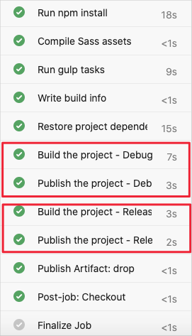
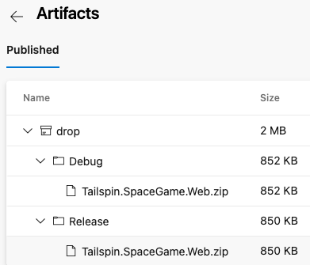

In the previous exercises, you implemented a pipeline that builds the *Space Game* website. You started with a script that performs each build action and mapped each action to its corresponding pipeline task. The output of the pipeline is a *.zip* file that contains the compiled web app.

In this exercise, you use a template to define build tasks that can build any configuration defined in the project file. Templates enable you to define your logic one time and then reuse it several times. Templates combine the content of multiple YAML files into a single pipeline.

Let's begin by checking in with Mara and Amita.

## The demo

Mara, excited to share her results, tracks down Amita to show her the build pipeline.

**Amita:** I'm impressed you got this working so quickly! In fact, I was just coming to see you because I got an email telling me the build was ready. Thank you! I see that the pipeline builds only the Release configuration. We also use Debug builds so we can capture additional information if the app crashes. Can we add that?

**Mara:** Absolutely. I forgot to consider Debug builds when I set this up. How about we sit down together and add it?

**Amita:** You showed me the YAML file that defines the build steps, but I'm not sure I would know how to modify it.

**Mara:** That's OK. You can watch while I type. We can think through it together.

## How might you define both build configurations?

Consider the following tasks that build and publish the *Space Game* web project's Release configuration. (Don't add this code to your *azure-pipelines.yml* file.)

[!code-yml[](code/8-azure-pipelines-partial-release.yml?highlight=5,9,14)]

To build the Debug configuration, you might repeat these two tasks, but replace `Release` with `Debug`.

Doing so would give you the result you're looking for, but what happens when your build becomes more complex or your requirements change? You'd need to manually locate and change both variations of each build task. After you added the additional build requirements, you'd also need to create two tasks, one for the Debug configuration and one for Release, to satisfy those requirements.

A better solution is to use a template.

## What are templates?

A *template* enables you to define common build tasks one time and reuse those tasks multiple times.

You call a template from the parent pipeline as a build step. You can pass parameters into a template from the parent pipeline.

Mara can define tasks to build and publish the app as a template, and then apply that template to each configuration she needs.

## Define the template

Remember that a template enables you to define common build tasks one time and reuse those tasks multiple times. You call a template from its parent template as a build step, and pass parameters into a template from the parent pipeline.

You'll now create a template that can build any configuration that's defined in the project file.

1. From the Visual Studio Code integrated console, at the root of your project, create a *templates* directory.

    ```bash
    mkdir templates
    ```

    In practice, you can put a template file in any location. You don't need to put them in the *templates* directory.

1. In Visual Studio Code, select **File > New File**. Next, to save the blank file as *build.yml* in your project's *templates* directory, select **File > Save**. (For example, *~/mslearn-tailspin-spacegame-web/templates*.)

    > [!IMPORTANT]
    > As before, in Windows, in the **Save as type** list, select **YAML**.

1. In Visual Studio Code, add this code to *build.yml*.

    [!code-yml[](code/8-build.yml?highlight=1-2,6,9,13,18)]

    These tasks look like the ones you defined earlier to build and publish the app. But in a template, you work with input parameters differently than you work with normal variables. Here are two differences:

   - In a template file, you use the `parameters` section instead of `variables` to define inputs.
   - In a template file, you use `${{ }}` syntax instead of `$()` to read a parameter's value.
        When you read a parameter's value, you include the `parameters` section in its name. For example, `${{ parameters.buildConfiguration }}`.

## Call the template from the pipeline

You'll now call the template that you just built from the pipeline. You'll do so one time for the Debug configuration and then repeat the process for the Release configuration.

1. In Visual Studio Code, modify *azure-pipelines.yml* as you see here.

    [!code-yml[](code/8-azure-pipelines.yml?highlight=41-43, 45-47)]

    This file looks like the original, except that it replaces the build and publish tasks with calls to the template that performs the same tasks.

    You see that the template is called one time for each configuration. To pass the configuration name to the template, each `template` task uses the `parameters` argument.

## Run the pipeline

You'll now push your changes to GitHub and see the pipeline run.

1. From the integrated terminal, add *azure-pipelines.yml* and **templates/build.yml** to the index, commit the changes, and push the changes up to GitHub.

    ```bash
    git add azure-pipelines.yml templates/build.yml
    git commit -m "Support build configurations"
    git push origin build-pipeline
    ```

1. From Azure Pipelines, trace the build through each of the steps, as you did earlier.

    As the pipeline runs, you see that the process expands the tasks within the template. The tasks that build and publish the project are run two times, once for each build configuration.

    

1. When the build completes, go back to the summary page, and select the published artifact as you did before. Expand the drop folder.

    You see that the pipeline produces a *.zip* file for both the Debug configuration and the Release configuration.

    

## Merge the branch into master

At this point, you have a working build pipeline that accomplishes everything Mara needs for right now.

In practice, you'd submit a *pull request* that merges your `build-pipeline` branch into the `master` branch.

We'll skip that step for now. In the next module, you'll learn some ways to collaborate with your team on GitHub, including how to submit, review, and merge pull requests.
