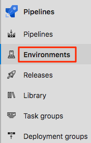
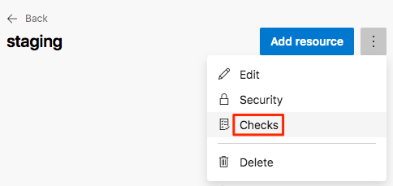
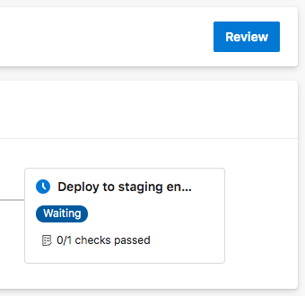

Your release pipeline now has three stages: _Build_, _Dev_, and _Test_. You and the Tailspin team have one more stage to implment: the _Staging_ stage.

In this part, you'll:

> [!div class="checklist"]
> * Create the **staging** environment in Azure Pipelines and assign yourself as an approver.
> * Define the _Staging_ stage, which runs only after an approver verifies the results of the _Test_ stage.

## Create the Staging environment

Here, you create an environment in Azure Pipelines for the _Staging_ environment. For learning purposes, you assign yourself as the approver. In practice, you would assign the users who are required to sign off on changes before those changes move to the next stage. For the Tailspin team, Amita approves changes as they move from _Test_ to _Staging_.

Recall that, earlier in this module, you specified `environment` settings for both the _Dev_ and _Test_ stages. Here's an example for the _Dev_ stage. 

[!code-yml[](code/2-azure-pipelines.yml?highlight=8)]

In this example, Azure Pipelines creates the **dev** environment for you if it doesn't exist. You can also define an environment through Azure Pipelines that includes specific criteria for your release. This criteria can include which pipelines are authorized to deploy to that environment. You can also specify what human approvals are needed to promote the release from one stage to the next, which you do here.

To create the **staging** environment:

1. From Azure Pipelines, select **Environments**.

    

1. Select **New environment**.
1. Under **Name**, enter **staging**.
1. Leave the remaining fields at their default values.
1. Select **Create**.
1. On the **staging** environment page, select the drop down menu, then select **Checks**.

    

1. On the **Use manual approvals** page, select **Create**.
1. Under **Approvers**, select **Add users and groups** and then select your account.
1. Under **Instructions to approvers**, enter:

    > Approve this change when it's ready for staging.
1. Select **Create**.

## Promote changes to the Staging stage

Here you modify your pipeline configuration to deploy the build to the _Staging_ stage.

1. In Visual Studio Code, modify *azure-pipelines.yml* like this.

    [!code-yml[](code/7-azure-pipelines.yml?highlight=125-146)]

    This code adds the _Staging_ stage. This stage deploys to the **staging** environment, which includes a release approval.

1. From the integrated terminal, add *azure-pipelines.yml* to the index, commit the change, and push the change up to GitHub.

    > [!TIP]
    > Remember to save *azure-pipelines.yml* before running these Git commands.

    ```bash
    git add azure-pipelines.yml
    git commit -m "Deploy to Staging"
    git push origin release-workflow
    ```

1. In Azure Pipelines, go to the build and trace the build as it runs.

    When the build reaches the _Staging_ stage, you see that the pipeline waits for all checks to pass. In this case there is one check: the manual release approval.

    

1. Select **Review**, then select **Approve**.

    In practice, you would inspect the changes to verify they meet your requirements.

1. After the build completes, open a web browser and navigate to the URL that's associated with the App Service instance for your _Staging_ environment.

    If you still have the browser tab open, simply refresh the page.

    If you need a refresher, you can find the URL from the App Service details page in the Azure portal.

    You see that the _Space Game_ website has been successfully deployed to App Service and is running.

    <!-- TODO: ADD SCREEN CAP  -->

1. As an optional step, in Azure Pipelines, select **Environments**. Then select the **test** environment.

    Azure Pipelines records your deployment history, which enables you to trace changes in the environment back to code commits and work items.

    <!-- TODO: ADD SCREEN CAP -->

The Tailspin team gathers to discuss their progress. Amita approves changes in the _Test_ stage while the others watch.

**Tim:** To tell you the truth, at first I was a little nervous about automated release pipelines. But I really like this now that I see it working. Each stage can have its own environment, associated tests, and approvers. It automates so many things for us that we once had to do manually. But we still have control where we need it.

**Amita:** I could imagine us doing something similar to promote changes from _Staging_ to _Production_. Speaking of which, when will we add a _Production_ environment?

**Andy:** We'll add that shortly. I think we still have a few pieces to fill in here first.