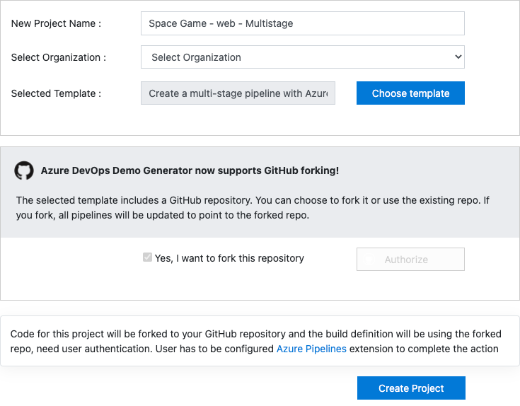

In this section, you make sure that your Azure DevOps organization is set up to complete the rest of this module. You also create the Azure App Service environments that you'll deploy to.

To accomplish these goals, you:

> [!div class="checklist"]
> * Add a user to ensure Azure DevOps can connect to your Azure subscription.
> * Set up an Azure DevOps project for this module.
> * On Azure Boards, move the work item for this module to the **Doing** column.
> * Make sure your project is set up locally so that you can push changes to the pipeline.
> * Create the Azure App Service environments by using the Azure CLI in Azure Cloud Shell.
> * Create pipeline variables that define the names of your App Service environments.
> * Create a service connection that enables Azure Pipelines to securely access your Azure subscription.

## Add a user to Azure DevOps

To complete this module, you need your own [Azure subscription](https://azure.microsoft.com/free/?azure-portal=true). You can get started with Azure for free.

You don't need an Azure subscription to work with Azure DevOps, but here you'll use Azure DevOps to deploy to Azure resources that exist in your Azure subscription. To simplify the process, use the same Microsoft account to sign in to both your Azure subscription and your Azure DevOps organization.

If you use different Microsoft accounts to sign in to Azure and Azure DevOps, add a user to your DevOps organization under the Microsoft account that you use to sign in to Azure. For more information, see [Add users to your organization or project](https://docs.microsoft.com/azure/devops/organizations/accounts/add-organization-users?tabs=browser&azure-portal=true). When you add the user, select the **Basic** access level.

Next, sign out of Azure DevOps and sign in. Use the Microsoft account that you use to sign in to your Azure subscription.

## Get the Azure DevOps project

Here, you make sure that your Azure DevOps organization is set up to complete the rest of this module. To do so, you run a template that creates a project in Azure DevOps.

The modules in this learning path form a progression. You follow the Tailspin web team through their DevOps journey. For learning purposes, each module has its own Azure DevOps project.

### Run the template

Run a template that sets up your Azure DevOps organization:

> [!div class="nextstepaction"]
> [Run the template](https://azuredevopsdemogenerator.azurewebsites.net/?name=create-multi-stage-pipeline&azure-portal=true)

From the Azure DevOps Demo Generator site, to run the template, follow these steps.

1. Select **Sign In**, and accept the usage terms.
1. On the **Create New Project** page, select your Azure DevOps organization. Enter a project name, such as *Space Game - web - Multistage*.

    

1. Select **Yes, I want to fork this repository** > **Authorize**.

    If a window appears, authorize access to your GitHub account.

    > [!IMPORTANT]
    > You need to select this option so the template will connect to your GitHub repository. Select it even if you've already forked the _Space Game_ website project. The template uses your existing fork.

1. Select **Create Project**.

    The template takes a few moments to run.

1. To go to your project in Azure DevOps, select **Navigate to project**.

> [!IMPORTANT]
> In this module, the [Clean up your Azure DevOps environment](/learn/modules/create-multi-stage-pipeline/7-clean-up-environment?azure-portal=true) page contains important cleanup steps. Cleaning up helps ensure that you don't run out of free build minutes. Even if you don't complete this module, be sure to follow the cleanup steps.

[!include[](../../shared/includes/project-visibility.md)]

## Move the work item to Doing

Here, you assign a work item to yourself on Azure Boards. You also move the work item to the **Doing** state. In practice, you and your team would create work items at the start of each *sprint*, or work iteration.

This work assignment gives you a checklist to work from. It gives other team members visibility into what you're working on and how much work is left. The work item also helps enforce work-in-progress (WIP) limits, so that the team doesn't take on too much work at one time.

Recall that the team settled on the following top issues for the current sprint.


> [!NOTE]
> Within an Azure DevOps organization, work items are numbered sequentially. In your project, the number for each work item might not match what you see here.

Here you move the first item, **Create a multistage pipeline**, to the **Doing** column. Then you assign yourself to the work item. **Create a multistage pipeline** relates to defining each stage of deploying the _Space Game_ website.

To set up the work item:

1. From Azure DevOps, navigate to **Boards**. Then, from the menu, select **Boards**.

    

1. In the **Create a multistage pipeline** work item, at the bottom of the card, select the down arrow. Then, assign the work item to yourself.

    

1. Move the work item from the **To Do** column to the **Doing** column.

    

At the end of this module, you'll move the card to the **Done** column, after you complete the task.

[!include[](../../shared/includes/deploy-local-setup.md)]

## Create the Azure App Service environments

Here, you create the environments that define the pipeline stages. You create one App Service instance for each stage: _Dev_, _Test_, and _Staging_.

In [Create a release pipeline with Azure Pipelines](/learn/modules/create-release-pipeline?azure-portal=true), you brought up App Service through the Azure portal. Although the portal is a great way to explore what's available on Azure or to do basic tasks, bringing up components such as App Service can be tedious.

In this module, you use the Azure CLI to bring up three App Service instances. You can access the Azure CLI from a terminal or through Visual Studio Code. Here, you access the Azure CLI from Azure Cloud Shell. This browser-based shell experience is hosted in the cloud. In Cloud Shell, the Azure CLI is configured for use with your Azure subscription.

> [!IMPORTANT]
> To complete the exercises in this module, you need your own Azure subscription.

### Bring up Cloud Shell through the Azure portal

1. Go to the [Azure portal](https://portal.azure.com?azure-portal=true), and sign in.
1. From the menu, select **Cloud Shell**. When prompted, select the **Bash** experience.

    

    > [!NOTE]
    > Cloud Shell requires an Azure storage resource to persist any files that you create in the Cloud Shell. When you first open the Cloud Shell, you're prompted to create a resource group, storage account, and Azure Files share. This setup is automatically used for all future Cloud Shell sessions.

### Select an Azure region

A _region_ is one or more Azure datacenters within a geographic location. East US, West US, and North Europe are examples of regions. Every Azure resource, including an App Service instance, is assigned a region.

To make commands easier to run, start by selecting a default region. After you specify the default region, later commands use that region unless you specify a different region.

1. From the Cloud Shell, to list the regions that are available from your Azure subscription, run the following `az account list-locations` command.

    ```azurecli
    az account list-locations \
      --query "[].{Name: name, DisplayName: displayName}" \
      --output table
    ```

1. From the `Name` column in the output, select a region that's close to you. For example, choose `eastasia` or `westus2`.

1. Run `az configure` to set your default region. Replace `<REGION>` with the name of the region you selected.

    ```azurecli
    az configure --defaults location=<REGION>
    ```

    This example sets `westus2` as the default region:

    ```azurecli
    az configure --defaults location=westus2
    ```

### Create the App Service instances

Here, create the App Service instances for the three stages you'll deploy to: _Dev_, _Test_, and _Staging_.

1. Generate a random number that makes your web app's domain name unique.

    This step is for learning purposes. In practice, you would choose a domain name that matches the name of your app or service.
1. Create a resource group that contains all of your App Service instances.

    For learning purposes, here you create one resource group that contains all of your App Service instances. In practice, you might create a separate resource group for each App Service instance so that you can better control the life cycle of each instance.

1. Create an App Service plan.

    An App Service plan defines the CPU, memory, and storage resources for your web app. Here, you use the **B1 Basic** plan. This plan is intended for apps that have low traffic requirements. The **Standard** and **Premium** plans are for production workloads. These plans run on dedicated virtual machine instances.

1. For each of the  _Dev_, _Test_, and _Staging_ environments, create an App Service instance.
1. Get the host name for each environment.
1. Verify that each environment is running, and that the home page is accessible.

   > [!NOTE]
   > For learning purposes, here, you use the default network settings. These settings make your site accessible from the internet. In practice, you could configure an Azure virtual network that places your website in a network that's not internet routable, and that only you and your team can access. Later, you could reconfigure your network to make the website available to your users.

1. From the Cloud Shell, generate a random number that makes your web app's domain name unique.

    ```bash
    webappsuffix=$RANDOM
    ```

1. To create a resource group that's named *tailspin-space-game-rg*, run the following `az group create` command.

    ```azurecli
    az group create --name tailspin-space-game-rg
    ```

1. To create an App Service plan that's named *tailspin-space-game-asp*, run the following `az appservice plan create` command.

    ```azurecli
    az appservice plan create \
      --name tailspin-space-game-asp \
      --resource-group tailspin-space-game-rg \
      --sku B1
    ```

    The `--sku` argument specifies the B1 plan. This plan runs on the Basic tier.

    > [!IMPORTANT]
    > If the B1 SKU isn't available in your Azure subscription, [select a different plan](https://azure.microsoft.com/pricing/details/app-service/linux/?azure-portal=true), such as S1 (Standard).

1. To create the three App Service instances, one for each environment (_Dev_, _Test_, and _Staging_), run the following `az webapp create` commands.

    ```azurecli
    az webapp create \
      --runtime "DOTNETCORE|3.1" \
      --name tailspin-space-game-web-dev-$webappsuffix \
      --resource-group tailspin-space-game-rg \
      --plan tailspin-space-game-asp

    az webapp create \
      --runtime "DOTNETCORE|3.1" \
      --name tailspin-space-game-web-test-$webappsuffix \
      --resource-group tailspin-space-game-rg \
      --plan tailspin-space-game-asp

    az webapp create \
      --runtime "DOTNETCORE|3.1" \
      --name tailspin-space-game-web-staging-$webappsuffix \
      --resource-group tailspin-space-game-rg \
      --plan tailspin-space-game-asp
    ```

    For learning purposes, here, you apply the same App Service plan, B1 Basic, to each App Service instance. In practice, you would assign a plan that matches your expected workload.

    For example, for the environments that map to the _Dev_ and _Test_ stages, B1 Basic might be appropriate because you want only your team to access the environments.

    For the _Staging_ environment, you would select a plan that matches your production environment. That plan would likely provide greater CPU, memory, and storage resources. Under the plan, you can run performance tests, like load tests, in an environment that resembles your production environment. You can run the tests without affecting live traffic to your site.

1. To list the host name and state of each App Service instance, run the following `az webapp list` command.

    ```azurecli
    az webapp list \
      --resource-group tailspin-space-game-rg \
      --query "[].{hostName: defaultHostName, state: state}" \
      --output table
    ```

    Note the host name for each running service. You'll need the host names later when you verify your work. Here's an example:

    ```output
    HostName                                                 State
    -------------------------------------------------------  -------
    tailspin-space-game-web-dev-21017.azurewebsites.net      Running
    tailspin-space-game-web-test-21017.azurewebsites.net     Running
    tailspin-space-game-web-staging-21017.azurewebsites.net  Running
    ```

1. As an optional step, go to one or more of the host names. Verify that they're running, and that the default home page appears.

    Here's what you see:

    

> [!IMPORTANT]
> The [Clean up your Azure DevOps environment](/learn/modules/create-multi-stage-pipeline/7-clean-up-environment?azure-portal=true) page in this module contains important cleanup steps. Cleaning up helps ensure that you're not charged for Azure resources after you complete this module. Be sure to perform the cleanup steps even if you don't complete this module.

## Create pipeline variables in Azure Pipelines

In [Create a release pipeline with Azure Pipelines](/learn/modules/create-release-pipeline?azure-portal=true), you added a variable to your pipeline that stores the name of your web app in App Service. Here you do the same. But this time, you add one variable for each App Service instance that corresponds to a _Dev_, _Test_, or _Staging_ stage in your pipeline.

You could hard-code these names in your pipeline configuration, but if you define them as variables, your configuration will be more reusable. Additionally, if the names of your App Service instances change, you can update the variables and trigger your pipeline without modifying your configuration.

To add the variables:

1. In Azure DevOps, go to your **Space Game - web - Multistage** project.
1. Under **Pipelines**, select **Library**.

    
1. Select **+ Variable group**.
1. Under **Properties**, enter **Release** for the variable group name.
1. Under **Variables**, select **+ Add**.
1. For the name of your variable, enter *WebAppNameDev*. For the value, enter the name of the App Service instance that corresponds to your _Dev_ environment, such as *tailspin-space-game-web-dev-1234*.
1. Repeat the previous two steps twice more to create variables for your _Test_ and _Staging_ environments. Here are examples:

    | Variable name         | Example value                            |
    |-----------------------|------------------------------------------|
    | *WebAppNameTest*    | *tailspin-space-game-web-test-1234*    |
    | *WebAppNameStaging* | *tailspin-space-game-web-staging-1234* |

    Be sure to replace each example value with the App Service instance that corresponds to your environment.

    > [!IMPORTANT]
    > Set the name of the App Service instance, not its host name. In this example, you would enter *tailspin-space-game-web-dev-1234* and not *tailspin-space-game-web-dev-1234.azurewebsites.net*.

1. Near the top of the page, to save your variable to the pipeline, select **Save**.

    Your variable group resembles this one:

    

## Create a service connection

Here, you create a service connection that enables Azure Pipelines to access your Azure subscription. Azure Pipelines uses this service connection to deploy the website to App Service. You created a similar service connection in the previous module.

> [!IMPORTANT]
> Make sure that you're signed in to both the Azure portal and Azure DevOps under the same Microsoft account.

1. In Azure DevOps, go to your **Space Game - web - Multistage** project.
1. From the bottom corner of the page, select **Project settings**.
1. Under **Pipelines**, select **Service connections**.
1. Select **New service connection**, then select **Azure Resource Manager**, and then select **Next**.
1. Near the top of the page, **Service principal (automatic)**. Then, select **Next**.
1. Fill in these fields:

    | Field                   | Value                                      |
    |-------------------------|--------------------------------------------|
    | Scope level             | **Subscription**                           |
    | Subscription            | Your Azure subscription                    |
    | Resource Group          | **tailspin-space-game-rg**                 |
    | Service connection name | *Resource Manager - Tailspin - Space Game* |

    During the process, you might be prompted to sign in to your Microsoft account.

1. Ensure you have selected **Grant access permission to all pipelines**.

1. Select **Save**.

    To verify that it can connect to your Azure subscription, Azure DevOps performs a test connection. If Azure DevOps can't connect, you have the chance to sign in a second time.
