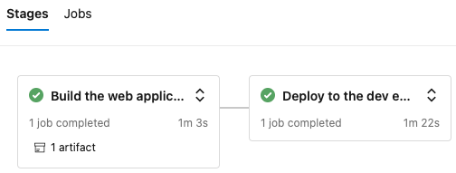
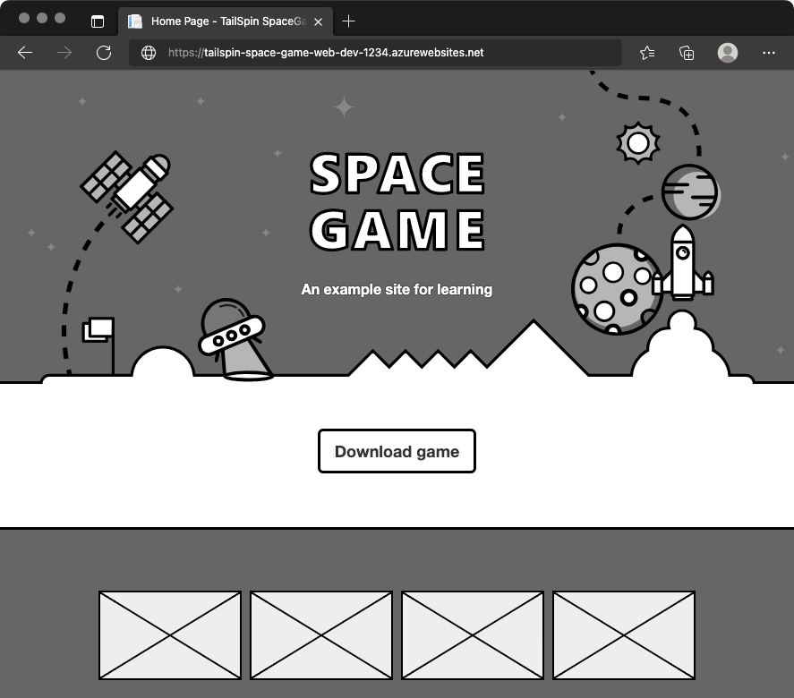
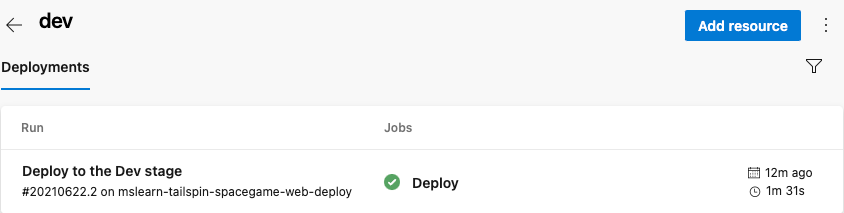

The team has a plan and is ready to begin implementing their release pipeline. You have your Azure DevOps project set up and Azure App Service instances that are ready to receive build artifacts.

At this point, remember that the team's pipeline has only two stages. The first stage produces the build artifact and the second stage deploys the _Space Game_ web application to App Service. Here, you follow along with Andy and Mara as they modify the pipeline to deploy to the App Service environment that corresponds to the _Dev_ stage.

## Fetch the branch from GitHub

Here, you fetch the `release` branch from GitHub and checkout, or switch to, that branch.

This branch serves as your _release_ branch. It contains the _Space Game_ project you worked with in the previous modules and an Azure Pipelines configuration to start with.

1. In Visual Studio Code, open the integrated terminal.
1. Run the following `git` commands to fetch a branch named `release` from Microsoft's repository and switch to that branch.

    ```bash
    git fetch upstream release
    git checkout -b release upstream/release
    ```

    The format of these commands enables you to get starter code from Microsoft's GitHub repository, known as `upstream`. Shortly, you'll push this branch up to your GitHub repository, known as `origin`.

1. As an optional step, open *azure-pipelines.yml* from Visual Studio Code and familiarize yourself with the initial configuration.

    The configuration resembles the basic one you created in the [Create a release pipeline with Azure Pipelines](/learn/modules/create-release-pipeline?azure-portal=true) module. It builds only the application's Release configuration. For learning purposes, this configuration does not run the quality or security checks that you set up in previous modules.

    [!include[](../../shared/includes/pipeline-branches-note.md)]

## Promote changes to the _Dev_ stage

Here you modify your pipeline configuration to promote the build to the _Dev_ stage.

1. In Visual Studio Code, modify *azure-pipelines.yml* like this.

    [!code-yml[](code/4-azure-pipelines.yml?highlight=3,66,69-74,92)]

    This configuration resembles the one you built in the previous module, where you and the team built a proof of concept around continuous deployment. However, note these differences, which are highlighted in the code example:

    * This configuration defines variables at the top of the file that are used throughout the pipeline. These variables define which configuration to build (**Release**) and the name of your release branch (**release**).
    * The **Deploy** stage from the POC is now named **Dev**.
    * The **Dev** stage uses a condition that specifies to run the stage only when the previous stage succeeds and the current branch is **release**. This ensures that release features only are deployed to the _Dev_ environment.
    * The deployment step uses the variable that's named **WebAppNameDev** to deploy to the App Service instance that's associated with the _Dev_ environment.

    > [!NOTE]
    > Remember, in practice, you might deploy from some other branch, such as `master`. You can include additional logic that allows changes to promote to the _Dev_ stage from multiple branches, such as `release` and `master`.

1. From the integrated terminal, add *azure-pipelines.yml* to the index, commit the change, and push the change up to GitHub.

    > [!TIP]
    > Remember to save *azure-pipelines.yml* before running these Git commands.

    ```bash
    git add azure-pipelines.yml
    git commit -m "Deploy to the Dev stage"
    git push origin release
    ```

1. In Azure Pipelines, go to the build and trace the build as it runs.
1. After the build completes, press the back button to return to the summary page.

    

    You see that the deployment completed successfully.
1. From a web browser, navigate to the URL that's associated with the App Service instance for your _Dev_ environment.

    If you still have the browser tab open, simply refresh the page. If you need a refresher, you can find the URL from the App Service details page in the Azure portal.

    You see that the _Space Game_ website has been successfully deployed to App Service and is running.

    

1. As an optional step, in Azure Pipelines, select **Environments**. Then select the **dev** environment.

    Azure Pipelines records your deployment history, which enables you to trace changes in the environment back to code commits and work items.

    