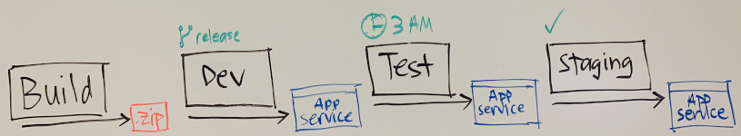

Nice job. Your pipeline is taking shape. You and the Tailspin team have moved from a basic proof of concept to a realistic release pipeline. You can use this pipeline to build an artifact and test it before you give it to your users.

In this module, you learned ways to control how changes move from one stage of a pipeline to the next. Let's review the pipeline you built in this module. This image shows your pipeline's overall shape:

The _Dev_, _Test_, and _Staging_ stages each deploy the build artifact to their own Azure App Service environment.

* When a change is pushed to GitHub, a _trigger_ causes the _Build_ stage to run. The _Build_ stage produces a build artifact as its output.
* The _Dev_ stage runs only when the change happens in the _release_ branch. You use a _condition_ to specify this requirement.
* The _Test_ stage runs at 3 A.M. each morning. This stage runs only when the _release_ branch contains changes since the last run. You use a _scheduled trigger_ to specify when the _Test_ stage runs.
* The _Staging_ stage runs only after you approve the changes in the _Test_ stage. You add a _release approval_ to the **staging** environment to pause the pipeline until you approve or reject the change.

This pipeline satisfies the requirements of the Tailspin team. Your pipeline's shape and how changes flow through it depend on the needs of your team, and of the apps and services that you build.

Although the Tailspin team is improving their release cadence, there's room for more improvement. For example, the _Dev_ stage is the perfect place to integrate the web app with a database server. In the next module, you'll work with the Tailspin team to integrate a database with the _Space Game_ web app. Instead of reading sample data from local files, the app will use a real SQL database that runs on Azure.

## Learn more

In this module, you worked with conditions, triggers, and approvals. To learn more, explore these resources.

* [Conditions](https://docs.microsoft.com/azure/devops/pipelines/process/conditions?tabs=yaml&azure-portal=true)
* [Build pipeline triggers](https://docs.microsoft.com/azure/devops/pipelines/build/triggers?tabs=yaml&azure-portal=true)
* [Approvals and other checks](https://docs.microsoft.com/azure/devops/pipelines/process/approvals?azure-portal=true)

## Appendix: Explore additional build options

The following sections are optional. They provide additional information beyond what's covered in this module.

Now that you're familiar with making your builds part of an automated pipeline, you might want to think about a few more possibilities.

### Implement a hybrid build process

Implementing CI/CD to deploy apps is difficult when you build and operate on-premises apps differently than cloud apps. If this mimics your situation, consider [Azure Stack Hub](https://docs.microsoft.com/azure-stack/operator/azure-stack-overview?azure-portal=true). Azure Stack Hub is a hybrid cloud platform that enables you to use Azure services from your company's or service provider's datacenter.

As a developer, you can build apps on Azure Stack Hub. You can then deploy them to Azure Stack Hub, to Azure, or you can build truly hybrid apps that connect between an Azure Stack Hub cloud and Azure.

### Implement multi-agent builds

You can use multiple build agents to support multiple build machines, either to distribute the load, to run builds in parallel, or to use different agent capabilities. As an example, components of an app might require different incompatible versions of a library or dependency. To learn more, see the [Jobs](https://docs.microsoft.com/azure/devops/pipelines/process/phases?tabs=yaml?azure-portal=true) documentation.

### Implement a container build strategy

If you're not using them yet, at some point you'll probably want to include containers in your CI/CD pipeline. Azure provides several services that will help you include them in the build process, including:

* Azure Kubernetes Service (AKS). Kubernetes has quickly become the standard for container orchestration. AKS lets you easily deploy and manage Kubernetes, to scale and run apps, while maintaining strong overall security.

* Azure Container Registry (ACR). ACR lets you store and manage container images in a central registry. It provides you with a Docker private registry as a first-class Azure resource.

* Azure Service Fabric. Service Fabric lets you build and operate always-on, scalable, distributed apps. It can host and orchestrate containers, including stateful containers.

* Azure App Service. App Service provides a managed service for both Windows- and Linux-based web apps, and provides the ability to deploy and run containerized apps for both platforms.

#### Use Docker multi-stage builds

If you're building Docker images and are struggling to optimize your Dockerfiles, while keeping them easy to read and maintain, consider using multi-stage builds.

With multi-stage builds, you use multiple `FROM` statements in your Dockerfile. Each `FROM` instruction can use a different base, and each of them begins a new stage of the build. You can selectively copy artifacts from one stage to another, leaving behind everything you don't want in the final image.

### Integrate Jenkins with Azure Pipelines

As we've mentioned before, Jenkins is a popular third-party CI tool. We've also mentioned that Azure Pipelines supports integration with Jenkins. You can use Jenkins for CI while gaining several DevOps benefits from an Azure Pipelines release pipeline that deploys to Azure, such as:

* Reuse your existing investments in Jenkins build jobs.
* Track work items and related code changes.
* Get end-to-end traceability for your CI/CD workflow.

A typical approach is to use Jenkins to build an app from source code hosted in a Git repository such as GitHub and then deploy it to Azure by using Azure Pipelines. If you want a procedure for integrating the two tools, see [Continuously deploy from a Jenkins build](https://docs.microsoft.com/azure/devops/pipelines/release/integrate-jenkins-pipelines-cicd?tabs=yaml&azure-portal=true).

## Scale your release pipeline

In this module, you created a multi-stage release platform that deployed to App Service. As your projects become larger, you may need to scale out your pipeline so you can deploy to multiple endpoints. For example, you may need multiple deployment groups, or you might want to deploy to another service, such as Azure Kubernetes Service.

### Multiple deployment groups

A deployment group is a logical set of deployment target machines, where each machine has an agent installed on it. Deployment groups represent the physical environments; for example, "Dev", "Test", "UAT", and "Production". In effect, a deployment group is just another grouping of agents, much like an agent pool.

You create deployment groups on the **Deployment Groups** tab of the **Azure Pipelines** section, and install the agent on each server in the group. You specify the security context and runtime targets for the agents. You can add users and give them appropriate permissions to administer, manage, view, and use the group.

For more information about creating deployment groups, see [Deployment groups](https://docs.microsoft.com/azure/devops/pipelines/release/deployment-groups/?azure-portal=true).

### Azure Kubernetes Service

You can set up continuous deployment of your containerized app to an Azure Kubernetes Service (AKS) using Azure Pipelines. After you commit and push a code change, it will be automatically built and deployed to the target Kubernetes cluster.

For a step-by-step procedure, see [Deploy a Docker container app to Azure Kubernetes Service](https://docs.microsoft.com/azure/devops/pipelines/apps/cd/deploy-aks?tabs=java?azure-portal=true).

## Manage and modularize tasks and variable groups

As the complexity of your releases grows, you want to think about reusability. For example, if you deploy to the same set of servers and use the same connection strings, you might want to store the values in one place so you can easily update them. The same is true for actions you always want to perform together. Common examples of these actions are stopping a website, running a script, and starting a website.

You might even want to write a reusable task that you can use in your organization or even make public. This is an excellent way to encapsulate logic and distribute it safely and securely.

Within Azure DevOps, three important concepts enable reusability. They are:

* Task groups
* Variable groups
* Custom build and release tasks

### Task groups

A *task group* enables you to encapsulate a sequence of tasks, already defined in a build or a release pipeline, into a single reusable task that can be added to any build or release pipeline. You can extract the parameters from the encapsulated tasks as configuration variables and abstract the rest of the task information.

Task groups are a way to standardize and centrally manage deployment steps for all your apps. When you include a task group in your definitions and then make a change centrally to the task group, the change is automatically reflected in all the definitions that use the task group. There is no need to change each one individually.

### Variable groups

A *variable group* stores values that you want to make available across multiple builds and release pipelines. Here are some examples:

* Store the username and password for a shared server.
* Store a share connection string.
* Store the geolocation of an app.
* Store all settings for a specific app.

### Custom tasks

Instead of using out-of-the-box tasks, or a command line or shell script, you can also create custom build and release task. Creating your own task has these advantages:

* You get access to variables that are otherwise not accessible.
* You can use and reuse a secure endpoint to a target server.
* You can safely and efficiently distribute the tasks across your entire organization.
* Other users don't see the implementation details.

## Integrate secrets within the release pipeline

When you deploy your apps to a target environment, there are almost always secrets involved. Examples of these secrets are:

* Secrets to access the target environment such as servers and storage accounts.
* Secrets to access resources such as connections strings, tokens, and passwords.
* Secrets that your app uses, such as configuration files.

As your software moves through the different stages of the pipeline, you need to insert these secrets. We say "insert" mainly because secrets are generally different from one stage and environment. However, another reason is that secrets should never be part of your source control repository.

How do you integrate secrets into your release pipeline? Two options are service connections and Azure Key Vault.

### Service connections

A service connection is a securely stored configuration of a connection to a server or service. By using a service connection, pipeline tasks can execute securely against the endpoint.

With a service connection, you can use secret variables. These variables give you a straightforward and convenient way to add secrets to your pipeline. When you make a variable secret, it's hidden in all the log files and is unrecoverable.

Secret variables are often used to store secrets, such as connection strings, and are used as replacement values in the pipeline. By creating placeholders in a target file and replacing the placeholder with the real value in the pipeline, you create a secret-free repository.

### Azure Key Vault

Another option for securing passwords and secrets is to use an Azure Key Vault. Key Vault enables you to keep the secrets outside of the pipeline. Then, if you have the appropriate permissions, you can retrieve them with a variable group that you created. If you don't want to use a variable group to access the secret variables in the vault, you can also use a dedicated build task.

To learn more about linking secrets from Key Vault, see [Variable groups](https://docs.microsoft.com/azure/devops/pipelines/library/variable-groups?tabs=yaml#link-secrets-from-an-azure-key-vault).