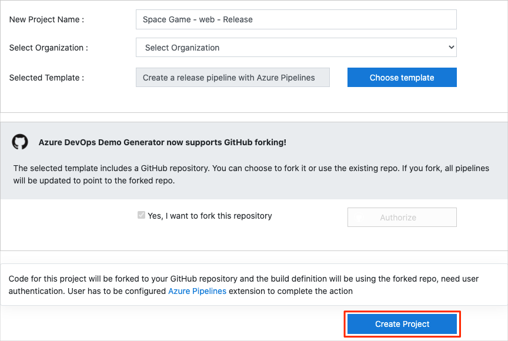
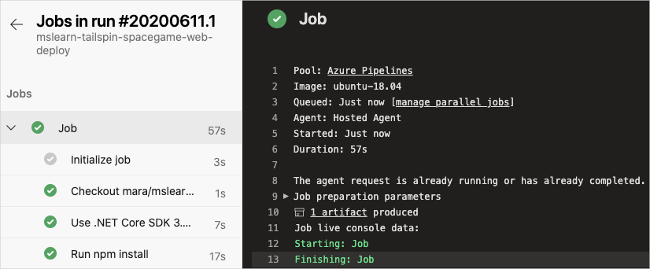
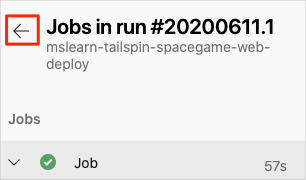
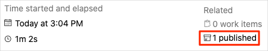
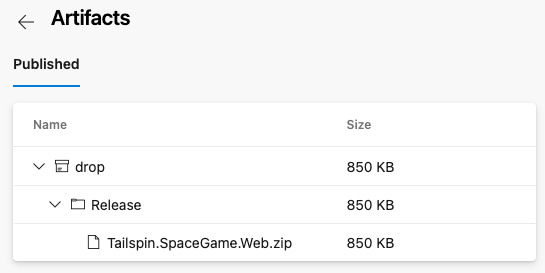

The team has been slowly integrating a DevOps strategy into their processes. In this section, you make sure that your environment reflects the team's efforts so far.

To do this, you:

> [!div class="checklist"]
> * Add a user to ensure Azure DevOps can connect to your Azure subscription.
> * Set up an Azure DevOps project for this module.
> * Add the build pipeline.

## Add a user to Azure DevOps

To complete this module, you need your own [Azure subscription](https://azure.microsoft.com/free/?azure-portal=true). You can get started with Azure for free.

Although you don't need an Azure subscription to work with Azure DevOps, here you'll use Azure DevOps to deploy to Azure resources that exist in your Azure subscription. To simplify the process, sign in to both your Azure subscription and your Azure DevOps organization under the same Microsoft account.

If you use different Microsoft accounts to sign in to Azure and Azure DevOps, add a user to your DevOps organization under the Microsoft account you use to sign in to Azure. For more information, see [Add users to your organization or project](https://docs.microsoft.com/azure/devops/organizations/accounts/add-organization-users?tabs=browser&azure-portal=true). When you add the user, choose the **Basic** access level.

Then sign out of Azure DevOps and sign in again under the Microsoft account you use to sign in to your Azure subscription.

## Get the Azure DevOps project

Make sure your Azure DevOps organization is set up to complete the rest of this module. You do this by running a template that creates a project for you in Azure DevOps.

The modules in this learning path form a progression as you follow the Tailspin web team through their DevOps journey. For learning purposes, each module has an associated Azure DevOps project.

### Run the template

Run a template that sets up everything for you in your Azure DevOps organization.

> [!div class="nextstepaction"]
> [Run the template](https://azuredevopsdemogenerator.azurewebsites.net/?name=create-release-pipeline&azure-portal=true)

From the Azure DevOps Demo Generator site, follow these steps to run the template:

1. Select **Sign In** and accept the usage terms.
1. From the **Create New Project** page, select your Azure DevOps organization and enter a project name, such as *Space Game - web - Release*.

    

1. Select **Yes, I want to fork this repository** > **Authorize**.

    If a window appears, authorize access to your GitHub account.

    > [!IMPORTANT]
    > You need to select this option so the template will connect to your GitHub repository. Select it even if you've already forked the _Space Game_ website project. The template uses your existing fork.

1. Select **Create Project**.

    The template takes a few moments to run.

1. Select **Navigate to project** to go to your project in Azure DevOps.

> [!IMPORTANT]
> The [Clean up your Azure DevOps environment](/learn/modules/create-release-pipeline/8-clean-up-environment?azure-portal=true) page in this module contains important cleanup steps. Cleaning up helps ensure that you don't run out of free build minutes. Be sure to perform the cleanup steps even if you don't complete this module.

[!include[](../../shared/includes/project-visibility.md)]

## Prepare Visual Studio Code

Set up Visual Studio Code so you can build the website locally and work with source files.

Visual Studio Code comes with an integrated terminal so you can edit files and work from the command line, all from one place.

1. Start Visual Studio Code.
1. On the **View** menu, select **Terminal**.
1. In the drop-down list, select **bash**:

    

    The terminal window lets you choose any shell that's installed on your system, like Bash, Zsh, and PowerShell.

    Here you'll use Bash. Git for Windows provides Git Bash, which makes it easy to run Git commands.

    [!include[](../../shared/includes/troubleshoot-code-terminal.md)]

1. Run the `cd` command to navigate to the directory you want to work from, like your home directory (`~`). You can choose a different directory if you want.

    ```bash
    cd ~
    ```

### Configure Git

If you're new to Git and GitHub, you'll first need to run a few commands to associate your identity with Git and authenticate with GitHub. For more information, see [Set up Git](https://help.github.com/articles/set-up-git?azure-portal=true).

At a minimum, you'll need to complete the following steps. Run these commands from the Visual Studio Code integrated terminal:

1. [Set your username](https://help.github.com/articles/setting-your-username-in-git?azure-portal=true).
1. [Set your commit email address](https://help.github.com/articles/setting-your-commit-email-address-in-git?azure-portal=true).
1. [Cache your GitHub password](https://help.github.com/articles/caching-your-github-password-in-git?azure-portal=true).

> [!NOTE]
> If you're already using two-factor authentication with GitHub, [create a personal access token](https://help.github.com/articles/creating-a-personal-access-token-for-the-command-line?azure-portal=true). Use your token in place of your password when you're prompted later.
>
> Treat your access token like you would treat a password. Keep it in a safe place.

## Set up your project in Visual Studio Code

In the [Build applications with Azure DevOps](/learn/paths/build-applications-with-azure-devops?azure-portal=true) learning path, you forked and then cloned a Git repository that contains the source code for the _Space Game_ website. Your fork was connected to your projects in Azure DevOps so that the build runs when you push changes to GitHub.

> [!IMPORTANT]
> In this learning path, we switch to a different Git repository, [mslearn-tailspin-spacegame-web-deploy](https://github.com/MicrosoftDocs/mslearn-tailspin-spacegame-web-deploy?azure-portal=true). When you ran the template to set up your Azure DevOps project, the process forked the repository automatically for you.

In this part, you clone your fork locally so that you can make changes and build out your pipeline configuration.

### Clone your fork locally

You now have a copy of the *Space Game* web project in your GitHub account. Now you'll download, or *clone*, a copy to your computer so you can work with it.

A clone, just like a fork, is a copy of a repository. When you clone a repository, you can make changes, verify they work as you expect, and then upload those changes back to GitHub. You can also synchronize your local copy with changes that other authenticated users have made to GitHub's copy of your repository.

To clone the *Space Game* web project to your computer:

1. On [GitHub](https://github.com?azure-portal=true), go to your fork of the *Space Game* web project (**mslearn-tailspin-spacegame-web-deploy**).
1. Select **Clone or download**. Then copy the URL to your clipboard by selecting the button next to the URL:

    
1. In Visual Studio Code, go to the terminal window.
1. In the terminal, move to the directory you want to work from, like your home directory (`~`). You can choose a different directory if you want.

    ```bash
    cd ~
    ```

1. Run the `git clone` command. Replace the URL that's shown here with the contents of your clipboard:

    ```bash
    git clone https://github.com/your-name/mslearn-tailspin-spacegame-web-deploy.git
    ```

1. Move to the *mslearn-tailspin-spacegame-web-deploy* directory. This directory is the root of your repository.

    ```bash
    cd mslearn-tailspin-spacegame-web-deploy
    ```

### Set the upstream remote

A *remote* is a Git repository where team members collaborate. It's like a repository on GitHub.

Run this `git remote` command to list your remotes:

```bash
git remote -v
```

You see that you have both fetch (download) and push (upload) access to your repository:

```output
origin  https://github.com/username/mslearn-tailspin-spacegame-web-deploy.git (fetch)
origin  https://github.com/username/mslearn-tailspin-spacegame-web-deploy.git (push)
```

*Origin* specifies your repository on GitHub. When you fork code from another repository, the original remote (the one you forked from) is commonly named *upstream*.

Run this `git remote add` command to create a remote named *upstream* that points to the Microsoft repository:

```bash
git remote add upstream https://github.com/MicrosoftDocs/mslearn-tailspin-spacegame-web-deploy.git
```

Run `git remote` a second time to see the changes:

```bash
git remote -v
```

You see that you still have both fetch (download) and push (upload) access to your repository. You also now have fetch access from the Microsoft repository:

```output
origin  https://github.com/username/mslearn-tailspin-spacegame-web-deploy.git (fetch)
origin  https://github.com/username/mslearn-tailspin-spacegame-web-deploy.git (push)
upstream        https://github.com/MicrosoftDocs/mslearn-tailspin-spacegame-web-deploy.git (fetch)
```

### Open the project

In Visual Studio Code, your terminal window points to the root directory of the *Space Game* web project. You'll now open the project in Visual Studio Code so you can view its structure and work with files.

1. On the **File** menu, select **Open**.
1. Navigate to the root directory of the *Space Game* web project. (In the terminal window, you can run the `pwd` command to see the full path if you need a reminder.)

You see the directory and file tree in the browsing window.

> [!NOTE]
> You might need to open the integrated terminal a second time after you open the folder.

## Create the initial pipeline configuration

Create an initial pipeline configuration that builds the web application. This step ensures that your project is set up to build from your GitHub repository. The build configuration resembles the one you set up in previous modules.

1. From Visual Studio Code, open the integrated terminal.
1. Run the following `git fetch` and `git checkout` commands to download a branch named `release-pipeline` from the Microsoft repository and switch to that branch.

    ```bash
    git fetch upstream release-pipeline
    git checkout -b release-pipeline upstream/release-pipeline
    ```

    Recall that `upstream` refers to the Microsoft GitHub repository. Your project's Git configuration understands the `upstream` remote because you set up that relationship when you forked the project from the Microsoft repository and cloned it locally.

    Shortly, you'll push this branch up to your GitHub repository, known as `origin`.

1. As an optional step, open *azure-pipelines.yml* from Visual Studio Code and familiarize yourself with the initial configuration.

    The configuration resembles the basic one you created in the [Create a build pipeline with Azure Pipelines](/learn/modules/create-a-build-pipeline/6-create-the-pipeline?azure-portal=true) module. It builds only the application's release configuration. For learning purposes, this configuration doesn't run the quality or security checks that you set up in previous modules.

    [!include[](../../shared/includes/pipeline-branches-note.md)]

1. Run the following `git commit` command to add an empty entry to your commit history.

    ```bash
    git commit --allow-empty -m "Trigger the pipeline"
    ```

    This step is for learning purposes and isn't typical. We provide starter code that you don't need to modify now. The `--allow-empty` flag ensures that the next step successfully pushes the branch to GitHub and triggers Azure Pipelines to run.

    If you omitted this step, the `git push` command you run in the next step wouldn't take any action and therefore wouldn't trigger Azure Pipelines to run.

1. Run the following `git push` command to upload the branch to your GitHub repository.

    ```bash
    git push origin release-pipeline
    ```

1. In Azure Pipelines, go to the build and trace it as it runs.

    

1. After the build finishes, select the back button to return to the summary page.

    

1. On the summary page, select your published artifact.

    

1. From the **Published artifacts** page, expand the **drop** folder.

    You see a _.zip_ file that contains your built application and its dependencies. This is your build artifact.

    

    You can manually download and install the build artifact in your own environment, just as Amita did in the previous learning path. In this module, you add a deployment stage that automatically deploys the build artifact to Azure App Service.

You now have a build pipeline for the _Space Game_ web project. Next you add the deployment stage to the pipeline.