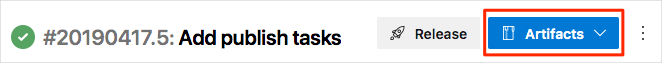
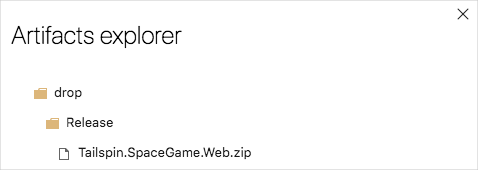

Over the previous learning paths [Evolve your DevOps practices](/learn/paths/evolve-your-devops-practices?azure-portal=true) and [Build applications with Azure DevOps](/learn/paths/build-applications-with-azure-devops?azure-portal=true), the team has been slowly integrating an Azure DevOps strategy into their current processes. They have created Boards to help them begin using a more Agile aproach to development, and they have set up a build pipeline to automate their builds. 

Here you make sure that your environment reflects the team's efforts so far.

To do this, you:

> [!div class="checklist"]
> * Set up your Azure DevOps project
> * Add the build pipeline

## Get the Azure DevOps project

In this part, you make sure that your Azure DevOps organization is set up to complete the rest of this module.

The modules in this learning path form a progression, where you follow the Tailspin web team through their DevOps journey.

This learning path also builds on the [Evolve your DevOps practices](/learn/paths/evolve-your-devops-practices?azure-portal=true) learning path. There, you set up your Azure DevOps organization and created a task backlog on Azure Boards using the Basic process.

### Run the template

1. Run a template that sets up everything for you in your Azure DevOps organization.

> [!div class="nextstepaction"]
> [Run the template](https://azuredevopsdemogenerator.azurewebsites.net/?name=create-build-pipeline&azure-portal=true)

From the Azure DevOps Demo Generator site, perform these steps to run the template.

1. Click **Sign In** and accept the usage terms.
1. From the **Create New Project** page, select your Azure DevOps organization and enter a project name, such as **Space Game - web - Release**. Then click **Create Project**.

    

    It takes a few moments for the template to run.
1. Click **Navigate to project** to go to your project in Azure DevOps.

> [!IMPORTANT]
> The [Clean up your Azure DevOps environment](/learn/modules/create-a-build-pipeline/9-clean-up-environment?azure-portal=true) page in this module contains important cleanup steps. Cleaning up helps ensure that you don't run out of free build minutes. Be sure to perform the cleanup steps even if you don't complete this module.

## Create the initial build pipeline

Here you turn on multistage pipelines and add the build pipeline.

### Turn on multistage pipelines in Azure DevOps

Mulitstage pipelines are a preview feature. This means that they will shortly become integrated into the standard Azure DevOps experience, but for now you need to turn on this feature.

From your Azure DevOps portal:

  1. Right-click your profile
  1. Select Preview features
  1. Turn on **Multi Stage Pipelines** **TODO: (screenshot)**
  1. Notice that separate **Pipelines** menu entries for **Release** and **Build** are now gone. This is because you will now do your build and release from the same pipeline.

### Add the build pipeline

1. From the terminal move to the `release-pipeline` branch.

    ```bash
    git fetch upstream release-pipeline
    git checkout release-pipeline
    ```

1. From Visual Studio Code, open **azure-pipelines.yml** and familiarize yourself with the initial configuration.

    The configuration resembles the basic one you created in the [Create a build pipeline with Azure Pipelines](/learn/modules/create-a-build-pipeline/6-create-the-pipeline?azure-portal=true) module. It builds only the application's Release configuration.

1. Run the following `git commit` command to add an empty entry to your commit history.

    ```bash
    git commit --allow-empty -m "Trigger Azure Pipelines"
    ```

    This step is for learning purposes and is not typical.

    When you forked the repository from Microsoft's account into yours, your fork already came with the `release-pipeline` branch. Here you run the `git commit` command using the `--allow-empty` flag to create an additional entry in your commit history. This will help the next step successfully push a change to GitHub.

    If you were to omit this step, the `git push` command you run in the next step would not take any action, and therefore wouldn't cause the build to run in Azure Pipelines.

1. Run the following `git push` command to upload the branch to your GitHub repository.

    ```bash
    git push origin release-pipeline
    ```

    When the build completes, you see the **Artifacts** button appear. We'll use this artifact as our source for the deploy stage.

    

1. Click the **Artifacts** button, then click **drop**. The **Artifacts explorer** appears.
1. From the **Artifacts explorer**, expand the **drop** folder.

    You see a .zip file that contains your built application and its dependencies.

    

You now have a build pipeline for the _Space Game_ web project. Next, you will add the deployment stage to this pipeline.
