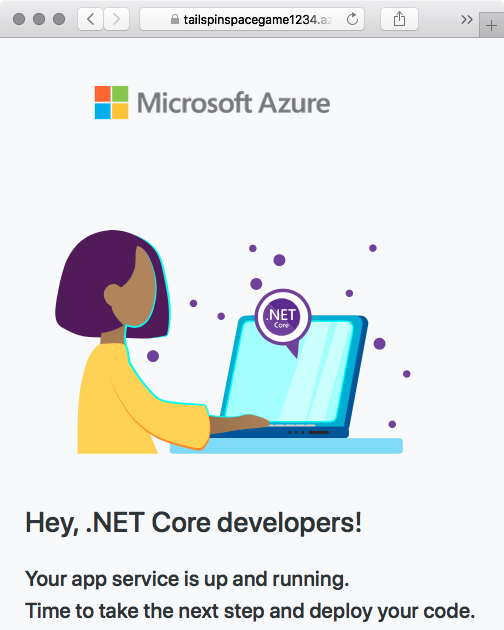
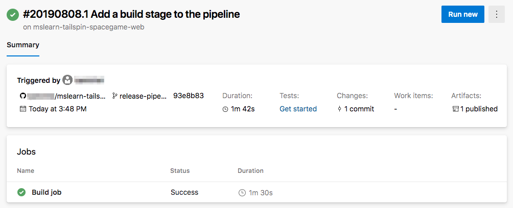
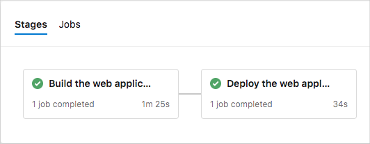
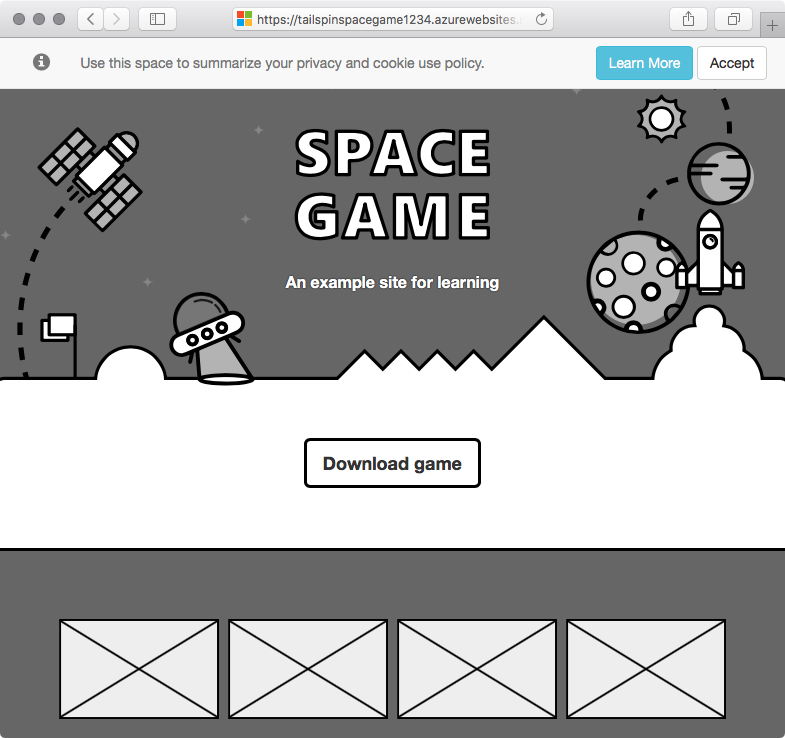

The Tailspin team has been using a build pipeline to automate their build processes. They've decided they're ready to implement a simple CI/CD pipeline as a POC. They'll extend the build pipeline to include a deployment stage that deploys to Azure App Service.

Andy and Mara have taken on the job of creating the pipeline. Let's follow them and see how they achieve their first automated deployment.

> [!IMPORTANT]
> You need your own Azure subscription to complete the exercises in this module.

Here you create a multistage pipeline that includes a stage named _Build_ and a stage named _Deploy_. To create the pipeline, you:

> [!div class="checklist"]
> * Create an App Service instance to host the website.
> * Use multistage pipelines to define a build stage and a deployment stage.
> * Run the pipeline and see the website deployed to App Service.

## Create the App Service instance

Here you create the App Service instance that hosts the website.

You can bring up App Service in several ways. In this case, you'll use the Azure portal because it's a great way to explore and visualize available services. In later modules, you'll use more automated ways to bring up and manage App Service.

We won't go into many of the details about how App Service works or the configuration options you can select. You'll find more information about App Service at the end of this module.

> [!IMPORTANT]
> The [Clean up your Azure DevOps environment](/learn/modules/create-release-pipeline/8-clean-up-environment?azure-portal=true) page in this module explains how to tear down your App Service instance after you're done with it. Cleaning up helps ensure that you're not charged for Azure resources after you complete this module. Be sure to follow the cleanup steps even if you don't complete this module.

1. Go to the [Azure portal](https://portal.azure.com?azure-portal=true) and sign in.
1. On the left, select **App Services**.
1. Select **+ Add**.
1. On the **Web App** page, fill in these fields:

    | Field                | Value                                                                                         |
    |----------------------|-----------------------------------------------------------------------------------------------|
    | **Subscription**     | Your Azure subscription.                                                                       |
    | **Resource Group**   | Select **Create new** and then enter *tailspin-space-game-rg* as the resource group name.   |
    | **Name**             | Provide a unique name, such as *tailspin-space-game-web-1234*. Your App Service instance requires a unique name because the name becomes part of the domain name. In practice, choose a name that describes your service. Note the name for later.                              |
    | **Publish**          | **Code**                                                                                      |
    | **Runtime stack**    | **.NET Core 3.1**                                                                            |
    | **Operating System** | **Linux**                                                                                     |
    | **Region**           | Select any region, preferably one close to you.                                               |
    | **Linux Plan**       | Keep the default value.                                                                       |
    | **Sku and size**     | Select **Change size** > **Dev/Test** tab > **B1** > **Apply**. |

   

1. Select **Review + Create** > **Create**.

    The deployment takes a few moments to finish.

1. After the deployment finishes, select **Go to resource**.

    You see details related to your deployment.

    

1. Select the URL.

    From a new browser tab, you see the default home page for your app.

    

    Soon you'll define a pipeline stage that deploys the _Space Game_ website to this App Service instance.

    Keep this browser tab open for later.

> [!NOTE]
> For learning purposes, here you use the default network settings. These settings make your site accessible from the internet. In practice, you could configure an Azure virtual network that places your website in a network that's not internet routable but that only you and your team can access. Later, when you're ready, you could reconfigure your network to make the website available to your users.

## Create a service connection

Here you create a service connection that enables Azure Pipelines to access your Azure subscription. Azure Pipelines uses this service connection to deploy the website to App Service.

> [!IMPORTANT]
> Make sure that you're signed in to both the Azure portal and Azure DevOps under the same Microsoft account.

1. In Azure DevOps, go to your **Space Game - web - Release** project.
1. From the bottom corner of the page, select **Project settings**.
1. Under **Pipelines**, select **Service connections**.
1. Select **New service connection**, then choose **Azure Resource Manager**, then select **Next**.
1. Select **Service principal (automatic)**, then select **Next**.
1. Fill in these fields:

    | Field               | Value                                        |
    |---------------------|----------------------------------------------|
    | Connection name | *Resource Manager - Tailspin - Space Game* |
    | Scope level     | **Subscription**                             |
    | Subscription    | Your Azure subscription                      |
    | Resource Group  | **tailspin-space-game-rg**                   |

    During the process, you might be prompted to sign in to your Microsoft account.

1. Ensure that **Allow all pipelines to use this connection** is selected.

1. Select **OK**.

    Azure DevOps performs a test connection to verify that it can connect to your Azure subscription. If Azure DevOps can't connect, you have the chance to sign in a second time.

## Add the Build stage to the pipeline

Here you convert your existing build pipeline to use the multistage feature of Azure Pipelines. You update your build configuration to define one stage that performs the build. Then you watch the pipeline run.

Recall that your build pipeline defines the agent pool, variables, and tasks that are required to build your app. As a refresher, here are the first few lines from your current build configuration:

```yml
trigger:
- '*'

pool:
  vmImage: 'ubuntu-16.04'
  demands:
    - npm

variables:
  buildConfiguration: 'Release'
  wwwrootDir: 'Tailspin.SpaceGame.Web/wwwroot'
  dotnetSdkVersion: '3.1.100'

steps:
- task: UseDotNet@2
  displayName: 'Use .NET Core SDK $(dotnetSdkVersion)'
  inputs:
    version: '$(dotnetSdkVersion)'

...
```

A _multistage pipeline_ enables you to define distinct phases that your change passes through as it's promoted through the pipeline. Each stage defines the agent, variable, and steps required to carry out that phase of the pipeline. In this module, you define one stage to perform the build. You define a second stage to deploy the web application to App Service.

To convert your existing build configuration to a multistage pipeline, you add a `stages` section to your configuration. You then add one or more `stage` sections to define each phase of your pipeline. Stages break down into jobs, which are a series of steps that run sequentially as a unit.

Before we add the _Deploy_ stage to the pipeline, let's first convert the existing build configuration to a multistage pipeline.

1. From your project in Visual Studio Code, open *azure-pipelines.yml* and replace its contents with this code:

    [!code-yml[](code/5-azure-pipelines-1.yml?highlight=7-11)]

    > [!IMPORTANT]
    > In YAML, white space is important. This change affects all of the white space in your file, so we recommend that you replace the entire file with what you see here. The highlighted sections illustrate the use of stages and jobs.
1. From the integrated terminal, add *azure-pipelines.yml* to the index. Then commit the change and push it up to GitHub.

    > [!TIP]
    > Save *azure-pipelines.yml* before you run these Git commands.

    ```bash
    git add azure-pipelines.yml
    git commit -m "Add a build stage to the pipeline"
    git push origin release-pipeline
    ```
1. In Azure Pipelines, go to the build and trace the build as it runs.
1. After the build finishes, select the back button to return to the summary page.

    

    You see that the build finished successfully. Your build pipeline accomplishes the same task as before. It builds the web app and publishes the artifact to the pipeline. But with this new change, you can now add more stages to the pipeline.

## Store your web app name in a pipeline variable

Here you add a variable to your pipeline to store the name of your web app in App Service.

When you set up App Service earlier, you assigned it a name, such as *tailspin-space-game-web-1234*. The _Deploy_ stage you'll define uses this name to identify which App Service instance to deploy to.

Although you could hard-code this name in your pipeline configuration, defining it as a variable makes your configuration more reusable.

A pipeline variable enables you to define a value in Azure Pipelines and read that value from your pipeline configuration. If the name of your App Service instance changes, you can update the variable and trigger your pipeline without modifying your configuration.

To add the variable:

1. In Azure DevOps, under **Pipelines**, select **Library**.

    
1. Select **+ Variable group**.
1. Under **Properties**, enter *Release* for the variable group name.
1. Under **Variables**, select **+ Add**.
1. For the name of your variable, enter *WebAppName*. For its value, enter your App Service instance's name, such as *tailspin-space-game-web-1234*.
1. Near the top of the page, select **Save** to save your variable to the pipeline.

## Add the deployment stage to the pipeline

Here you extend your pipeline by adding a deployment stage that uses App Service to deploy the _Space Game_ web application. To accomplish this objective, you define a second stage and use the `download` and `AzureWebApp@1` tasks to download the build artifact from the pipeline and perform the deployment.

1. From Visual Studio Code, replace the contents of *azure-pipelines.yml* with this code:

    [!code-yml[](code/5-azure-pipelines-2.yml?highlight=68-89)]

    Notice the use of the `download` and `AzureWebApp@1` tasks. `$(WebAppName)` reads the web app name from your pipeline variable.

1. From the integrated terminal, add *azure-pipelines.yml* to the index. Then commit the change and push it up to GitHub.

    ```bash
    git add azure-pipelines.yml
    git commit -m "Add a deployment stage to the pipeline"
    git push origin release-pipeline
    ```

1. In Azure Pipelines, trace the build and deployment through each of the stages.
1. After the pipeline finishes, select the back button to return to the summary page.

    

    You see that both the build stages and the deployment stages finished successfully.

## See the deployed website on App Service

When you created your App Service instance, you saw the default website that was created for you. Here you revisit your website to see the results of your deployment.

1. From a web browser, navigate to the URL that's associated with your App Service instance.

    If you still have the browser tab open, simply refresh the page. If the browser tab isn't open, you can find the URL on the App Service details page in the Azure portal.

    

1. See that the _Space Game_ website has been successfully deployed to App Service and is running.

    

Congratulations! You've successfully deployed the _Space Game_ website to App Service by using Azure Pipelines.