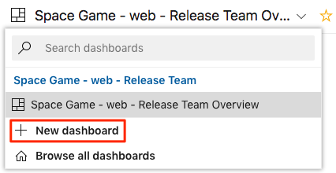
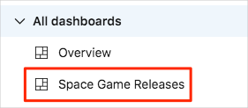

In this exercise, you add a release dashboard to Azure DevOps.

Irwin asked the Tailspin team how they can release faster. Building an automated release pipeline is a great step towards that. As you release more rapidly, it's important to understand the health and history of your releases. Looking at health trends regularly can help you diagnose potential problems before those problems become critical.

Before you set up your release dashboard, let's listen in on the Tailspin team at their morning meeting.

## How can I track the health of my entire pipeline?

In the [Build applications with Azure DevOps](/learn/paths/build-applications-with-azure-devops?azure-portal=true) learning path, you created a dashboard that tracks the status of build and test runs over time. You can add widgets to the dashboard that also track the health of your deployments.

It's the following morning. At the team meeting, Andy and Mara have just finished demonstrating the build and release pipeline that they set up as a proof of concept.

**Amita:** This is fantastic. Having just the build pipeline was a great step, but I still had to manually install the build artifact in my lab so I could test it. If I can get these releases to my test environment on a regular schedule, that would save a lot of time getting new features through QA.

**Mara:** Exactly! We can expand our release pipeline to create a more complete deployment workflow.

**Tim:** That workflow could include a staging environment as well. I could do additional stress testing before we present new features to management for final approval.

The team is excited to see what the new pipeline can do and they all start talking at once.

**Andy:** I'm excited about this as well. But let's take things one step at a time. Yes, I think we can do all of this and more, but this is just a proof of concept. We'll work on expanding it later.

**Amita:** This is great, but how do we know if what we have in this environment is valid? What I mean is, where do I go to see the health of the builds and releases?

**Andy:** Remember the dashboard we created to monitor the health of the builds? We can do the same thing for the releases. This way, we can monitor the health of the whole pipeline, and anyone interested can check in on the system and see what's happening.

**Tim:** Irwin will like that.

**Amita:** Can we add that dashboard to the proof of concept? I want to see what sort of monitoring is available.

**Andy:** Amita, you always approach things from a QA perspective. Yes, let's see what widgets we can add to the dashboard.

The team gathers around Andy's laptop.

## Create a release dashboard

You ran a template earlier to set up your Azure DevOps project. This project does not include any dashboard widgets. But recall that you added build and test quality widgets to the dashboard in previous modules.

To help others find what they need, you can create a second dashboard that focuses only on deployment health. Let's create that dashboard now.

1. In Azure DevOps, select **Overview** from the pane on the left. Then select **Dashboards**.
1. From the drop-down menu, select **+ New dashboard**.

    

1. Name the dashboard **Space Game Releases**.
1. Select **Create**.

Your dashboard is created. To find this dashboard later, select **Overview** and then **Dashboards**. Expand the **All dashboards** section to see your dashboards.

> [!IMPORTANT]
> **TODO:** I've tried this several times, and none of these widgets work because I don't have a release pipeline. We need to resolve this ASAP.

## Add the Deployment Status widget

1. From the **Space Game Releases** dashboard, select **Add a widget**.
1. Enter **Deployment Status** in the search box.
1. Drag the **Deployment Status** widget onto the canvas.
1. Select the gear icon.
1. 
1. Under **Linked release pipelines** select your pipeline and make sure both boxes are checked. TODO: Screenshot
1. Select **Save**

### Add a Release Pipeline Overview and Build History widgets

1. Search for **Release Pipeline Overview** in the Add Widget pane on the right.
1. Drag it on to the dashboard.
1. Select the gear icon to configure the widget.
1. Select your release TODO: get the name
1. Select **Save**
1. Search for **Build History** in the Add Widget pane on the right.
1. Drag it on to the dashboard.
1. Select your build **Tailspin-SpaceGame-web**.
1. Select **Save**

### Add Health Overview and Health Detail widgets

1. At the bottom of the Add Widget pane, select the **Extension Gallery** link.
1. When the Marketplace browser window opens, make sure you are on the **Azure DevOps** tab.
1. Search for **Team project Health**.  TODO: Screenshot
1. Install this extension
1. Back in Azure DevOps, refresh this screen to make sure you have the extension installed.
1. Select the **Edit** icon at the top to open the Add Widget pane. TODO: Screenshot
1. Search for **Release Health Overview** and add it to the dashboard.
1. Configure the widget.
1. Search for **Release Health Details** and add it to the dashboard.
1. Configure the widget.
1. Search for and add **Build Health Overview** and **Build Health Details**
1. Configure these widgets.

TODO: Screenshot of entire dashboard.

**Amita:** This is great. And it will make Irwin happy to have something to show management.

**Andy:** Right! But this is just the proof of concept. Now, we need to take this POC and expand on it to create a whole release and deployment workflow.
