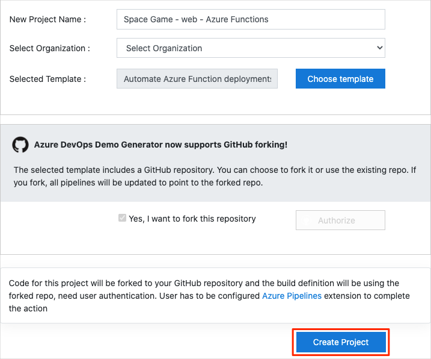
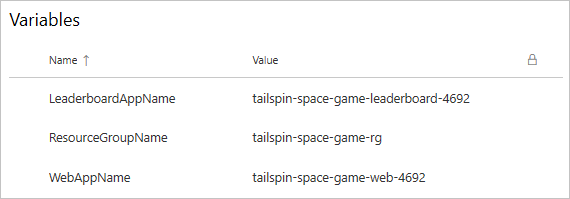

In this section, you make sure that your Azure DevOps organization is set up to complete the rest of this module. You also create the Azure App Service environments that you'll deploy to.

To accomplish these goals, you:

> [!div class="checklist"]
> * Add a user to ensure Azure DevOps can connect to your Azure subscription.
> * Set up an Azure DevOps project for this module.
> * On Azure Boards, move the work item for this module to the **Doing** column.
> * Make sure your project is set up locally so that you can push changes to the pipeline.
> * Create the Azure App Service and Azure Functions app using the Azure CLI in Azure Cloud Shell.
> * Create pipeline variables that define the names of your App Service and Azure Functions instance.
> * Create a service connection that enables Azure Pipelines to securely access your Azure subscription.

## Add a user to Azure DevOps

To complete this module, you need your own [Azure subscription](https://azure.microsoft.com/free/?azure-portal=true). You can get started with Azure for free.

You don't need an Azure subscription to work with Azure DevOps, but here you'll use Azure DevOps to deploy to Azure resources that exist in your Azure subscription. To simplify the process, use the same Microsoft account to sign in to both your Azure subscription and your Azure DevOps organization.

If you use different Microsoft accounts to sign in to Azure and Azure DevOps, add a user to your DevOps organization under the Microsoft account that you use to sign in to Azure. For more information, see [Add users to your organization or project](https://docs.microsoft.com/azure/devops/organizations/accounts/add-organization-users?view=azure-devops&tabs=browser&azure-portal=true). When you add the user, choose the **Basic** access level.

Then sign out of Azure DevOps and sign in. Use the Microsoft account that you use to sign in to your Azure subscription.

## Get the Azure DevOps project

Here you make sure that your Azure DevOps organization is set up to complete the rest of this module. To do so, you run a template that creates a project in Azure DevOps.

The modules in this learning path form a progression. You follow the Tailspin web team through their DevOps journey. For learning purposes, each module has its own Azure DevOps project.

### Run the template

Run a template that sets up your Azure DevOps organization:

> [!div class="nextstepaction"]
> [Run the template](https://azuredevopsdemogenerator.azurewebsites.net/?name=DeployAzureFunction&azure-portal=true)

From the Azure DevOps Demo Generator site, follow these steps to run the template:

1. Select **Sign In** and accept the usage terms.
1. On the **Create New Project** page, select your Azure DevOps organization. Enter a project name, such as *Space Game - web - Azure Functions*.

    

1. Select **Yes, I want to fork this repository** > **Authorize**.

    If a window appears, authorize access to your GitHub account.

    > [!IMPORTANT]
    > You need to select this option so the template will connect to your GitHub repository. Select it even if you've already forked the _Space Game_ website project. The template uses your existing fork.

1. Select **Create Project**.

    The template takes a few moments to run.

1. Select **Navigate to project** to go to your project in Azure DevOps.

> [!IMPORTANT]
> In this module, the [Clean up your Azure DevOps environment](/learn/modules/deploy-azure-functions/5-clean-up-environment?azure-portal=true) page contains important cleanup steps. Cleaning up helps ensure that you don't run out of free build minutes. Be sure to follow the cleanup steps even if you don't complete this module.

[!include[](../../shared/includes/project-visibility.md)]

## Move the work item to Doing

Here you assign a work item to yourself on Azure Boards. You also move the work item to the **Doing** state. In practice, you and your team would create work items at the start of each *sprint*, or work iteration.

This work assignment gives you a checklist to work from. It gives other team members visibility into what you're working on and how much work is left. The work item also helps enforce work-in-progress (WIP) limits so that the team doesn't take on too much work at one time.

Here you move the first item, **Refactor leaderboard API as an Azure Functions app**, to the **Doing** column. Then you assign yourself to the work item.

To set up the work item:

1. From Azure DevOps, navigate to **Boards**. Then select **Boards** from the menu.

    

1. In the **Refactor leaderboard API as an Azure Function** work item, select the down arrow at the bottom of the card. Then assign the work item to yourself.

    
1. Move the work item from the **To Do** column to the **Doing** column.

    

At the end of this module, you'll move the card to the **Done** column after you complete the task.

## Create the Azure App Service and Azure Functions environments

Here you create the App Service and Azure Functions app required to deploy the new version of the site and API.

In [Create a release pipeline with Azure Pipelines](/learn/modules/create-release-pipeline?azure-portal=true), you brought up App Service through the Azure portal. Although the portal is a great way to explore what's available on Azure or to do basic tasks, bringing up components such as App Service can be tedious.

In this module, you use the Azure CLI to bring up an App Service instance. You can access the Azure CLI from a terminal or through Visual Studio Code. Here you access the Azure CLI from Azure Cloud Shell. This browser-based shell experience is hosted in the cloud. In Cloud Shell, the Azure CLI is configured for use with your Azure subscription.

> [!IMPORTANT]
> You need your own Azure subscription to complete the exercises in this module.

### Bring up Cloud Shell through the Azure portal

1. Go to the [Azure portal](https://portal.azure.com?azure-portal=true) and sign in.
1. From the menu, select **Cloud Shell**. When prompted, select the **Bash** experience.

    

    > [!NOTE]
    > Cloud Shell requires an Azure storage resource to persist any files that you create in Cloud Shell. When you first open Cloud Shell, you're prompted to create a resource group, storage account, and Azure Files share. This setup is automatically used for all future Cloud Shell sessions.

### Select an Azure region

A _region_ is one or more Azure datacenters within a geographic location. East US, West US, and North Europe are examples of regions. Every Azure resource, including an App Service instance, is assigned a region.

To make commands easier to run, start by selecting a default region. After you specify the default region, later commands use that region unless you specify a different region.

1. From Cloud Shell, run the following `az account list-locations` command to list the regions that are available from your Azure subscription.

    ```azurecli
    az account list-locations \
      --query "[].{Name: name, DisplayName: displayName}" \
      --output table
    ```

1. From the `Name` column in the output, choose a region that's close to you. For example, choose `eastasia` or `westus2`.

1. Run `az configure` to set your default region. Replace `<REGION>` with the name of the region you chose.

    ```azurecli
    az configure --defaults location=<REGION>
    ```

    This example sets `westus2` as the default region:

    ```azurecli
    az configure --defaults location=westus2
    ```

### Create some Bash variables

Here, create some Bash variables to make the setup process more convenient and less error-prone. Using variables for shared text strings helps avoid accidental typos.

1. From Cloud Shell, generate a random number. This will make it easier to create globally unique names for certain services in the next step.

    ```bash
    resourceSuffix=$RANDOM
    ```

1. Create three globally unique names for your App Service, Azure Function, and storage accounts. Note that these commands use double quotes, which instructs Bash to interpolate the variables using the inline syntax.

    ```bash
    webName="tailspin-space-game-web-${resourceSuffix}"
    leaderboardName="tailspin-space-game-leaderboard-${resourceSuffix}"
    storageName="tailspinspacegame${resourceSuffix}"
    ```

1. Create two more Bash variables to store the names of your resource group and service plan.

    ```bash
    rgName='tailspin-space-game-rg'
    planName='tailspin-space-game-asp'
    ```

### Create the Azure resources required

This solution requires several Azure resources for deployment, which will be created now.

   > [!NOTE]
   > For learning purposes, here you use the default network settings. These settings make your site accessible from the internet. In practice, you could configure an Azure virtual network that places your website in a network that's not internet routable and that only you and your team can access. Later, you could reconfigure your network to make the website available to your users.

1. Run the following `az group create` command to create a resource group using the name defined earlier.

    ```azurecli
    az group create --name $rgName
    ```

1. Run the following `az appservice plan create` command to create an App Service plan using the name defined earlier.

    ```azurecli
    az appservice plan create \
      --name $planName \
      --resource-group $rgName \
      --sku B1
    ```

    The `--sku` argument specifies the B1 plan. This plan runs on the Basic tier.

    > [!IMPORTANT]
    > If the B1 SKU isn't available in your Azure subscription, [choose a different plan](https://azure.microsoft.com/pricing/details/app-service/linux/?azure-portal=true), such as S1 (Standard).

1. Run the following `az webapp create` command to create the App Service instance.

    ```azurecli
    az webapp create \
      --name $webName \
      --resource-group $rgName \
      --plan $planName
    ```

1. Azure Functions requires a storage account for deployment. Run the following `az storage account create` command to create it.

    ```azurecli
    az storage account create \
      --name $storageName \
      --resource-group $rgName \
      --sku Standard_LRS
    ```

1. Run the following `az functionapp create` command to create the Azure Functions app instance. Replace the &lt;region&gt; with your preferred region.

    ```azurecli
    az functionapp create \
      --name $leaderboardName \
      --resource-group $rgName \
      --storage-account $storageName \
      --functions-version 3 \
      --consumption-plan-location <region>
    ```

1. Run the following `az webapp list` command to list the host name and state of the App Service instance.

    ```azurecli
    az webapp list \
      --resource-group $rgName \
      --query "[].{hostName: defaultHostName, state: state}" \
      --output table
    ```

    Note the host name for the running service. You'll need the web host name later when you verify your work. Here's an example:

    ```output
    HostName                                        State
    ----------------------------------------------  -------
    tailspin-space-game-web-4692.azurewebsites.net  Running
    ```

1. Run the following `az functionapp list` command to list the host name and state of the Azure Functions instance.

    ```azurecli
    az functionapp list \
      --resource-group $rgName \
      --query "[].{hostName: defaultHostName, state: state}" \
      --output table
    ```

    Note the host name for the running service. You'll need the leaderboard host name later when you verify your work. Here's an example:

    ```output
    HostName                                                State
    ------------------------------------------------------  -------
    tailspin-space-game-leaderboard-4692.azurewebsites.net  Running
    ```

1. Copy these two host names to a location you can easily access later.

1. As an optional step, go to one or more of the host names. Verify that they're running and that the default home page appears.

> [!IMPORTANT]
> The [Clean up your Azure DevOps environment](/learn/modules/deploy-azure-functions/5-clean-up-environment?azure-portal=true) page in this module contains important cleanup steps. Cleaning up helps ensure that you're not charged for Azure resources after you complete this module. Be sure to perform the cleanup steps even if you don't complete this module.

## Create pipeline variables in Azure Pipelines

In [Create a release pipeline with Azure Pipelines](/learn/modules/create-release-pipeline?azure-portal=true), you added a variable to your pipeline that stores the name of your web app in App Service. Here you do the same. In addition, you will add the name of your leaderboard app for the Azure Functions instance.

You could hard-code these names in your pipeline configuration, but if you define them as variables, your configuration will be more reusable. Plus, if the names of your instances change, you can update the variables and trigger your pipeline without modifying your configuration.

To add the variables:

1. In Azure DevOps, go to your **Space Game - web - Azure Functions** project.

1. Under **Pipelines**, select **Library**.

    

1. Select **+ Variable group**.

1. Under **Properties**, enter *Release* for the variable group name.

1. Under **Variables**, select **+ Add**.

1. For the name of your variable, enter *WebAppName*. For the value, enter the name of the App Service instance created above, such as *tailspin-space-game-web-4692*.

    > [!IMPORTANT]
    > Set the name of the App Service instance, not its host name. In this example, you would enter *tailspin-space-game-web-4692* and not *tailspin-space-game-web-4692.azurewebsites.net*.

1. Repeat the process to add another variable named *LeaderboardAppName* with the value of your Azure Functions app name, such as *tailspin-space-game-leaderboard-4692*.

1. Add a final variable named *ResourceGroupName* with the value *tailspin-space-game-rg*.

1. Near the top of the page, select **Save** to save your variable to the pipeline.

    Your variable group resembles this one:

    

## Create a service connection

Here you create a service connection that enables Azure Pipelines to access your Azure subscription. Azure Pipelines uses this service connection to deploy the website to App Service. You created a similar service connection in the previous module.

> [!IMPORTANT]
> Make sure that you're signed in to both the Azure portal and Azure DevOps under the same Microsoft account.

1. In Azure DevOps, go to your **Space Game - web - Azure Functions** project.
1. From the bottom corner of the page, select **Project settings**.
1. Under **Pipelines**, select **Service connections**.
1. Select **New service connection**, then choose **Azure Resource Manager**, then select **Next**.
1. Near the top of the page, **Service principal (automatic)**. Then select **Next**.
1. Fill in these fields:

    | Field                   | Value                                      |
    |-------------------------|--------------------------------------------|
    | Scope level             | **Subscription**                           |
    | Subscription            | Your Azure subscription                    |
    | Resource Group          | **tailspin-space-game-rg**                 |
    | Service connection name | *Resource Manager - Tailspin - Space Game* |

    During the process, you might be prompted to sign in to your Microsoft account.

1. Ensure that **Grant access permission to all pipelines** is selected.

1. Select **Save**.

    Azure DevOps performs a test connection to verify that it can connect to your Azure subscription. If Azure DevOps can't connect, you have the chance to sign in a second time.
