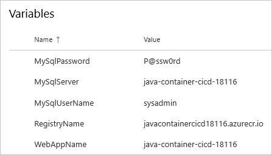

In this section, you make sure that your Azure DevOps organization is set up to complete the rest of this module. You also create the Azure App Service environments that you'll deploy to.

To accomplish these goals, you:

> [!div class="checklist"]
> * Add a user to ensure Azure DevOps can connect to your Azure subscription.
> * Clone a GitHub repo for this module.
> * Create the Azure App Service using the Azure CLI in Azure Cloud Shell.

## Add a user to Azure DevOps

To complete this module, you need your own [Azure subscription](https://azure.microsoft.com/free/?azure-portal=true). You can get started with Azure for free.

You don't need an Azure subscription to work with Azure DevOps, but here you'll use Azure DevOps to deploy to Azure resources that exist in your Azure subscription. To simplify the process, use the same Microsoft account to sign in to both your Azure subscription and your Azure DevOps organization.

If you use different Microsoft accounts to sign in to Azure and Azure DevOps, add a user to your DevOps organization under the Microsoft account that you use to sign in to Azure. For more information, see [Add users to your organization or project](https://docs.microsoft.com/azure/devops/organizations/accounts/add-organization-users?view=azure-devops&tabs=browser&azure-portal=true). When you add the user, choose the **Basic** access level.

Then sign out of Azure DevOps and sign in. Use the Microsoft account that you use to sign in to your Azure subscription.

## Get the Azure DevOps project

Here you make sure that your Azure DevOps organization is set up to complete the rest of this module. You set it up by running a template that creates a project in Azure DevOps.

### Run the template

Run a template that sets up your Azure DevOps organization.

> [!div class="nextstepaction"]
> [Run the template](https://azuredevopsdemogenerator.azurewebsites.net/?TemplateId=77371&Name=MyShuttle&azure-portal=true)

On the Azure DevOps Demo Generator site, follow these steps to run the template:

1. Select **Sign In** and accept the usage terms.
1. On the **Create New Project** page, select your Azure DevOps organization. Then enter a project name, such as *java-container-cicd*.

    

1. Select **Create Project**.

    The template takes a few moments to run.
1. Select **Navigate to project** to go to your project in Azure DevOps.

## Create the Azure App Service environment

Here you create the App Service resources required to deploy the Java container app.

In this module, you use the Azure CLI to spin up the Azure App Service that will host the Java container app, which includes an Azure Container Registry and an Azure Database for MySQL instance. You can access the Azure CLI from a terminal or through Visual Studio Code. Here you access the Azure CLI from Azure Cloud Shell. This browser-based shell experience is hosted in the cloud. In Cloud Shell, the Azure CLI is configured for use with your Azure subscription.

> [!IMPORTANT]
> You need your own Azure subscription to complete the exercises in this module.

### Bring up Cloud Shell through the Azure portal

1. Go to the [Azure portal](https://portal.azure.com?azure-portal=true) and sign in.
1. From the menu, select **Cloud Shell**. When prompted, select the **Bash** experience.

    

    > [!NOTE]
    > Cloud Shell requires an Azure storage resource to persist any files that you create in Cloud Shell. When you first open Cloud Shell, you're prompted to create a resource group, storage account, and Azure Files share. This setup is automatically used for all future Cloud Shell sessions.

### Select an Azure region

A _region_ is one or more Azure datacenters within a geographic location. East US, West US, and North Europe are examples of regions. Every Azure resource, including an App Service instance, is assigned a region.

To make commands easier to run, start by selecting a default region. After you specify the default region, later commands use that region unless you specify a different region.

1. From Cloud Shell, run the following `az account list-locations` command to list the regions that are available from your Azure subscription.

    ```azurecli
    az account list-locations \
      --query "[].{Name: name, DisplayName: displayName}" \
      --output table
    ```

1. From the `Name` column in the output, choose a region that's close to you. For example, choose `eastasia` or `westus2`.

1. Run `az configure` to set your default region. Replace `<REGION>` with the name of the region you chose.

    ```azurecli
    az configure --defaults location=<REGION>
    ```

    This example sets `westus2` as the default region:

    ```azurecli
    az configure --defaults location=westus2
    ```

### Create some Bash variables

Here, create some Bash variables to make the setup process more convenient and less error-prone. Using variables for shared text strings helps avoid accidental typos.

1. From Cloud Shell, generate a random number. This will make it easier to create globally unique names for certain services in the next step.

    ```azurecli
    resourceSuffix=$RANDOM
    ```

1. Create globally unique names for your App Service Web App, Azure Container Registry, and Azure Database for MySQL server. Note that these commands use double quotes, which instructs Bash to interpolate the variables using the inline syntax.
 
    ```azurecli
	webName="java-container-cicd-${resourceSuffix}"
	registryName="javacontainercicd${resourceSuffix}"
	dbServerName="java-container-cicd-${resourceSuffix}"
	```

1. Create two more Bash variables to store the names of your resource group and service plan. 

    ```azurecli
	rgName='java-container-cicd-rg'
	planName='java-container-cicd-asp'
	```

### Create the Azure resources required

This solution requires several Azure resources for deployment, which will be created now.

   > [!NOTE]
   > For learning purposes, here you use the default network settings. These settings make your site accessible from the internet. In practice, you could configure an Azure virtual network that places your website in a network that's not internet routable and that only you and your team can access. Later, you could reconfigure your network to make the website available to your users.

1. Run the following `az group create` command to create a resource group using the name defined earlier.

    ```azurecli
	az group create --name $rgName
    ```

1. Run the following `az mysql server create` command to create an Azure Database for MySQL server using the name defined earlier. You may opt to change the admin username and password supplied here, but just remember them for later reference. Note that this step may take several minutes to complete.

    ```azurecli
	az mysql server create \
      --name $dbServerName \
      --resource-group $rgName \
      --admin-user sysadmin \
      --admin-password P@ssw0rd \
      --sku-name GP_Gen5_2 \
      --version 5.7
    ```

1. Run the following `az mysql server firewall-rule create` command to create a firewall rule to allow services hosted in Azure (like the one you are deploying) to access the server. By default, all incoming connections to the server are blocked, so it should be necessary to add at least one rule for it to be accessible.

    ```azurecli
	az mysql server firewall-rule create \
      --name AllowAzureServices \
      --resource-group $rgName \
      --server $dbServerName \
      --start-ip-address 0.0.0.0 \
      --end-ip-address 0.0.0.0
    ```

1. Run the following `az acr create` command to create an Azure Container Registry using the name defined earlier.

    ```azurecli
	az acr create --name $registryName \
      --resource-group $rgName \
      --sku Standard \
      --admin-enabled true
    ```

1. Run the following `az appservice plan create` command to create an App Service plan using the name defined earlier.

    ```azurecli
	az appservice plan create \
	  --name $planName \
	  --resource-group $rgName \
	  --sku B1 \
      --is-linux
    ```

    The `--sku` argument specifies the B1 plan. This plan runs on the Basic tier.

    > [!IMPORTANT]
    > If the B1 SKU isn't available in your Azure subscription, [choose a different plan](https://azure.microsoft.com/pricing/details/app-service/linux/?azure-portal=true), such as S1 (Standard).

1. Run the following `az webapp create` command to create the App Service instance.

    ```azurecli
    az webapp create \
	  --name $webName \
	  --resource-group $rgName \
	  --plan $planName \
      --deployment-container-image-name $registryName.azurecr.io/web:latest
    ```

1. Run the following `az webapp list` command to list the host name and state of the App Service instance.

    ```azurecli
    az webapp list \
	  --resource-group $rgName \
	  --query "[].{hostName: defaultHostName, state: state}" \
	  --output table
    ```

    Note the host name for the running service. You'll need it later when you verify your work. Here's an example:

    ```output
    HostName                                        State
    ----------------------------------------------  -------
    java-container-cicd-18116.azurewebsites.net  Running
    ```

1. Run the following `az acr list` command to list the login server of the Azure Container Registry instance. You will need this server name when creating pipeline variables later.

    ```azurecli
    az acr list \
	  --resource-group $rgName \
	  --query "[].{loginServer: loginServer}" \
	  --output table
    ```

    Note the login server. You'll need it later when you configure the pipeline. Here's an example:

    ```output
	LoginServer
	---------------------------------
	javacontainercicd18116.azurecr.io    
    ```

> [!IMPORTANT]
> The [Clean up your Azure DevOps environment](/learn/modules/deploy-java-containers/5-clean-up-environment?azure-portal=true) page in this module contains important cleanup steps. Cleaning up helps ensure that you're not charged for Azure resources after you complete this module. Be sure to perform the cleanup steps even if you don't complete this module.

## Create pipeline variables in Azure Pipelines

Your pipeline is going to need to include some variable names that specify the resources created in the previous steps. You could hard-code these names in your pipeline configuration, but if you define them as variables, your configuration will be more reusable. Plus, if the names of your instances change, you can update the variables and trigger your pipeline without modifying your configuration.

To add the variables:

1. In Azure DevOps, go to the project created for this module.

1. Under **Pipelines**, select **Library**.

    

1. Select **+ Variable group**.

1. Under **Properties**, enter **Release** for the variable group name.

1. Under **Variables**, select **+ Add**.

1. For the name of your variable, enter *WebAppName*. For the value, enter the name of the App Service instance created above, such as *java-container-cicd-18116*.

    > [!IMPORTANT]
    > Set the name of the App Service instance, not its host name. In this example, you would enter *java-container-cicd-18116* and not *java-container-cicd-18116.azurewebsites.net*.

1. Repeat the process to add another variable named *RegistryName* with the value of your Azure Container Registry login server, such as *javacontainercicd18116.azurecr.io*.

1. Repeat the process to add another variable named *MySqlServer* with the value of your MySQL server host name, such as *java-cicd-18116*. You should not use the fully qualified domain, just the host. If you followed the instructions as-is, then this is the same as your web app name.

1. Repeat the process to add another variable named *MySqlUserName* with the value of the MySQL user name used to create the server, such as *sysadmin*.

1. Repeat the process to add another variable named *MySqlPassword* with the value of the MySQL password used to create the server, such as *P@ssw0rd*.

    > [!IMPORTANT]
    > In a real world scenario, you should use a more secure storage mechanism for credentials, such as Azure Key Vault. To learn more about Azure Key Valult, see [Configure and manage secrets in Azure Key Vault](/learn/modules/configure-and-manage-azure-key-vault/?azure-portal=true).

1. Near the top of the page, select **Save** to save your variable to the pipeline.

    Your variable group resembles this one:

    

## Create required service connections

Here you create a service connection that enables Azure Pipelines to access your Azure subscription. Azure Pipelines uses this service connection to deploy the website to App Service. You created a similar service connection in the previous module. You will also create a Docker Registry connection to publish your container to the Azure Container Registry.

> [!IMPORTANT]
> Make sure that you're signed in to both the Azure portal and Azure DevOps under the same Microsoft account.

1. In Azure DevOps, go to the project created for this module.
1. From the bottom corner of the page, select **Project settings**.
1. Under **Pipelines**, select **Service connections**.
1. Select **Create service connection**, then choose **Azure Resource Manager**, then select **Next**.
1. Near the top of the page, select **Service principal (automatic)**.
1. Fill in these fields:

    | Field           | Value                                        |
    |-----------------|----------------------------------------------|
    | Scope level     | **Subscription**                             |
    | Subscription    | Your Azure subscription                      |
    | Resource Group  | **java-container-cicd-rg**                   |
    | Service connection name | *Azure Connection*                           |

    During the process, you might be prompted to sign in to your Microsoft account.

1. Ensure that **Allow all pipelines to use this connection** is selected.

1. Select **OK**.

    Azure DevOps performs a test connection to verify that it can connect to your Azure subscription. If Azure DevOps can't connect, you have the chance to sign in a second time.

1. Select **New service connection**, then choose **Docker Registry**, then select **Next**.
1. Near the top of the page, select **Azure Container Registry**.
1. Fill in these fields:

    | Field               | Value                                        |
    |---------------------|----------------------------------------------|
    | Subscription    | Your Azure subscription                          |
    | Azure container registry  | **Select the one you created earlier** |
    | Service connection name | *Container Registry Connection*          |

1. Ensure that **Grant access permission to all pipelines** is selected.

1. Select **OK**.