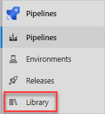
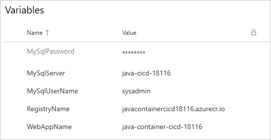
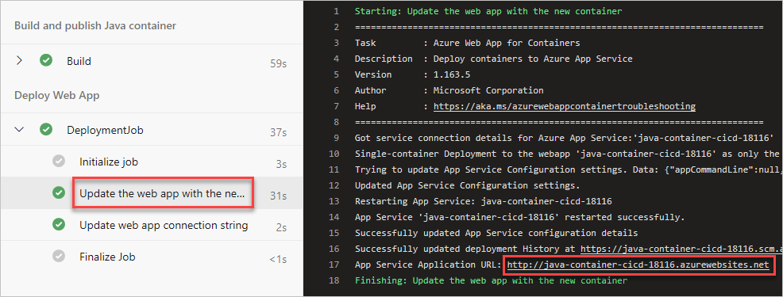
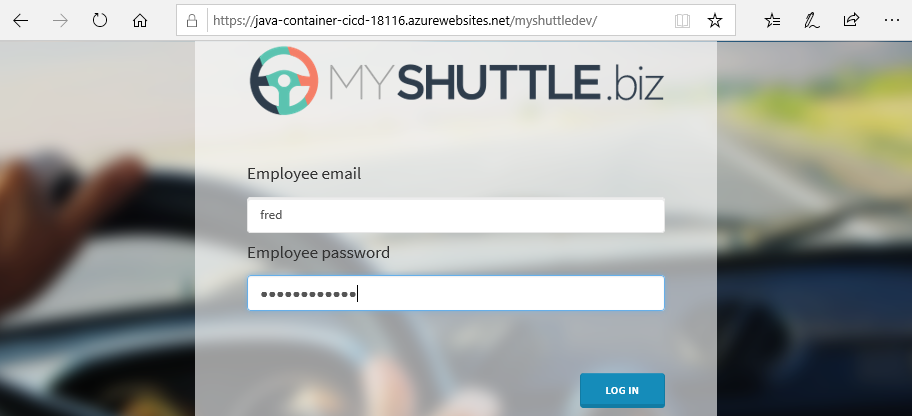

In this part, you create a project in Azure Pipelines that builds and deploys that project to the Azure app service created earlier.

The GitHub repo that you forked for this project contains the source code for a basic Java web project that connects to a MySQL database.

In this part, you'll:

> [!div class="checklist"]
> * Install the Azure Pipelines extension for your GitHub repo.
> * Set up an Azure DevOps project for this module.
> * Create pipeline variables in Azure Pipelines.
> * Create required service connections so Azure Pipelines can connect to your Azure Container Registry and Azure App Service.
> * Create a CI/CD pipeline to build and publish the Java container app.
> * Save the pipeline to trigger a CI/CD workflow.

## Install the Azure Pipelines extension

Here you install the Azure Pipelines extension for your GitHub repository. This extension enables Azure Pipelines to access your GitHub account so that it can pull the latest source code from your repository.

1. Go to the [GitHub Marketplace](https://github.com/marketplace?azure-portal=true).
1. Search for **Azure Pipelines** and select the **Azure Pipelines** result.
1. Locate the **Free** option and select **Install it for free**.
1. Select **Complete order and begin installation**.
1. Select **Only select repositories** and choose the **mslearn-java-containers** repository that you forked earlier.
1. Select **Install**.

## Set up an Azure DevOps project

The previous task links your GitHub repository to your Azure DevOps organization. To complete the process, you now create an Azure DevOps project.

1. Sign into your account at [dev.azure.com](https://dev.azure.com?azure-portal=true).
1. Select **+ New project**.

    The **Create new project** dialog box opens.
1. In the **Project name** field, enter a name such as *mslearn-java-containers*.
1. Under **Visibility**, you choose whether to make your project public or private. For now, you can choose private.

    Creators of open source projects will often choose public visibility so that others can view active issues and build status.
1. Select **Advanced**.
1. Under **Version control**, make sure that **Git** is selected.
1. Select **Create**.

## Create pipeline variables in Azure Pipelines

Your pipeline is going to need to include some variable names that specify the resources created in the previous steps. You could hard-code these names in your pipeline configuration, but if you define them as variables, your configuration will be more reusable. Plus, if the names of your instances change, you can update the variables and trigger your pipeline without modifying your configuration.

To add the variables:

1. In Azure DevOps, go to your **mslearn-java-containers** project.
1. Under **Pipelines**, select **Library**.

    

1. Select **+ Variable group**.
1. Under **Properties**, enter *Release* for the variable group name.
1. Under **Variables**, select **+ Add**.
1. For the name of your variable, enter *WebAppName*. For the value, enter the name of the App Service instance created above, such as *java-container-cicd-18116*.

    > [!IMPORTANT]
    > Set the name of the App Service instance, not its host name. In this example, you would enter *java-container-cicd-18116* and not *java-container-cicd-18116.azurewebsites.net*.

1. Repeat the process to add another variable named *RegistryName* with the value of your Azure Container Registry login server, such as *javacontainercicd18116.azurecr.io*.
1. Repeat the process to add another variable named *MySqlServer* with the value of your MySQL server host name, such as *java-container-cicd-18116*. You should not use the fully qualified domain, just the host. If you followed the instructions as-is, then this is the same as your web app name.
1. Repeat the process to add another variable named *MySqlUserName* with the value of the MySQL user name used to create the server, such as *sysadmin*.
1. Repeat the process to add another variable named *MySqlPassword* with the value of the MySQL password used to create the server, such as *P@ssw0rd*. Select the padlock icon that appears when you hover over the variable to *Change variable type to secret* so that it will not be shown as plaintext once saved.

    > [!IMPORTANT]
    > In a real world scenario, you may opt to use an alternative storage mechanism for credentials, such as Azure Key Vault. To learn more about Azure Key Valult, see [Configure and manage secrets in Azure Key Vault](/learn/modules/configure-and-manage-azure-key-vault/?azure-portal=true).

1. Near the top of the page, select **Save** to save your variable to the pipeline.

    Your variable group resembles this one:

    

## Create required service connections

Here you create a service connection that enables Azure Pipelines to access your Azure subscription. Azure Pipelines uses this service connection to deploy the website to App Service. You created a similar service connection in the previous module. You will also create a Docker Registry connection to publish your container to the Azure Container Registry.

> [!IMPORTANT]
> Make sure that you're signed in to both the Azure portal and Azure DevOps under the same Microsoft account.

1. In Azure DevOps, go to the project created for this module.
1. From the bottom corner of the page, select **Project settings**.
1. Under **Pipelines**, select **Service connections**.
1. Select **Create service connection**, then choose **Azure Resource Manager**, then select **Next**.
1. Near the top of the page, choose **Service principal (automatic)**, then select **Next**.
1. Fill in these fields:

    | Field           | Value                                        |
    |-----------------|----------------------------------------------|
    | Scope level     | **Subscription**                             |
    | Subscription    | Your Azure subscription                      |
    | Resource Group  | **java-container-cicd-rg**                   |
    | Service connection name | *Azure Connection*                           |

    During the process, you might be prompted to sign in to your Microsoft account.

1. Ensure that **Grant access permission to all pipelines** is selected.

1. Select **Save**.

    Azure DevOps performs a test connection to verify that it can connect to your Azure subscription. If Azure DevOps can't connect, you have the chance to sign in a second time.

1. Select **New service connection**, then choose **Docker Registry**, then select **Next**.
1. Near the top of the page, select **Azure Container Registry**.
1. Fill in these fields:

    | Field               | Value                                        |
    |---------------------|----------------------------------------------|
    | Subscription    | Your Azure subscription                          |
    | Azure container registry  | **Select the one you created earlier** |
    | Service connection name | *Container Registry Connection*          |

1. Ensure that **Grant access permission to all pipelines** is selected.
1. Select **Save**.

## Create the CI/CD pipeline

Here you create a CI/CD pipeline that's based on a starter template. The process generates a pipelines configuration file named *azure-pipelines.yml*, which lives in the root directory of your Git repository.

1. In Azure DevOps, go to your **mslearn-java-containers** project.
1. Select **Pipelines**, either from the project page or from the left pane.
1. Select **Create Pipeline**.
1. On the **Connect** tab, select **GitHub**.

    If prompted, enter your GitHub credentials.
1. On the **Select** tab, select your **mslearn-java-containers** repository.
1. On the **Configure** tab, select **Starter pipeline**. While there are other templates you could choose that provide starter pipeline code, in this module you'll define each of the build steps.
1. On the **Review** tab, review the starter code for your pipeline configuration. Don't select **Save and run** just yet.

### Setting up the trigger and variables  

The pipeline runs whenever there is a change to the `master` branch on GitHub. Replace the contents of *azure-pipelines.yml* with this:

[!code-yml[](code/4-1-azure-pipelines.yml)]

### Pipeline variables

To aid in pipeline maintenance, the default template uses variables for commonly-used parameters, such as the name of the container repository to publish the app image to. You can also import variables from pipeline libraries managed outside of the pipeline itself.

Add this code the to end of the pipeline:

[!code-yml[](code/4-2-azure-pipelines.yml)]

### The Build stage

This pipeline is divided into two stages: *Build* and *Deploy*. The build stage configures and runs the build, publishing the package to artifact storage.

Add this code to define the *Build* stage:

[!code-yml[](code/4-3-azure-pipelines.yml)]

### Maven task

The `Maven@3` task builds Java projects. For the purposes of this pipeline, only the `options` and `publishJUnitResults` parameters are used to specify the path to the settings file and to skip publishing test results. You can learn more about this task in the [Maven task](/azure/devops/pipelines/tasks/build/maven?azure-portal=true) documentation.

Add this code to the end of the pipeline:

[!code-yml[](code/4-4-azure-pipelines.yml)]

> [!IMPORTANT]
> YAML is very particular about indentation. Fortunately, the Azure Pipelines YAML editor is your best friend. After each step where you add YAML in this module, take a moment to review the editor to be sure that it's satisfied with your indentation (no visual warnings about indentation) before continuing.

### Copying output files

The build produces a WAR file that must be accessible to the Docker build. To make it available, use the `CopyFiles@2` task to copy it to the artifact staging directory.

Add this code to the end of the pipeline:

[!code-yml[](code/4-5-azure-pipelines.yml)]

### Docker task

The `Docker@2` task builds and deploys Docker containers. It's ideal for this scenario because it accomplishes everything in a single task:

* `command` indicates the feature to run. In this case, `buildAndPush` does exactly what it sounds like.
* `buildContext` specifies the path to the build context.
* `repository` specifies the name of the repository.
* `dockerfile` specifies the path to the Dockerfile.
* `containerRegistry` specifies the name of the container registry connection to use.
* `tags` indicates which tags to apply to the container image.

You can learn more about this task in the [Docker task](/azure/devops/pipelines/tasks/build/docker?azure-portal=true) documentation.

Add this code to the end of the pipeline:

[!code-yml[](code/4-6-azure-pipelines.yml)]

### Azure Database for Mysql Deployment task

The `AzureMysqlDeployment@1` task enables the pipeline to run scripts against an Azure Database for MySQL instance. In this case, the task is needed to run the initialization script that creates the database and configures sample data. It's safe to run this code every time the pipeline runs because it only makes changes when necessary.

* `azureSubscription` specifies the name of the Azure service connection to use.
* `ServerName` specifies the fully-qualified host name of the server.
* `DatabaseName` specifies the name of the database, which is `alm` in this app.
* `SqlUsername` specifies the username in the format *username@server*.
* `SqlPassword` specifies the password configured earlier.
* `SqlFile` specifies the script to run. This is in the root of the project's source.

You can learn more about this task in the [Azure Database for Mysql Deployment task](/azure/devops/pipelines/tasks/deploy/azure-mysql-deployment?azure-portal=true) documentation.

Add this code to the end of the pipeline:

[!code-yml[](code/4-7-azure-pipelines.yml)]

### Deploying the build image

The second stage of the pipeline manages deploying the solution out to Azure. It takes a dependency on the *Build* stage completing successfully and imports the variables from the **Release** library that you created earlier.

Add this code to the end of the pipeline:

[!code-yml[](code/4-8-azure-pipelines.yml)]

### Azure Web App for Container task

The `AzureWebAppContainer@1` task deploys Docker containers to Azure App Service. Deployment can be accomplished with a single task:

* `appName` specifies the name of the App Service instance.
* `azureSubscription` specifies the name of the Azure connection.
* `imageName` specifies the full name of the Docker container image.

You can learn more about the flexibility of this task in the [Azure Web App for Container task](/azure/devops/pipelines/tasks/deploy/azure-rm-web-app-containers?azure-portal=true) documentation.

Add this code to the end of the pipeline:

[!code-yml[](code/4-9-azure-pipelines.yml)]

### Azure App Service Settings task

The `AzureAppServiceSettings@1` task enables pipelines to update the settings of an app service in Azure. In this case, the pipeline is going to add (or update) the connection string the container app uses after each successful deployment. The parameters are straightforward:

* `azureSubscription` specifies the name of the Azure connection.
* `appName` specifies the name of the App Service instance.
* `resourceGroupName` specifies the resource group the app service belongs to. 
* `connectionStrings` provides the JSON-formatted list of connection string settings to apply.

You can learn more about the details of this task in the [Azure App Service Settings task](/azure/devops/pipelines/tasks/deploy/azure-app-service-settings?azure-portal=true) documentation.

Add this code to the end of the pipeline:

[!code-yml[](code/4-10-azure-pipelines.yml)]

## Save the pipeline to trigger the build

1. Select **Save and run** from the top right corner of the page. Confirm the **Save and run** to trigger a run.
1. In Azure Pipelines, go to the build. Trace the build as it runs.
1. After the build has succeeded, select the web site's deploy task and copy the URL to view the deployed site.

    

1. The site is hosted under the */myshuttledev/* path on the server. Append that path to the copied URL and navigate to it in a new browser tab, such as:

    ```
    http://java-container-cicd-18116.azurewebsites.net/myshuttledev/
    ```

1. You see the site running on App Service. You can log in to the site using the credentials *fred*/*fredpassword*.

    