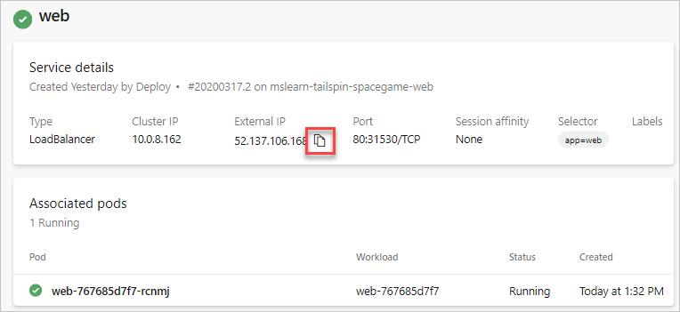
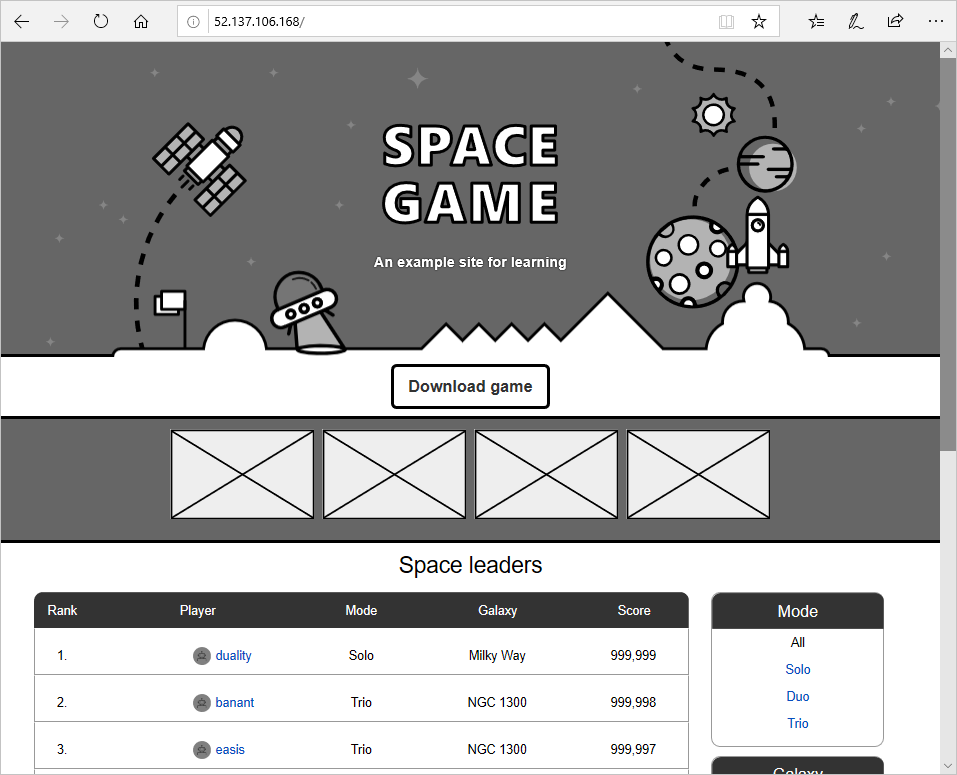
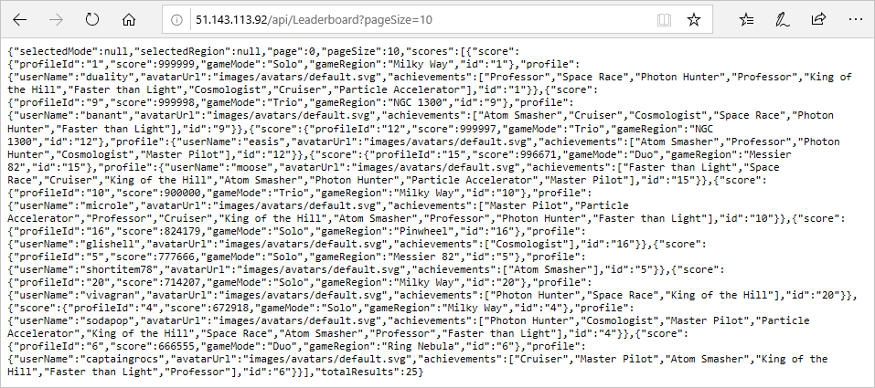

Your project came with a release pipeline that builds the web project in the solution as a Docker container and deploys it to Azure App Service. This will all need to be updated to support the multi-container deployment to Kubernetes.

In this part, you'll:

> [!div class="checklist"]
> * Update the pipeline to support CI/CD on a commit to the master branch.
> * Define some pipeline variables to make the build pipeline easier to maintain.
> * Add a task to build and publish the leaderboard container to your container registry.
> * Add a task to publish Kubernetes manifests from the **Build** stage so that they can be downloaded for use in the **Deploy** stage.
> * Add a task to create an image pull secret for use between your Kubernetes and container registry instances.
> * Add a task to deploy updated images to a Kubernetes cluster.
> * Save the pipeline to trigger a CI/CD workflow.

## Update the pipeline to support CI/CD

Here you add a new pipeline variable to the existing CI/CD pipeline defined in *azure-pipelines.yml*.

1. From Azure DevOps, navigate to **Pipelines**.
1. Select the pipeline.
1. Select **Edit**. This brings up the *azure-pipelines.yml* file that defines the existing CI/CD pipeline.

    **Andy:** This was the build stage we had in place for the previous single-container solution. I knew it wasn't going to run properly, so I disabled it. We can start off by re-enabling CI/CD for commits to the `master` branch.

1. Replace the existing `trigger` line at the top of the file with the code below. This will automate runs when there is a commit to the master branch.

    [!code-yml]

## Define variables to be shared within the pipeline

**Andy:** We're going to need to add two variables for the pipeline. The first will specify the name of the leaderboard repository, which is `leaderboard`. The other will be the name we want to use for the image pull secret shared by our AKS and ACR instances when deploying.

1. Add the highlighted code below to the `variables` section.

    [!code-yml]

## Add a task to build and publish the leaderboard container

**Andy:** We already have a task for building the web app as a Docker container, which we publish to our container registry. We can just use a second task to do the same for our leaderboard.

1. Add a second `Docker@2` task that builds and pushes the leaderboard container using the highlighted code below. Add this task after the web container task.

    [!code-yml]

    > [!TIP]
    > In a YAML file, whitespace is important. Ensure that the task you add here uses the same indentation as the previous task.

## Add a task to publish the Kubernetes manifests for use in the Deploy stage

**Andy:** I think we can move on to the next stage. Do you see anything missing?

**Mara:** You mentioned that there were some manifest files in the source project that define the deployment and services Kubernetes will need when we deploy. We should publish those before we finish this stage.

**Andy:** Do we need to? Won't they still be on the local disk?

**Mara:** They would be if we were adding the deployment tasks within the same stage as the build. However, since our deployment tasks happen in their own *Deploy* stage, it will run on a completely fresh environment, probably even on a different agent. We should be sure to publish anything this stage produces that the other stage will need.

**Andy:** That's a great point. Is it easy to do? We just need to make sure the *manifests* folder is copied to the new agent.

**Mara**: That's what the `PublishBuildArtifacts@1` task is for. It's so common that there's even a shorthand for it, `publish`.

1. Add a `publish` task that stores the *manifests* folder for a future stage as shown below. Be sure to match the indentation of the previous task.

    [!code-yml]

## Replace the deploy stage

**Mara:** I am going to replace our existing **Deploy** stage with one that uses a deployment job. A *deployment job* is a special kind of job that allows us to associate our deployment with the Azure DevOps environment created earlier. This will make it easier to track deployment history, which will be especially useful as our solutions get more sophisticated. Another benefit is that it helps us monitor our Kubernetes cluster with integrated features for reviewing pods, services, and more.

1. Remove the existing **Deploy** stage (everything after the build stage) and replace it with the code below. Note the highlighted code that specifies the deployment environment to use created by `(Azure DevOps environment name).(AKS namespace)`.

    [!code-yml]

    **Mara:** The first step we'll add in the deployment stage is to download the manifest artifacts published earlier using the `DownloadBuildArtifacts@0` task.

    **Andy:** Let me guess, is there a `download` shorthand for that task?

    **Mara:** Exactly correct! We can use the `current` specifier to indicate that we want the artifact from the current run of the pipeline.

1. Add the highlighted code as the first step of the **Deploy** stage.

    [!code-yml]

    **Andy:** Now we need to create an image pull secret that will be shared between our ACR and AKS instances. Do you know if there's a task we can use?

    **Mara:** I was just looking that up, and we are in luck. The `KubernetesManifest@0` task supports an action to create the secret needed.

### Kubernetes manifest task

The `KubernetesManifest@0` task is designed to manage all of the mainstream deployment operations required for Kubernetes. It supports multiple `action` options that range from creating secrets to deploying images. In this case, the `createSecret` action will be used, along with the additional parameters defined below.

* `action` indicates the feature to run. In this case, `createSecret` creates the shared secret.
* `secretName` specifies the name of the secret to create.
* `dockerRegistryEndpoint` specifies the name of the Azure Container Services connection.
* `kubernetesServiceConnection` specifies the name of the Azure Kubernetes Services connection.
* `namespace` specifies the Kubernetes namespace this action applies to.

You can learn more about the flexibility of this task in the [Kubernetes manifest task](/azure/devops/pipelines/tasks/deploy/kubernetes-manifest?azure-portal=true) documentation.

1. Add the code below to the end of the pipeline. Be sure to indent it to match the `download` step before it.

    [!code-yml]

    **Andy:** The final step is to trigger the deployment of our updates images to the Kubernetes cluster. Based on the documentation, it looks like we can use the same task, but with a different action and parameters.

    * `action` indicates the feature to run. In this case, `deploy` does exactly what it sounds like.
	* `kubernetesServiceConnection` specifies the name of the Azure Kubernetes Services connection.
	* `namespace` specifies the Kubernetes namespace this action applies to.
	* `imagePullSecrets` specifies the list of secrets needed to pull from the container registry.
	* `containers` specifies the list of container images to deploy.

1. Add the code below to the end of the pipeline. Be sure to indent it to match the previous task.

	[!code-yml]

## Save the pipeline to trigger a build and release

1. Select **Save** from the top right corner of the page. Confirm the **Save** to trigger a run.
1. In Azure Pipelines, go to the build. Trace the build as it runs.
1. After the build has succeeded, return to the **Environments** tab in Azure DevOps.
1. Select **spike**, the Azure DevOps environment that you created earlier.
1. Select **default**, the Kubernetes namespace used by the deployment. Here you see the list of deployments currently in the Kubernetes cluster.
1. Select **Services**. Here you see the different services running in Kubernetes, along with their cluster and external IP addresses.
1. Select **web**. Here you see the service details and associated pods for the **web** service.
1. Select the **Copy External IP to  clipboard** button. This IP address is where the site is publicly hosted.

    

1. Navigate to the copied IP address in a new browser tab.
1. You see the site on AKS.

    

1. Return to the Azure DevOps browser tab.
1. Use the browser **Back** button to return to the **default** namespace page.
1. Select **leaderboard**. Here you see the service details and associated pods for the **leaderboard** service.
1. Like before, select the **Copy External IP to  clipboard** button. This IP address is where the leaderboard API is publicly hosted.
1. The full URL to the public leaderboard API is at that IP address using path `/api/Leaderboard`. You can also add a `pageSize=10` query parameter to make it easier to view the JSON response in your browser. Use a URL like the one below in a new browser tab.

    `http://[IP]/api/Leaderboard?pageSize=10`

1. You see the raw JSON response from the leaderboard API hosted in the Kubernetes cluster.

    

    You now have a REST API that you can call from other applications.

**Andy:** This turned out great! I think using Kubernetes would be a great way for us to adopt a broader microservices strategy.