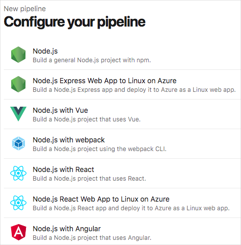
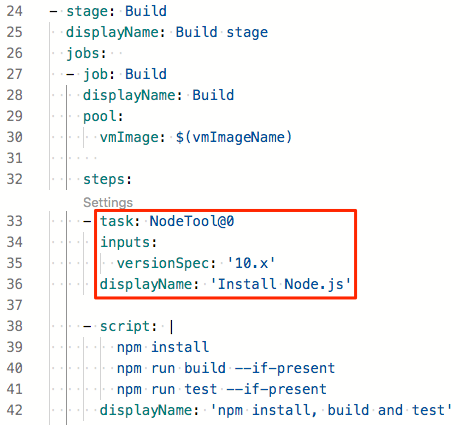

In this part, you'll learn some of the ways Azure and Azure DevOps support Node.js applications.

**Node.js** is an open-source JavaScript runtime environment. Designed for server-side execution, it runs outside the context of a web browser. You can learn more at [nodejs.org](https://nodejs.org?azure-portal=true).

## Node.js and Azure

Azure provides first-class support for Node.js. This means that you can take your existing codebase and, in most cases, deploy it directly to Azure without making modifications. On Azure, hosting a Node.js application is similar to hosting a .NET application, assuming that the proper dependencies are configured. Azure also enables you to configure environment variables for application settings, which means you can continue to load settings and secrets using standard methods for Node.js.

Once deployed to Azure, a Node.js application can connect to resources within Azure, across VPN connections, and anywhere else accessible from the internet. This includes access to databases, document stores, and all the other resources and services Node.js developers rely on.

## Node.js and Azure DevOps

As a Node.js developer, you'll find a welcoming environment in Azure DevOps. Although Azure DevOps provides a wide range of features for managing the entire software lifecycle, you can choose the features you need to make the process as efficient as possible.

When you connect your code to Azure Pipelines, Azure Pipelines can automatically detect the language that you're using and provide starter code for your CI/CD pipeline.

Here's an example that shows starter code templates for a Node.js application:

Azure Pipelines provides built-in tasks that support the build, test, and deployment jobs you need to deploy source code from GitHub or anywhere else.

In Azure Pipelines, pipeline code is expressed through YAML configuration files. This example shows the built-in `NodeTool@0` task, which installs the version of Node.js that you need to build your application.

If Azure Pipelines doesn't provide a specific task that you need, you can provide scripts that fill in the gaps. The `script` task in the previous example uses `npm` to install dependencies, build the application, and run any associated tests.
