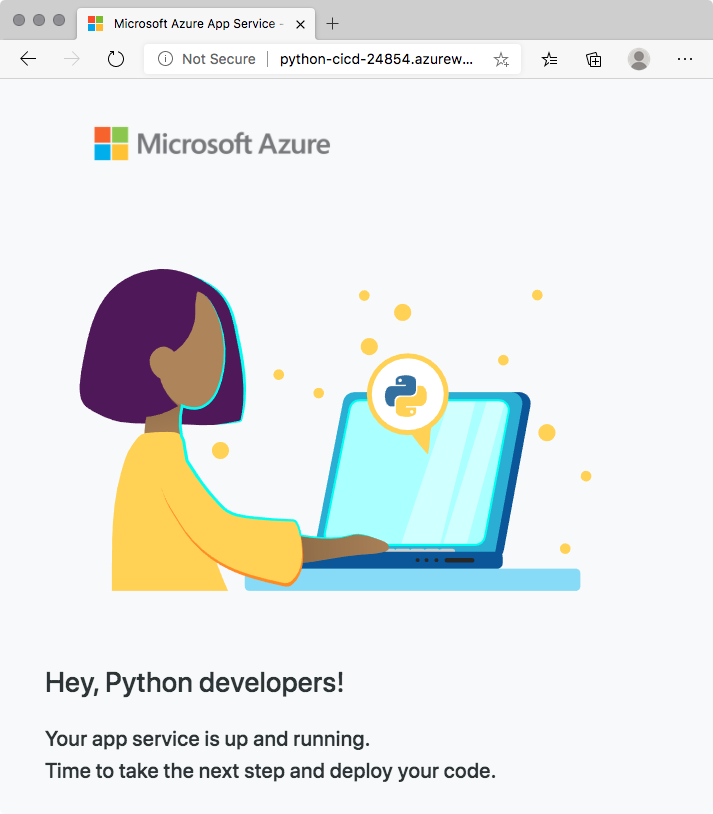

In this part, you make sure that your Azure DevOps organization is set up to complete the rest of this module. You also create the Azure App Service environment that you'll deploy to.

To accomplish these goals, you:

> [!div class="checklist"]
> * Add a user to ensure Azure DevOps can connect to your Azure subscription.
> * Fork and clone a GitHub repo that contains a basic Python app.
> * Create the Azure App Service by using the Azure CLI in Azure Cloud Shell.

## Add a user to Azure DevOps

To complete this module, you need your own [Azure subscription](https://azure.microsoft.com/free/?azure-portal=true). You can get started with Azure for free.

You don't need an Azure subscription to work with Azure DevOps, but here you'll use Azure DevOps to deploy to Azure resources that exist in your Azure subscription. To simplify the process, use the same Microsoft account to sign in to both your Azure subscription and your Azure DevOps organization.

If you use different Microsoft accounts to sign in to Azure and Azure DevOps, add a user to your DevOps organization under the Microsoft account that you use to sign in to Azure. For more information, see [Add users to your organization or project](https://docs.microsoft.com/azure/devops/organizations/accounts/add-organization-users?tabs=browser&azure-portal=true). When you add the user, choose the **Basic** access level.

Then sign out of Azure DevOps and sign in. Use the Microsoft account that you use to sign in to your Azure subscription.

## Fork the GitHub repo

Here you fork the GitHub repo required for this project. It's a basic Python web app built by using the Django framework.

1. Go to the [Python with Django repo](https://github.com/MicrosoftDocs/mslearn-python-django?azure-portal=true).
1. Select **Fork** and then select your account.

## Create the Azure App Service environment

Here you create the App Service required to deploy the Python app.

> [!IMPORTANT]
> You need your own Azure subscription to complete the exercises in this module.

In this module, you use the Azure CLI to spin up the Azure App Service that will host the Python app. You can access the Azure CLI from a terminal or through Visual Studio Code. Here you access the Azure CLI from Azure Cloud Shell. This browser-based shell experience is hosted in the cloud. In Cloud Shell, the Azure CLI is configured for use with your Azure subscription.

### Bring up Cloud Shell through the Azure portal

1. Go to the [Azure portal](https://portal.azure.com?azure-portal=true) and sign in.
1. From the menu, select **Cloud Shell**. When prompted, select the **Bash** experience.

    

    > [!NOTE]
    > Cloud Shell requires an Azure storage resource to persist any files that you create in Cloud Shell. When you first open Cloud Shell, you're prompted to create a resource group, storage account, and Azure Files share. This setup is automatically used for all future Cloud Shell sessions.

### Select an Azure region

A _region_ is one or more Azure datacenters within a geographic location. East US, West US, and North Europe are examples of regions. Every Azure resource, including an App Service instance, is assigned a region.

To make commands easier to run, start by selecting a default region. After you specify the default region, later commands use that region unless you specify a different region.

1. From Cloud Shell, run the following `az account list-locations` command to list the regions that are available from your Azure subscription.

    ```azurecli
    az account list-locations \
      --query "[].{Name: name, DisplayName: displayName}" \
      --output table
    ```

1. From the `Name` column in the output, choose a region that's close to you. For example, choose `eastasia` or `westus2`.

1. Run `az configure` to set your default region. Replace `<REGION>` with the name of the region you chose.

    ```azurecli
    az configure --defaults location=<REGION>
    ```

    This example sets `westus2` as the default region:

    ```azurecli
    az configure --defaults location=westus2
    ```

### Create the Azure resources

This solution requires several Azure resources for deployment, which you create now.

   > [!NOTE]
   > For learning purposes, here you use the default network settings. These settings make your site accessible from the internet. In practice, you could configure an Azure virtual network that places your website in a network that's not internet routable and that only you and your team can access. Later, you could reconfigure your network to make the website available to your users.

1. Run the following `az group create` command to create a resource group.

    ```azurecli
    az group create --name python-cicd-rg
    ```

1. Run the following `az appservice plan create` command to create an App Service plan.

    ```azurecli
    az appservice plan create \
      --name python-cicd-asp \
      --resource-group python-cicd-rg \
      --sku B1 \
      --is-linux
    ```

    The `--sku` argument specifies the B1 plan. This plan runs on the Basic tier.

    > [!IMPORTANT]
    > If the B1 SKU isn't available in your Azure subscription, [choose a different plan](https://azure.microsoft.com/pricing/details/app-service/linux/?azure-portal=true), such as S1 (Standard).

1. Run the following `az webapp create` command to create the App Service instance.

    ```azurecli
    az webapp create \
      --name python-cicd-$RANDOM \
      --resource-group python-cicd-rg \
      --plan python-cicd-asp \
      --runtime "python|3.7"
    ```

    The name must be globally unique, so here we use `$RANDOM` to append a random number to the name. In practice, you would choose a name that reflects your application. If this step fails due to a naming conflict, try running it again.

1. Run the following `az webapp list` command to list the host name and state of the App Service instance.

    ```azurecli
    az webapp list \
      --resource-group python-cicd-rg \
      --query "[].{hostName: defaultHostName, state: state}" \
      --output table
    ```

    Note the host name for your running service. You'll need the web host name later when you verify your work. Here's an example:

    ```output
    HostName                             State
    -----------------------------------  -------
    python-cicd-16353.azurewebsites.net  Running
    ```

1. As an optional step, navigate your browser to the host name. Verify that it's running and that the default home page appears.

    Here's what you see:

    

> [!IMPORTANT]
> The [Clean up your Azure DevOps environment](/learn/modules/deploy-python/5-clean-up-environment?azure-portal=true) page in this module contains important cleanup steps. Cleaning up helps ensure that you're not charged for Azure resources after you complete this module. Be sure to perform the cleanup steps even if you don't complete this module.