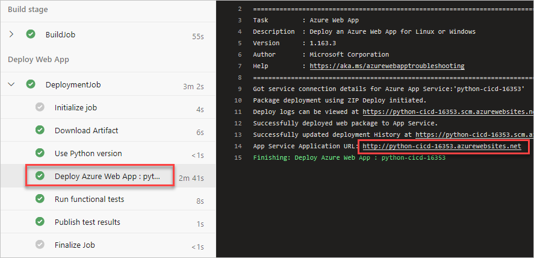

The GitHub repo cloned for this project contains the source for a minimal Node.js project. In this unit you create an Azure DevOps pipeline to build and deploy that project to the Azure app service created earlier. 

In this part, you'll:

> [!div class="checklist"]
> * Install Azure Pipelines for your GitHub repo.
> * Set up an Azure DevOps project for this module.
> * Create a CI/CD pipeline triggered by commits to the *master* branch.
> * Review the pipeline tasks.
> * Save the pipeline to trigger a CI/CD workflow.

## Install the Azure Pipelines extension

Here you install Azure Pipelines for the forked repo

1. Use your browser to navigate to the [GitHub Marketplace](https://github.com/marketplace?azure-portal=true).
1. Search for **Azure Pipelines** and select the **Azure Pipelines** result.
1. Locate the *Free* option and select **Install it for free**.
1. Select **Complete order and begin installation**.
1. Select **Only select repositories** and choose the **python-docs-hello-world** repo forked earlier.
1. Select **Install**.

## Set up an Azure DevOps project

The previous task will begin the process of linking your GitHub repo to your Azure DevOps account. You now complete that process and create a new Azure DevOps project as part of the process.

1. Sign in when prompted.
1. Use the form to create a new Azure DevOps project. 
1. Select **Continue**.

## Create a CI/CD pipeline

Here you create a new CI/CD pipeline using one of the built-in templates. This will be saved as *azure-pipelines.yml* in the repo root.

1. Select the Node.js project created earlier (called *python-docs-hello-world*).
1. Select **Node.js Express Web App to Linux on Azure**.
1. If prompted, select the Azure subscription you created resources under earlier.
1. Select the **Web App name** created earlier.
1. Select **Validate and configure**. 

## Review the pipeline tasks

The pipeline you begin with is fully-functional and ready to go. However, before saving it, let's walk through the stages and tasks it uses to build and deploy the app. 

### The CI trigger

The pipeline is configured to run whenever a change is committed to the *master* branch. You can adjust this as needed, such as if you wanted to include (or exclude) runs based on their branch, path, or tag.  

[!code-yml]

### Pipeline variables

To aid in pipeline maintenance, the default template uses variables for commonly-used parameters, such as the name of the service connection string used to connect to Azure. You can also import variables from pipeline libraries managed outside of the pipeline itself.

[!code-yml]

### The Build stage

This pipeline is divided into two stages: *Build* and *Deploy*. The build stage configures and runs the build, publishing its zipped output to artifact storage.

[!code-yml]

### Node.js Tool Installer task

The `NodeTool@0` task is designed to set up the build environment for Node.js projects. For the purposes of this pipeline, only the `versionSpec` parameter is needed to specify the version of the Node.js tools to install. You can learn more about this task in the official docs for the [Node.js Tool Installer task](/azure/devops/pipelines/tasks/tool/node-js?azure-portal=true).

[!code-yml]

### Running the build

The build itself is run using `npm` commands in an inline script. This project doesn't have any tests in its source right now, but if you added them, they would be run as part of the `npm run test` command.

[!code-yml]

### Publishing the build

After the build completes, the `ArchiveFiles@2` task is used to zip the output. The resulting zip is then published to artifact storage using the alias *drop* for future usage and review.

[!code-yml]

### Deploying the build

The second stage of the pipeline manages deploying the solution out to Azure. It takes a dependency on the **Build** stage completing successfully, after which it uses the pipeline's Azure service connection to deploy the app to the configured target.

[!code-yml]

### Azure Web App task

The `AzureWebApp@1` task is designed to deploy web apps to an Azure App Service. It's a very flexible task that supports apps across a variety of platforms and includes everything needed for this Node.js scenario:

* `azureSubscription` refers to the name of your Azure service connection pipeline variable.
* `appType` indicates whether the app is being deployed for Linux (`webAppLinux`).
* `appName` specifies the name of the Azure App Service instance in your Azure account.
* `runtimeStack` indicates which image the app should be run on, which is required for Linux deployments.
* `package` specifies the path to the package to be deployed.
* `startUpCommand` specifies the startup command to run after the app has been deployed, which is required for Linux deployments.

You can learn more about the flexibility of this task in the official docs for the [Azure Web App task](/azure/devops/pipelines/tasks/deploy/azure-rm-web-app?azure-portal=true)

## Save the pipeline to trigger a build and release

1. Select **Save and run** from the top right corner of the page. Confirm the **Save and run** to trigger a run.
1. In Azure Pipelines, go to the build. Trace the build as it runs.
1. After the build has succeeded, select the web site's deploy task and click the URL to view the deployed site.

    

1. You see the site in production.

    

Don't be fooled by the modest presentation. This automated deployment was an engineering feat to rival the greatest of our time.