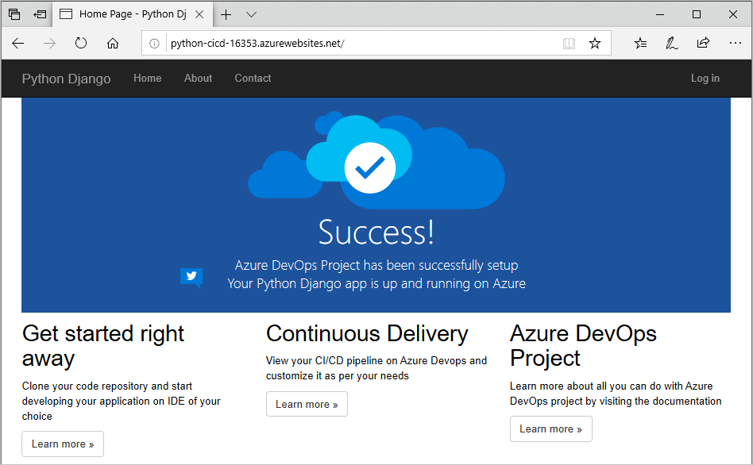
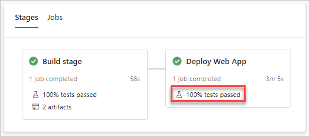
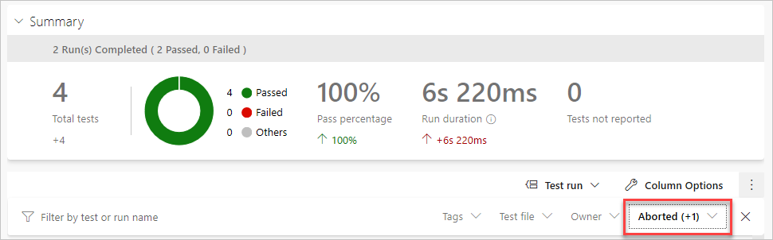

In this part, you create a project in Azure Pipelines that builds and deploys that project to the Azure app service created earlier.

The GitHub repo that you forked for this project contains the source code for a basic Python web project that uses Django. In addition, it also includes some very useful unit and functional tests for validating the code both before and after deployment.

In this part, you:

> [!div class="checklist"]
> * Install the Azure Pipelines extension for your GitHub repo.
> * Set up an Azure DevOps project for this module.
> * Create a CI/CD pipeline triggered by commits to the *master* branch.
> * Review the pipeline tasks.
> * Add tasks to run functional tests against the deployment and publish their results.
> * Save the pipeline to trigger a CI/CD workflow.

## Install the Azure Pipelines extension

Here you install the Azure Pipelines extension for your GitHub repository. This extension enables Azure Pipelines to access your GitHub account so that it can pull the latest source code from your repository.

1. Go to the [GitHub Marketplace](https://github.com/marketplace?azure-portal=true).
1. Search for **Azure Pipelines** and select the **Azure Pipelines** result.
1. Locate the **Free** option and select **Install it for free**.
1. Select **Complete order and begin installation**.
1. Select **Only select repositories** and choose the **mslearn-python-django** repository that you forked earlier.
1. Select **Install**.

## Set up an Azure DevOps project

The previous task links your GitHub repository to your Azure DevOps organization. To complete the process, you now create an Azure DevOps project.

1. Sign into your account at [dev.azure.com](https://dev.azure.com).
1. Select **+ New project**.

    The **Create new project** dialog box opens.
1. In the **Project name** field, enter a name such as *mslearn-python-django*.
1. Under **Visibility**, you choose whether to make your project public or private. For now, you can choose private.

    Creators of open source projects will often choose public visibility so that others can view active issues and build status.
1. Select **Advanced**.
1. Under **Version control**, make sure that **Git** is selected.
1. Select **Create**.

## Create the pipeline

Here you create a CI/CD pipeline in Azure Pipelines by using one of the built-in templates. The process generates a pipelines configuration file named *azure-pipelines.yml*, which lives in the root directory of your Git repository.

1. In Azure DevOps, go to your **mslearn-python-django** project.
1. Select **Pipelines**, either from the project page or from the left pane.
1. Select **Create Pipeline**.
1. On the **Connect** tab, select **GitHub**.

    If prompted, enter your GitHub credentials.
1. On the **Select** tab, select your **mslearn-python-django** repository.
1. On the **Configure** tab, select **Python to Linux Web App on Azure**.

    When prompted:

    1. Select the Azure subscription from which you created resources earlier.
    1. Select **Continue**.
    1. Select the Web App name you created earlier, for example **python-cicd-16353**.
    1. Select **Validate and configure**.
1. On the **Review** tab, review the starter code for your pipeline configuration. Don't select **Save and run** just yet.

## Review the pipeline tasks

The starter pipeline code provides everything you need to build, test, package, and deploy the Python application to Azure. Before you run it, let's walk through the stages and tasks it uses to build and deploy the app.

### The CI trigger

The pipeline is configured to run whenever a change is committed to the `master` branch. You can adjust this as needed, such as if you wanted to include (or exclude) runs based on their branch, path, or tag.

[!code-yml]

### Pipeline variables

To aid in pipeline maintenance, the default template uses variables for commonly-used parameters, such as the name of the service connection string used to connect to Azure. A service connection provides secure access to your Azure subscription from Azure Pipelines.

Update the **projectRoot** variable to use the */Application* path under the default working directory. This is where *manage.py* is located in the source code.

[!code-yml]

### The Build stage

A _stage_ is a part of the pipeline that can run independently and be triggered by different mechanisms. For example, you might have one stage that builds the application, a second stage that deploys to a pre-production environment, and a final stage that deploys to production.

This pipeline is divided into two stages: *Build* and *Deploy*. The *Build* stage configures and performs the build tasks, which includes publishing the build artifact (a *.zip* file) to artifact storage.

The example defines the host agent that the stage's job will run on.

[!code-yml]

`vmImageName` is defined as a variable in the previous section. It defines the newest version of Ubuntu.

### Use Python Version task

The `UsePythonVersion@0` task sets up the build environment for Python projects. For this pipeline, only the `versionSpec` parameter is needed to specify the version of the Python tools to install. To learn more about this task, see [Use Python Version task](/azure/devops/pipelines/tasks/tool/use-python-version?azure-portal=true).

[!code-yml]

### Running the build

The build itself is run using `python` and `pip` commands in an inline script. These commands are run from the project's root directory. The file *requirements.txt* specifies which components to pull in. Here, this file specifies Django.

[!code-yml]

### Publishing the build

After the build completes, the `ArchiveFiles@2` task packages the output. The resulting *.zip* file is then uploaded to artifact storage using the alias *drop* for future usage and review.

[!code-yml]

### Running unit tests

After the build is archived, unit tests are run. These could be run at any point after the build, but to keep things basic here we place all the unit test tasks together. After the tests are run, their results are published by using the `PublishTestResults@2` task. You can access test results from Azure Pipelines. The *Tests* folder, which contains the functional tests to be run after deployment, are also archived for later use during the deployment phase.

Add this code immediately after the *upload* task:

[!code-yml]

> [!TIP]
> In a YAML file, whitespace is important. Ensure that the task you add here uses the same indentation as the previous task.

### Deploying the build

The second stage of the pipeline deploys the application to Azure. It depends on the *Build* stage completing successfully, after which it uses the pipeline's Azure service connection to deploy the app to the configured target. This projects deploys the app to Azure App Service.

[!code-yml]

### Azure Web App task

The `AzureWebApp@1` task deploys web apps to Azure App Service. It's a very flexible task that supports apps across a variety of platforms and includes everything needed for this Python application:

* `azureSubscription` refers to the name of your Azure service connection pipeline variable.
* `appType` indicates whether the app is being deployed for Linux (`webAppLinux`).
* `appName` specifies the name of the Azure App Service instance in your Azure account.
* `runtimeStack` indicates which image the app should be run on, which is required for Linux deployments.
* `package` specifies the path to the package to be deployed.
* `startUpCommand` specifies the startup command to run after the app has been deployed, which is required for Linux deployments.

You can learn more about the flexibility of this task in the [Azure Web App task](/azure/devops/pipelines/tasks/deploy/azure-rm-web-app?azure-portal=true) documentation.

### Running functional tests

The final stage of the pipeline runs functional tests to validate the deployment. In this case, there is a single Selenium test that confirms that the home page loads as expected. The test results are published alongside the unit test results from the build job.

Append this code to the end of the pipeline. As before, ensure that the task is indented correctly.

[!code-yml]

## Save the pipeline to trigger a build and release

1. Select **Save and run** from the top right corner of the page. Select **Save and run** again to trigger the pipeline to run.
1. In Azure Pipelines, go to the build. Trace the build as it runs.
1. After the build has succeeded, select the web site's deploy task and click the URL to view the deployed site.

    

1. You see the site running on App Service.

    

1. Return to the pipeline summary. You see the details of the pipeline run, which also includes the test results. Scroll down to the stages view to see how the test run in each stage performed. Select one of the test links to view the aggregated performance.

    

1. The test run summary provides details about the test runs. If you would like to review specific tests, you may update the filters option to include *Passed* tests. By default it only shows tests that failed or were aborted.

    