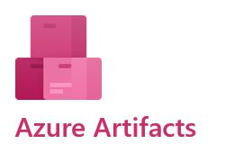

**Mara**: Amita asked about tools and I'm proposing we use Azure DevOps.

**Andy**: How can we use something for Azure if we're not deploying to the cloud? Plus, we deploy to Linux. Does that matter?

**Mara**: These tools are great whether you're in the cloud or on-prem. It also doesn't matter if we're deploying to Linux or Windows or another platform. Azure DevOps is a suite of services that provide an end-to-end solution for anyone who wants an enterprise-grade toolchain. Those tools will help us implement all the practices we just talked about. Here's what you get:

| | |
|-|-|
||[Azure Boards](https://azure.microsoft.com/services/devops/boards/). These are agile tools that help us plan, track, and discuss our work, even with other teams.|
||[Azure Pipelines](https://azure.microsoft.com/services/devops/pipelines/). These will let us build, test, and deploy with CI/CD that works with any language, platform, and cloud.|
||[Azure Test Plans](https://azure.microsoft.com/services/devops/test-plans/). These are manual and exploratory testing tools.|

Those are the three I was thinking about using now. There are two other services we can think about later.

| | |
|-|-|
||[Azure Repos](https://azure.microsoft.com/services/devops/repos/). These give us provide unlimited, cloud-hosted private and public Git repos.|
||[Azure Artifacts](https://azure.microsoft.com/services/devops/artifacts/). These let us create, host, and share packages.|

**Amita**: This sounds like a lot. Where do we start?

**Mara**: Let's just try to do some planning using Azure Boards. We'll see how that goes. You don't have to use every service Azure DevOps offers. You just use what you need.

**Tim**: What do we have to do?

**Mara**: It's easy. All we do is set up an account and an organization. It only takes a couple minutes.