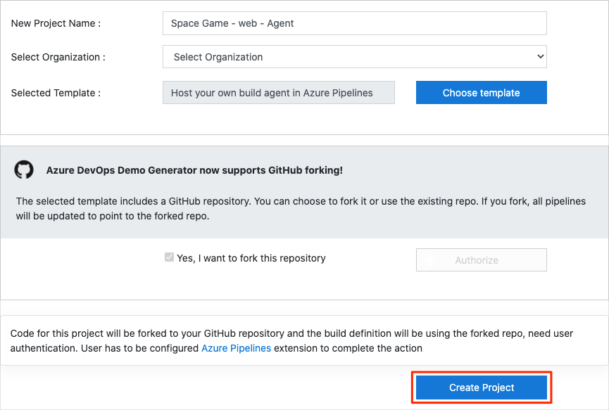
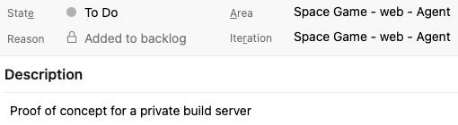

In this unit, you ensure that your Azure DevOps organization is set up to complete the rest of this module.

The modules in this learning path form a progression in which you follow the Tailspin web team through their DevOps journey.

This learning path also builds on the [Evolve your DevOps practices](/learn/paths/evolve-your-devops-practices?azure-portal=true) learning path, where you've already set up your Azure DevOps organization and created a task backlog on Azure Boards by using the Basic process.

## Run the template

At this point, you can follow either of two options:

* If you've completed the previous modules and have the Tailspin project set up in Azure DevOps, continue with the Azure DevOps project that you created in the _Evolve your DevOps practices_ learning path.

* If you haven't set up the project or if you want to repeat this module from a fresh environment, run a template that sets up everything for you in your Azure DevOps organization.

> [!div class="nextstepaction"]
> [Run the template](https://azuredevopsdemogenerator.azurewebsites.net/?name=host-build-agent&azure-portal=true)

To run the template, on the Azure DevOps Demo Generator site, do the following:

1. Select **Sign In**, and accept the usage terms.
1. On the **Create New Project** page, select your Azure DevOps organization, and then enter a project name, such as **Space Game - web - Agent**.
1. Select **Fork repository on GitHub**, and then select **Authorize**. If a window appears, authorize access to your GitHub account.

    > [!IMPORTANT]
    > You need to select this option for the template to connect to your GitHub repository. Select it even if you've already forked the _Space Game_ website project. The template uses your existing fork.

1. Select **Create Project**.

    

    It takes a few moments for the template to run.
1. Select **Navigate to project** to go to your project in Azure DevOps.

> [!IMPORTANT]
> The [Clean up your Azure DevOps environment](/learn/modules/host-build-agent/6-clean-up-environment?azure-portal=true) page in this module contains important cleanup steps. Cleaning up helps ensure that you don't run out of free build minutes. Be sure to perform the cleanup steps even if you don't complete this module.

## Move the work item to Doing

In this section, you assign yourself a work item that relates to this module on Azure Boards. You also move the work item to the **Doing** state. In practice, you and your team would assign work items at the start of each sprint, or work iteration.

Assigning work in this way gives you a checklist to work from. It gives others on your team visibility into what you're working on and how much work is left. It also helps the team enforce work in process (WIP) limits so that the team doesn't take on too much work at one time.

Recall that the team settled on these seven top issues:

Here you move the seventh item, **Investigate hosted vs private build servers**, to the **Doing** column and assign yourself to the work item.

Recall that **Investigate hosted vs private build servers** relates to setting up a private build agent to see whether it brings the team any benefits beyond using the Microsoft-hosted agents.

To set up the work item:

1. In Azure DevOps, go to **Boards** and then, in the left pane, select **Boards**.

    

1. In the **Investigate hosted vs private build servers** work item, select the **To Do** down arrow, and then assign the work item to yourself.

    
1. Drag the work item from the **To Do** column to the **Doing** column.

    

At the end of this module, after you've completed the task, you'll move the card to the **Done** column.
