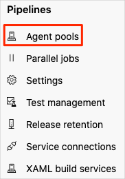
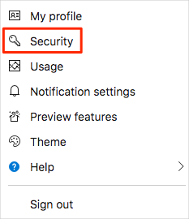
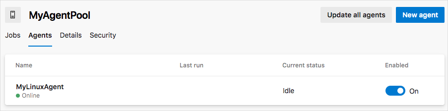
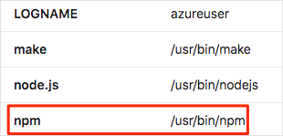

In this part, you'll use a virtual machine running on Azure to configure a build agent you can use in Azure Pipelines. We provide a virtual machine you can use for the duration of this module.

Here are the steps you'll follow:

> [!div class="checklist"]
> * Create an Ubuntu virtual machine on Azure to serve as your build agent.
> * Create an agent pool in Azure DevOps.
> * Create an access token to authenticate your agent with Azure DevOps.
> * Configure your agent with the software required to build the _Space Game_ web site.
> * Configure your agent to connect to Azure DevOps so that it can receive build jobs.
> * Verify the agent is connected to Azure DevOps and ready to receive build jobs.

There are many ways to create a virtual machine on Azure. Here, you'll create an Ubuntu virtual machine using an interactive terminal called Cloud Shell.

[!include[](../../../includes/azure-sandbox-activate.md)]

To configure your VM, you have several choices. For a Linux VM, you can connect directly over SSH and interactively configure your system. Or you can automate the deployment by using an Azure Resource Manager template. If you need to deploy many build agents, you can create a VM image that has all the software pre-installed.

Configuring a system interactively is a good way to get started because it helps you understand the process and what's needed. To simplify the process, here you'll connect to your Ubuntu VM over SSH and run shell scripts to set up your build agent.

> [!NOTE]
> If you're not familiar with connecting to or configuring Linux systems, just follow along. You can apply the same concepts to Windows build agents.

## Create a Linux virtual machine

Here you'll create a VM running Ubuntu 16.04 that will serve as your build agent. The VM won't yet be set up to be a build agent or have any of the tools needed to build the _Space Game_ web application. You'll set that up shortly.

1. From Cloud Shell on the side of this page, run the `az vm create` command to create your VM.

    ```azurecli
    az vm create \
      --name MyLinuxAgent \
      --resource-group <rgn>[Resource Group Name]</rgn> \
      --image Canonical:UbuntuServer:16.04-LTS:latest \
      --location eastus \
      --size Standard_DS2_v2 \
      --admin-username azureuser \
      --generate-ssh-keys
    ```

    Your VM will take about two minutes to come up.

    [Standard_DS2_v2](https://docs.microsoft.com/azure/virtual-machines/windows/sizes-general?azure-portal=true#dsv2-series) specifies the VM's size. A VM's size defines its processor speed, amount of memory, initial amount of storage, and expected network bandwidth. This is the same size provided by Microsoft-hosted agents. In practice, you can choose a different size that provides more compute power or additional capabilities such as graphics processing.

    The `--resource-group` argument specifies the _resource group_ that holds all the things that we need to create. A resource group enables you to administer all the VMs, disks, network interfaces, and other elements that make up our solution as a unit. Normally, you would create your own resource group before creating Azure resources. Since you are in the free Azure sandbox environment, you don't need to do this step. Instead, you will use the pre-created resource group <rgn>[Resource Group Name]</rgn>.

    > [!IMPORTANT]
    > The Azure sandbox gives you temporary access to Azure resources. When your session expires, the VM you create here will no longer be accessible to you as a build agent. In practice, you would set up a build agent using your own Azure subscription or a system running in your datacenter.

## Create the agent pool

Recall that an agent pool organizes build agents. Here you'll create the agent pool from Azure DevOps. Later, you'll specify the name of the agent pool when you configure your agent so that it can register itself to the correct pool.

1. From Azure DevOps, navigate to the **Space Game - web - Agent** project.
1. Select **Project settings** in the lower corner.
1. Under **Pipelines**, select **Agent pools**.

    
1. Click **Add pool**.
1. From the **Add agent pool** window, select **New** and enter **MyAgentPool** in the text box.

    In practice, you might choose a more specific name that describes the purpose of your pool.
1. Click **Create**.
    You see the new agent pool appear in the list.

## Create a personal access token

In order for your build agent to register itself with Azure DevOps, you need a way for it to authenticate itself.

To do that, here you'll create a personal access token. A personal access token, or PAT, is an alternative to passwords that you can use to authenticate with services such as Azure DevOps.

> [!IMPORTANT]
> Like a password, be sure to keep your access token in a safe place. In this module, you'll store your access token as an environment variable so that it doesn't appear in your shell script.

1. From Azure DevOps, open your profile. Then select **Security**.

    
1. Click **+ New Token**.
1. Enter a name for your token, such as **Build agent**.
1. Under **Scopes**, select **Show all scopes**.
1. Locate **Agent Pools**. Then select **Read & manage**.
1. Locate **Build**. Then select **Read & execute**.
1. Click **Create**.
1. Copy the token to a safe place.

    Shortly, you'll use your token to enable your build agent to authenticate access to Azure Pipelines.

### Connect to your VM

Here you'll connect to your Linux VM over SSH so that you can configure it.

Recall that you cannot interactively log on to a Microsoft-hosted agent. Because a private build agent is yours, you can log on and configure it however you'd like.

The ability to connect to your build agent enables you to configure it with the tools you need to build your software. It also enables you to troubleshoot issues as you build out your pipeline configuration.

1. From Cloud Shell, run `az vm show` to get the VM's IP address.

    ```azurecli
    IPADDRESS=$(az vm show \
      --name MyLinuxAgent \
      --resource-group <rgn>[Resource Group Name]</rgn> \
      --show-details \
      --query [publicIps] \
      --output tsv)
    ```

    This command stores the IP address in a Bash variable named `IPADDRESS`.

1. Print your VM's IP address to the console.

    ```bash
    echo $IPADDRESS
    ```

1. Create an SSH connection to your VM. When prompted, enter "yes" to continue connecting.

    ```bash
    ssh azureuser@$IPADDRESS
    ```

    You are now connected to your VM over SSH.

    This command works because you provided the `--generate-ssh-keys` option when you ran `az vm create` earlier. This option creates an SSH key pair to enable you to log in to the VM.

## Install build tools on your VM

Here you'll configure your VM with the tools needed to build the _Space Game_ web site.

Recall that your existing build process uses these tools:

* .NET Core
* Node.js, which is used to perform build tasks
* npm, the package manager for Node.js
* gulp, a Node.js package which is used to minify JavaScript and CSS files

These are the primary tools the build process requires. Here you'll download a shell script from GitHub and run it to install these tools.

> [!NOTE]
> The build process uses other tools, such as **node-sass** to convert Sass (.scss) files to CSS (.css) files. However, Node.js installs these tools when the build runs.

Let's start by updating Ubuntu's package manager, named **apt**. This fetches the latest information from the package repositories and is commonly the first thing you do when setting up a new Ubuntu system.

1. From your SSH connection, update the **apt** package manager cache.

    ```bash
    sudo apt-get update
    ```

    `sudo` runs the command with administrator, or root, priviledges.

1. Run the following `curl` command to download a shell script named **build-tools.sh** from GitHub.

    ```bash
    curl https://raw.githubusercontent.com/MicrosoftDocs/mslearn-azure-pipelines-build-agent/master/build-tools.sh > build-tools.sh
    ```

1. Print the script to the terminal so that you can examine its contents.

    ```bash
    cat build-tools.sh
    ```

    You see this.

    [!code-bash[](code/build-tools.sh)]

    You see that the script installs Node.js, npm, gulp, and .NET Core.

    The `DOTNET_VERSION` environment variable enables you to specify the .NET version to install. If you don't set this variable, the script installs the version your existing build configuration uses. For learning purposes, you won't set this variable and will allow the script to use the default version.

1. Make the script executable and then run the script.

    ```bash
    chmod u+x build-tools.sh
    sudo ./build-tools.sh
    ```

    In practice, you could now run commands to verify that each software component was successfully installed.

## Install agent software on your VM

Now it's time to install the agent software on your VM. This software enables the VM to act as a build agent and receive build jobs from Azure Pipelines.

The registration process checks for installed software before it registers the agent with Azure Pipelines. Therefore, it's important that you set up the agent after installing all other software. In practice, you can register the agent a second time if you need to install additional software.

The documentation explains how to set up [self-hosted Linux agents](https://docs.microsoft.com/azure/devops/pipelines/agents/v2-linux?view=azure-devops&azure-portal=true) as well as macOS and Windows agents manually. Here you'll run a shell script to configure your agent, similar to how you set up build tools in the last part.

> [!IMPORTANT]
> The script you'll run here is for learning purposes. In practice, understand how each command in the scripts you build impact the overall system. We'll point you to documentation that more completely describes your options at the end of this module.

1. Run the following `curl` command to download a shell script named **build-agent.sh** from GitHub.

    ```bash
    curl https://raw.githubusercontent.com/MicrosoftDocs/mslearn-azure-pipelines-build-agent/master/build-agent.sh > build-agent.sh
    ```

1. Print the script to the terminal so that you can examine its contents.

    ```bash
    cat build-agent.sh
    ```

    You see this.

    [!code-bash[](code/build-agent.sh)]

    You don't need to understand how each line works, but here's a brief summary of what this script does.

    * Download the agent package as a .tar.gz file and extract its contents.
    * From the extracted files, run a shell script named **installdependencies.sh** to install the agent software.
    * From the extracted files, run a shell script named **config.sh** to configure the agent and register the agent with Azure Pipelines.
    * From the extracted files, run a shell script named **svc.sh** to install and start the agent service.

    The script uses environment variables to enable you to provide details about your Azure DevOps account. Here's a summary.

    | Bash variable       | Description                          | Default |
    |---------------------|--------------------------------------|---------|
    | `AZP_AGENT_VERSION` | The [version of the agent software](https://github.com/Microsoft/azure-pipelines-agent/releases?azure-portal=true) to install | The version we last used to test this module |
    | `AZP_URL`           | The URL of your Azure DevOps account | (None) |
    | `AZP_TOKEN`         | Your personal access token           | (None) |
    | `AZP_AGENT_NAME`    | Your agent's name as it appears in Azure DevOps | The system's hostname |
    | `AZP_POOL`          | The name of your agent pool          | **Default** |
    | `AZP_WORK`          | The working directory for the agent to perform build tasks | **_work** |

    If the script does not provide a default value for a variable that's not set, the script prints an error message and immediately exits.

    In the steps that follow, you'll set these environment variables:

    * `AZP_URL`
    * `AZP_TOKEN`
    * `AZP_AGENT_NAME`
    * `AZP_POOL`

    For now, we recommend that you leave the other variables unset.

1. Set the `AZP_AGENT_NAME` environment variable to specify your agent's name. We recommend **MyLinuxAgent**.

    ```bash
    export AZP_AGENT_NAME=MyLinuxAgent
    ```

1. Set the `AZP_URL` environment variable to specify the URL to your Azure DevOps account.

    Replace **organization** with yours. You can get the name from the browser tab that's showing Azure DevOps.

    ```bash
    export AZP_URL=https://dev.azure.com/organization
    ```

1. Set the `AZP_TOKEN` environment variable to specify your personal access token.

    Replace **token** with your token.

    ```bash
    export AZP_TOKEN=token
    ```

1. Set the `AZP_POOL` environment variable to specify the name of your agent pool. Earlier, you created a pool named **MyAgentPool**.

    ```bash
    export AZP_POOL=MyAgentPool
    ```

1. Make the script executable and then run the script.

    ```bash
    chmod u+x build-agent.sh
    sudo -E ./build-agent.sh
    ```

    `sudo` enables the script to run as the root user. The `-E` argument preserves the current environment variables, including the ones you set, so that they are available to the script.

    As the script runs, you'll see the agent connect to Azure DevOps, see it added to the agent pool, and see the agent connection tested.

## Verify the agent is running

You successfully installed build tools and the agent software on your VM. As a verification step, here you'll navigate to Azure DevOps and see your agent in the agent pool.

1. From Azure DevOps, navigate to the **Space Game - web - Agent** project.
1. Select **Project settings** in the lower corner.
1. Under **Pipelines**, select **Agent pools**.

    
1. Select **MyAgentPool**.
1. Select the **Agents** tab.

    You see that your agent is online and ready to accept build jobs.

    

    > [!TIP]
    > If your build agent shows as **Offline**, try waiting a few moments and then refresh the page.

1. Select your agent, **MyLinuxAgent**.
1. Select the **Capabilities** tab.

    During setup, the configuration process scanned your build agent for tool capabilities. You see that `npm` is listed as one of them. Recall that your original build configuration specified that `npm` must be installed on the agent.

    

    When you specify which agent pool to use, you can include any of these entries in your `demands` section. This ensures that Azure Pipelines chooses a build agent that has the software you need to build your application. It also enables you to create agent pools with various software configurations &mdash; Azure Pipelines will select the correct one based on your requirements.