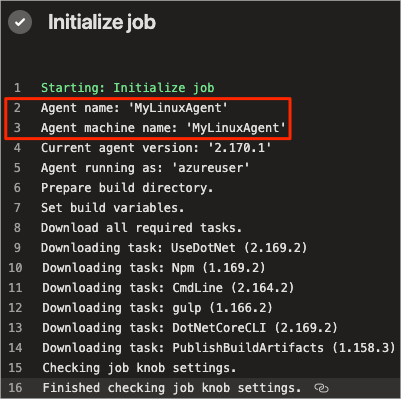
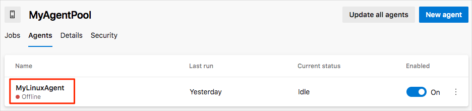
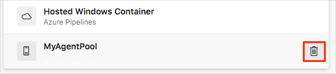

Now that your build agent is running and can receive build jobs, let's see it in action. Here you'll modify a basic build configuration that we provide to build the _Space Game_ web site using your agent and not the Microsoft-hosted agent.

As an optional step, at the end you'll remove the agent pool from your Azure DevOps organization.

## Fetch the branch from GitHub

Here you'll fetch the `build-agent` branch from GitHub and checkout, or switch to, that branch.

This branch contains the _Space Game_ project you worked with in the previous modules and an Azure Pipelines configuration to start with.

1. From Visual Studio Code, open the integrated terminal.
1. Run the following `git fetch` and `git checkout` commands to download a branch named `build-agent` from Microsoft's repository and switch to that branch.

    ```bash
    git fetch upstream build-agent
    git checkout build-agent
    ```

    Recall that `upstream` refers to Microsoft's GitHub repository. Your project's Git configuration understands the `upstream` remote because you set up that relationship when you forked the project from Microsoft's repository and cloned it locally.

    Shortly, you'll push this branch up to your GitHub repository, known as `origin`.

1. As an optional step, open **azure-pipelines.yml** from Visual Studio Code and familiarize yourself with the initial configuration.

    The configuration resembles the basic one you created in the [Create a build pipeline with Azure Pipelines](/learn/modules/create-a-build-pipeline/6-create-the-pipeline?azure-portal=true) module. It builds only the application's Release configuration.

## Modify the build configuration

Here you'll modify the build configuration to switch from using a Microsoft-hosted agent to using the agent from your build pool.

1. From Visual Studio Code, open **azure-pipelines.yml** and locate the `pool` section.

    ```yml
    pool:
      vmImage: 'Ubuntu-16.04'
      demands:
        - npm
    ```

1. Modify the `pool` section like this.

    ```yml
    pool:
      name: 'MyAgentPool'
      demands:
        - npm
    ```

    This version uses `name` to specify your agent pool, **MyAgentPool**. It maintains the `demands` section to specify that the build agent must have npm, the Node.js package manager, installed.

1. From the integrated terminal, add **azure-pipelines.yml** to the index, commit the changes, and push the branch up to GitHub.

    ```bash
    git add azure-pipelines.yml
    git commit -m "Use private agent pool"
    git push origin build-agent
    ```

## Watch Azure Pipelines use your build agent

Here you'll see the build run in the pipeline using your build agent.

1. From Azure DevOps, navigate to the **Space Game - web - Agent** project.
1. Select **Pipelines**, either from the project page or from the menu on the left.
1. Select **Builds**, then select the running build.
1. Trace the build through each of the steps.

    You see that the build succeeds using your build agent from your agent pool.

    

## Optional: Remove your build pool

For future reference, you can keep the build pool configuration in your Azure DevOps organization. But keep in mind that the VM we provide will no longer be available to you after your sandbox session ends.

In fact, Azure DevOps will detect that the agent is offline. Azure Pipelines will check for an available agent the next time a build is queued using the **MyAgentPool** pool.



As an optional step, you can remove the build pool configuration from Azure DevOps. Here's how.

1. From Azure DevOps, navigate to the **Space Game - web - Agent** project.
1. Select **Project settings** in the lower corner.
1. Under **Pipelines**, select **Agent pools**.

    
1. From the entry for **MyAgentPool**, click the trash can icon. Then click **Delete**.

    