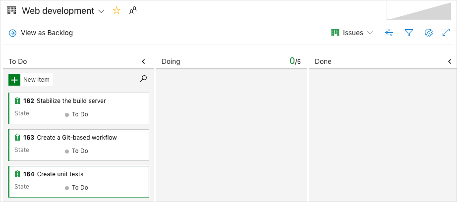

It's important to choose a code flow strategy that will work well for your team's collaboration. There are several strategies to consider and links to different strategies will be available at the end of the module. The Tailspin web team chooses a code flow strategy based on Git and GitHub.

When Mara set up Azure Boards, she identified a few initial problems to fix. One of them was to create a Git-based workflow because she knows Git is a source control tool that provides for excellent team collaboration.

Let's listen in on the team as they work out a better way to collaborate. Currently, they are using a centralized version control system and will move to a distributed system using Git.

Mara is diligently working on her assigned features when Andy walks in.

**Andy**: Hi Mara, are you finished with those files yet? I need them released to finish my build. I'm blocked until I get those files.

**Mara**: I have one more small bug to fix and then I want to test it all together. I should be done with them in a few hours.

Andy gives a heavy sigh.

**Andy**: Fine, just let me know when they are available.

**Mara**: You know Andy, if we were working with distributed version control instead of centralized, I would not be blocking you. It would be much easier for all of us to work together on the same project. And one of my tasks on our board is to increase visibility for stakeholders so we all know what the other person is working on. I think we can do that with a distributed system.

**Andy**: Git is a distributed system, right? I have been wanting to try working with Git. Is it difficult to learn or set up?

**Mara**: Let me explain it, and then you can decide if it is something you want to try on our projects.

**Andy**: It would be nice to be able to see what the others are doing, and to have access to the entire repository. OK, what is this all about?

Mara and Andy move to the whiteboard for a discussion on version control.

## What is Git and distributed version control?

<!-- TODO: Might be nice to draw out distributed vs. centralized on the whiteboard and add a screen cap here. -->

Git is a popular version control system among developers because it is powerful, open source, and free to use.

Git uses a _distributed_ version control approach. Distributed version control means that contributors have their own copy of the repository. Distributed version control frees you up to experiment and try different approaches without affecting the main repository or locking other developers out of the files they are working with. When your code is working as you want it to, you can then propose your changes for others to review and then merge those changes into the main repository.

There are other solutions for version control that are not distributed. For example, Team Foundation Version Control (TFVC) is a centralized version control system. With TFVC, there is only one copy of the master repository on a server and all branches will also exist on the server. Although you work with a local copy of a file, that file is the same version that's on the server.

Azure DevOps works well with both centralized and distributed version control systems.

## Where can I host my repository?

When deciding where to host your repositories, you have a few options. For example, you can host them on a local server, in Bitbucket, or GitHub. Bitbucket and GitHub are hosting solutions that are web-based.

GitHub has many features that are important to developers, including easy access to change logs and version control features from either the command line or the online portal.

## How do I work with Git?

In order for several developers to work together on a project efficiently, each developer needs access to the code files without restrictions. In centralized solutions, a developer "checks out" files they are working on, effectively locking other developers out of those files. With distributed systems, developers are free to access any file they need without affecting other developers' work since they have their own copy of the repository. A _clone_ is your local copy of a repository.

A common scenario for a developer when working on a feature or a bug fix is to try out different code until they find the best solution. But trying out code on your copy of the main codebase is not efficient since you may not want to keep the first few tries.

To accomplish this, Git has a feature called _branching_ where you can maintain as many copies as you want and only merge back the one you want to keep. This keeps the main branch stable.

## How do my local changes get up to the main codebase?

In Git, the main branch, or _trunk_, is typically called `master`.

Once you feel your code is ready to be merged into the `master` branch in the main repository shared by all developers, you create what's called a _pull request_. When you create a pull request, you are telling the other developers that you have code ready to review and you want it merged into the `master` branch. When your pull request is approved, it becomes part of the master codebase.

## What does a branching workflow look like?

 :::row:::
    :::column span="8":::
**Step 1:**
When you begin to work on a new feature or bug fix, the first thing you want to do is make sure you are starting with the latest stable codebase. To do this, you can synchronize your clone of the `master` branch on the server with your local `master` branch. This pulls down all of the other developers' changes that have been pushed up to the `master` branch on the server since your last synchronization.
    :::column-end:::
    :::column:::
        
    :::column-end:::
 :::row-end:::
 :::row:::
    :::column span="8":::
**Step 2:**
To make sure you are working safely on your copy of the code, you create a new branch just for that feature or bug fix. As you can imagine, having many branches for all of the things you are doing might get hard to remember, so a good naming convention is critical here.

Before you make changes to a file, you check out a new branch so that you know you are working on the files from that branch and not a different branch. You can switch branches anytime by checking out that branch.
    :::column-end:::
    :::column:::
        
    :::column-end:::
:::row-end:::
 :::row:::
    :::column span="8":::
**Step 3:**
You are now safe to make whatever changes you want to make since these changes are only in your branch. As you are working, you can _commit_ your changes to your branch to make sure you don't lose any work and to provide a way to roll back any changes you have made to previous versions. Before you can commit changes, you need to stage your files so that Git knows which ones you're ready to commit.
    :::column-end:::
    :::column:::
        
    :::column-end:::
:::row-end:::
 :::row:::
    :::column span="8":::
**Step 4:**
The next step is to _push_, or upload, your local branch up to the remote repository (such as GitHub) so that others can see what you are working on. Don't worry, this won't merge your changes yet. You can push up your work as often as you'd like. In fact, doing so is a good way to backup your work or allow you to work from multiple computers.
    :::column-end:::
    :::column:::
        
    :::column-end:::
:::row-end:::
:::row:::
    :::column span="8":::
**Step 5:**
This step is common, but not required. When you're satisfied that your code is working as you want it to, you can _pull_, or merge, the remote `master` branch back into your local  `master` branch. Changes have been taking place there that your local `master` branch does not yet have. Once you have synchronized the remote master branch into yours, merge your local `master` branch into your working branch and test your build again.

This process helps ensure your feature works with the latest code. It also helps ensure that your work will integrate smoothly when you submit your pull request.
    :::column-end:::
    :::column:::
        
    :::column-end:::
:::row-end:::
:::row:::
    :::column span="8":::
**Step 6:**
Your local code now needs to be committed and pushed up to the hosted repository. This is the same as steps 3 and 4.
    :::column-end:::
    :::column:::
        
    :::column-end:::
:::row-end:::
:::row:::
    :::column span="8":::
**Step 7:**
You are finally ready to propose your changes to the remote `master` branch. To do this, you begin a pull request. This triggers your CI build process, such as Azure Pipelines, and you can watch your changes move through the process. After the build succeeds and others approve your pull request, your code is merged into the remote `master` branch.
    :::column-end:::
    :::column:::
        
    :::column-end:::
:::row-end:::

**Andy**: This all looks complicated and hard to learn.

**Mara**: Yes, Git is pretty powerful, but once you get a hang of the flow it becomes a rather natural process.

There are really only a few commands you'll use daily. Here's a summary.

| Category                 | To perform this task                       | Use this command |
|--------------------------|--------------------------------------------|------------------|
| Repository management    | Create a Git repository                    | `git init`       |
|                          | Download a remote repository               | `git clone`      |
| Branch                   | Create a branch                            | `git checkout`   |
| Stage and commit changes | See which files have been changed          | `git status`     |
|                          | Stage files to commit                      | `git add`        |
|                          | Commit files to your branch                | `git commit`     |
| Remote synchronization   | Download a branch from a remote repository | `git pull`       |
|                          | Upload a branch to a remote repository     | `git push`       |

**Andy**: That sounds like a great starting point. I can definitely handle that. I can learn more advanced commands as I need them.