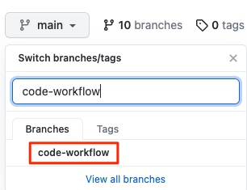
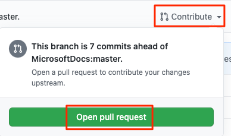
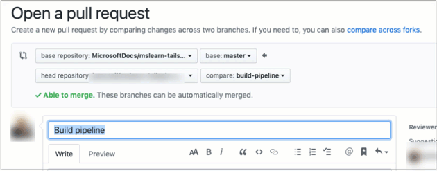
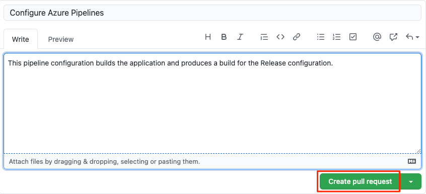
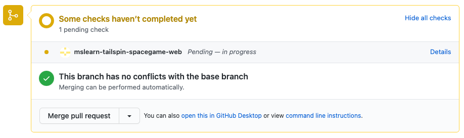
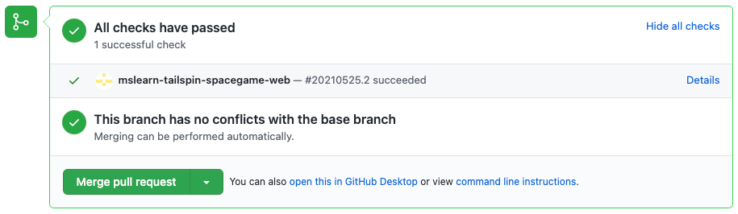

In this unit, you practice the process of submitting a pull request and merging your changes into the `master` branch so that everyone can benefit from your work.

In [Create a build pipeline with Azure Pipelines](/learn/modules/create-a-build-pipeline?azure-portal=true), you created a Git branch named `build-pipeline`, where you defined a basic build pipeline for the _Space Game_ website. Recall that your build definition goes in a file named *azure-pipelines.yml*.

Although your branch produces a build artifact, that work exists only on the `build-pipeline` branch. You need to merge your branch into `master`.

You've already done most of the work. You created the `build-pipeline` branch and verified that your build works. All you need to do now is submit a pull request and merge the change.

Recall that a _pull request_ tells the other developers that you have code ready to review, if necessary, and you want your changes merged into another branch, such as `master`.

Before we start, let's check in with Mara and Andy.

**Andy**: Hi, Mara. I know you've got a build pipeline running on Azure. I'm adding a feature to the website and I want to see the build process for myself. Are we ready to do that?

**Mara**: Absolutely. I created the pipeline on a branch. Why don't we set up a pull request and get it merged into `master` so you can use the pipeline, too?

**Andy**: Sounds great. Let's take a look.

> [!IMPORTANT]
> If you don't have the build pipeline for the _Space Game_ website set up or the `build-pipeline` Git branch, follow the instructions in [Create a build pipeline with Azure Pipelines](/learn/modules/create-a-build-pipeline?azure-portal=true) to get it set up. Then come back here to continue where you left off.

## Push your branch to GitHub

Your GitHub repository likely already has your latest changes to your `build-pipeline` branch, but let's make sure.

1. To ensure that you're on the `build-pipeline` branch, run the following `git checkout` command:

    ```bash
    git checkout build-pipeline
    ```

1. Run `git status` to verify you have no more uncommitted work on your branch:

    ```bash
    git status
    ```

    You see the following output, which indicates that you have no additional work to add to your branch:

    ```output
    On branch build-pipeline
    nothing to commit, working tree clean
    ```

1. To verify that the latest version of your `build-pipeline` branch is on GitHub, run the following `git push` command:

    ```bash
    git push origin build-pipeline
    ```

    You'll likely see that your branch is already synchronized with GitHub:

    ```output
    Everything up-to-date
    ```

## Create a pull request

1. In a browser, sign in to [GitHub](https://www.github.com?azure-portal=true).
1. Go to your **mslearn-tailspin-spacegame-web** repository.
1. In the **Branch** drop-down list, select your `build-pipeline` branch.

    

1. To start your pull request, select **New pull request**.

    

1. Ensure that the **base** specifies your forked repository and not the Microsoft repository.

    

    

    > [!IMPORTANT]
    > This step is important because you can't merge your changes into the Microsoft repository. When you work directly with your own repository, and not a fork, your `master` branch is selected by default.

1. Enter a title and description for your pull request.

    * Title:
    > _Configure Azure Pipelines_
    * Description:
    > _This configuration builds the application and produces builds for both Debug and Release configurations._

1. To complete your pull request, select **Create pull request**.

    This step does not merge any code. It tells others that you have changes that you are proposing be merged into `master`.

    

    The pull request window is displayed. You can see that the build status in Azure Pipelines is configured to appear as part of the pull request. That way, you and others can view the status of the build as it's running.

    

    Just like when you push a branch to GitHub, a pull request, by default, triggers Azure Pipelines to build your application.

1. Optionally, select the **Details** link, and then trace the build as it moves through the pipeline.

    After the build is finished, the **Artifacts** button appears in Azure Pipelines. You can hand off your build to the next step in the process, such as QA. Later, you can configure the pipeline to push your change all the way out to your QA lab or production.

1. Go back to your pull request on GitHub.

    You see that the build succeeded. You're now ready to merge your pull request.

    

1. Select **Merge pull request**, and then select **Confirm merge**.
1. To delete the `build-pipeline` branch from GitHub, select **Delete branch**.

    

    It's completely safe to delete a branch from GitHub after you've merged your pull request. In fact, it's a common practice, because the branch is no longer needed. The changes are merged and you can still find the details about the changes on GitHub or from the command line. Deleting a merged branch also helps others see only the work that's currently active.

    Git branches are meant to be short-lived. After you merge a branch, you don't push additional commits onto it or merge it a second time. In most cases, every time you start on a new feature or bug fix, you start with a clean branch that's based on the `master` branch.

    Deleting a branch on GitHub doesn't delete that branch from your local system. To do that, you would pass the `-d` switch to the `git branch` command.

## How many times is a change built?

The answer depends on how your build configuration is defined. Azure Pipelines enables you to define _triggers_ that specify which events cause builds to happen. You can control which branches get built or even which files trigger the build.

As an example, let's say that you want a build to happen when a change is pushed to GitHub on any Git branch. But you don't want the build to happen when the only changes are to files in your project's *docs* folder. You might include this `trigger` section in your build configuration:

```yml
trigger:
  branches:
    include:
    - '*'     # build all branches
  paths:
    exclude:
    - docs/*  # exclude the docs folder
```

By default, a build is triggered when a change is pushed to any file on any branch.

A _continuous integration_ (CI) build is a build that runs when you push a change to a branch.

A _pull request_ (PR) build is a build that runs when you open a pull request or when you push additional changes to an existing pull request.

The changes you make through the `build-pipeline` branch are built under three conditions:

* A CI build happens when you push changes to the `build-pipeline` branch.
* A PR build happens when you open a pull request on the `build-pipeline` branch against the `master` branch.
* A final CI build happens after the pull request is merged to `master`.

PR builds help you verify that your proposed changes _will_ work correctly after they're merged to `master` or another target branch.

The final CI build verifies that the changes are still good after the PR was merged.

As an optional step, go to Azure Pipelines and watch the final CI build happen on the `master` branch.
