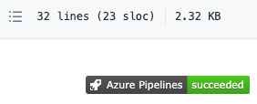
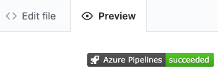
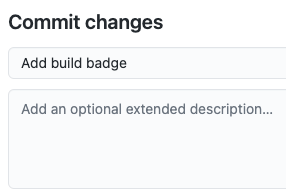

It's important for members of the team to know the status of the build. An easy way to quickly determine the build status is to add a build badge to the *README.md* file on GitHub. Let's check in on the team to see how it's done.

Andy is at his desk sifting through his emails. He's answering the third email that's related to the status of the build for the _Space Game_ website.

**Andy**: There has to be some way to automate a status message. We have the pipeline, so we should be able to put a status somewhere. Maybe Mara knows how we can do it.

Andy finds Mara talking with Amita in the break room.

**Andy**: Hi, Amita. Mind if I borrow Mara for a second?

**Amita**: I have to get to a meeting anyway. Borrow away.

**Mara**: Hi Andy. What's up?

**Andy**: I really like the changes we've made to our build pipeline by using Azure Pipelines and Git is a great version control system. I was wondering, is there a way to let people know the status of the build?

**Mara**: Yes, actually. We can use a build badge.

## What is a build badge?

A _badge_ is part of Azure Pipelines. It has methods you can use to add an SVG image that shows the status of the build on your GitHub repository.

Most GitHub repositories include a file named *README.md*, which is a Markdown file that includes essential details and documentation about your project. GitHub renders this file on your project's home page.

Here's an example build badge:

## Add the build badge

Up until now, you created Git branches locally to make changes to the _Space Game_ project. You can also propose changes directly through GitHub. In this section, you do that to set up your status badge.

1. In Azure DevOps, in the left pane, select **Pipelines**, and then select **Builds**.
1. Select the ellipsis (...), and then select **Status badge**.

    

1. Under **Sample Markdown**, select the **Copy** button to copy the Markdown code to the clipboard.
1. In GitHub, go to your project page.
1. Make sure you're in the `master` branch. In the files area, open the *README.md* file.
1. Select the pencil icon to open the file in the editor.
1. At the top of the page, add a blank line, and then paste the contents of the clipboard.
1. Select the **Preview changes** tab to see your proposed changes.

    GitHub renders the Markdown file and shows you the build badge.

    

## Commit your changes to master

In this section, you commit your changes to the `master` branch on GitHub.

1. Scroll to the bottom of the page and specify a commit message, such as "Add build badge".

    

1. Leave the **Commit directly to the master branch** option selected, and then select **Commit changes** to commit your changes to the `master` branch.

    Your badge is displayed on the *README.md* page.

    

    This process is a more basic way to merge code into GitHub. Instead of committing directly, you could have created a pull request with your changes for others to review.

    In practice, you would switch to the `master` branch and pull the latest changes from GitHub the next time you need to add a feature or address a bug.

**Andy**: Mara, you just made a change directly to `master`. Why didn't you use the flow you taught me? You know, with the feature branches.

**Mara**: We could have done that. But sometimes when people are changing only the Readme file or other documentation files, they commit to `master` right then. Plus, you and I were able to verify the work together before we merged the change.

But this brings up a good point. If we can all just commit to `master` when we want to, we could be letting problems in the code slip into our master branch.

**Andy**: I've been meaning to talk to you about that.

Andy and Mara continue this conversation while walking back to their offices.
