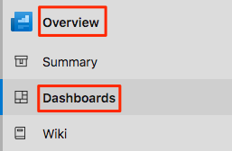
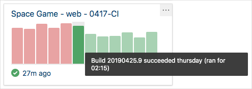

An easy way to track important events in your Azure DevOps project is to create a dashboard. A dashboard enables team members and observers to understand and track build trends at a glance.

In this part, you'll set up a dashboard and add widgets to track your build history.

Andy is putting together a report of the progress the team is making. He's in the middle of searching through all of the build reports and pull requests to try to get the big picture when Mara walks in.

**Mara**: Hi Andy, I have a question on a feature I'm working on. Do you have a minute?

**Andy**: Sure! I could use a break. There has to be an easier way to sum up the builds and see if there are patterns of failure.

**Mara**: Actually, there is! We can set up a dashboard.

**Andy**: So I can have a summary of the information I need in one place? I'm all ears.

## What's the dashboard?

A dashboard is a customizable area in Azure DevOps where you can add widgets and extensions to help you visualize areas of your DevOps solution. For example, you can add a widget to show the history of your builds over time, or give you a burn down of the work in progress, or show you the current pull requests.

## Add a build history widget to the dashboard

1. From Azure DevOps, navigate to **Overview** and then **Dashboards**.

    
1. Click **Add a widget**.
1. From the **Add widget** pane, search for "Build History".
1. Drag the **Build History** tile to the canvas.
1. Click the gear icon to configure the widget.

      * Keep the title **Build History**.
      * From the **Pipeline** drop-down, select your pipeline.
      * Keep **All branches** selected.
1. Click **Save**.
1. Click **Done Editing**.
1. You see the **Build History** widget on the dashboard.

    
1. Hover your mouse over each build to see the build number, when it was done, and the elapsed build time. Each build succeeded, so the bars are all green. But if there was a failed build, that build would appear in red.
1. Click on one of the bars to drill down into that build.

To discover more widgets, click on the **Extension Gallery** link at the bottom of the **Add Widget** pane.
