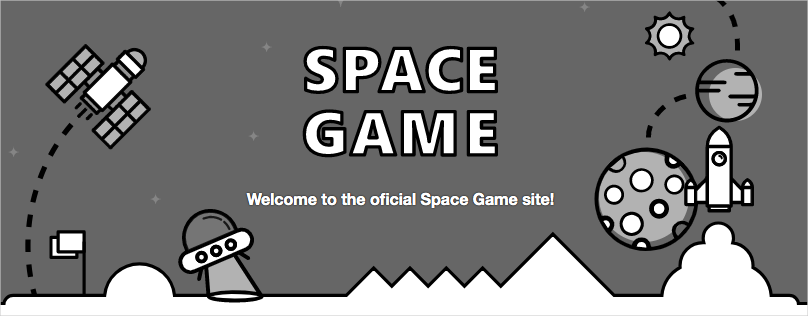
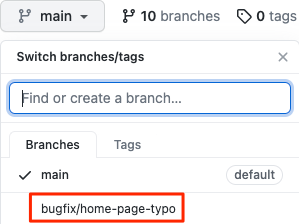
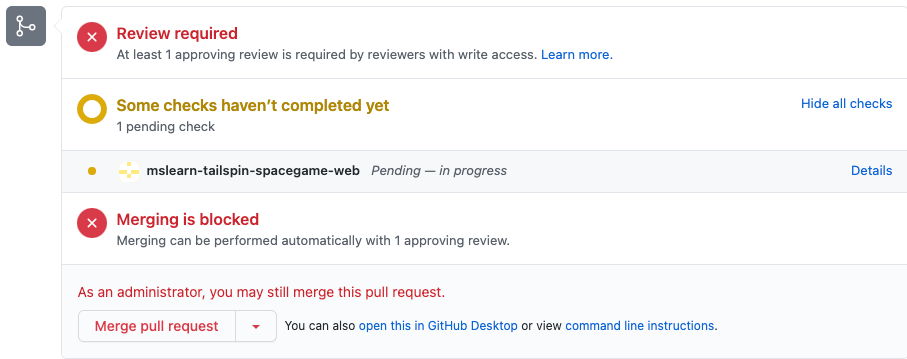

In this unit, you set up a rule on GitHub that requires a reviewer to approve changes before they can be merged into the `master` branch. As a bonus, you'll also fix the typing error on the _Space Game_ website's home page.

Currently, the team allows anyone who makes a pull request to merge the code into the `master` branch. Because no review is required, it's possible for incorrect or unstable code to creep in.

Andy decides that he wants to add a check to the pull request in the form of another pair of eyes. He wants to set up GitHub to require someone other than the pull request author to review the code before it's merged. Let's see how to do this.

Andy heads off to find Mara and spots her at her desk working away, her head bobbing to the music in her earbuds.

**Andy**: Mara, I've been meaning to talk to you about something.

Mara looks up.

**Mara**: What can I help you with?

**Andy**: Several small mistakes are making it through the build. Just today, a typing error showed up on the home page. Amita is spending too much time on these things. We need to stop them before they make it to the `master` branch. We need another pair of eyes on the code before the pull request is approved.

**Mara**: I can set that up. In GitHub, there's a way to make sure that no pull request is merged before someone else reviews and approves it.

## Set up approvals

In this section, you set up a rule on GitHub that requires at least one reviewer to approve a pull request before it can be merged into the `master` branch. You set up the rule and then verify that it works by pushing up a fix to the typing error that Mara made earlier.

### Add the rule

1. In GitHub, go to your _Space Game_ project repository.
1. Select the **Settings** tab near the top of the page.
1. On the menu, select **Branches**.
1. Make sure that **master** is selected as your default branch.
1. Select **Add rule**.
1. Under **Branch name pattern**, enter **master**.
1. Select the **Require pull request reviews before merging** check box.
1. Keep the **Required approving reviews** value at **1**.
1. To create the rule in the `master` branch, select **Create**.
1. Select **Save changes**.

> [!NOTE]
> At the bottom of the list of choices is an option named **Include Administrators**. This option requires repository administrators to follow the rule. You don't set that, because you're an administrator of your repository and there isn't another reviewer. In this unit, for learning purposes, you review and approve your own pull requests.

### Submit the fix

In this section, you submit a fix to the typing error on the home page. Recall that the word "official" is mistyped as "oficial".



1. In Visual Studio Code, go to the terminal.
1. To check out the `master` branch, run `git checkout`:

    ```bash
    git checkout master
    ```
1. To pull down the latest changes to the `master` branch from GitHub, run `git pull`: 

    ```bash
    git pull origin master
    ```

    You can see that two files are updated:

    * **README.md**: Contains the Markdown code for displaying the build badge.
    * **Index.cshtml**: Contains the updated home page text, which includes the typing error.

1. To fix the error, create and check out a branch:

    ```bash
    git checkout -b bugfix/home-page-typo
    ```
1. In File Explorer, open **Index.cshtml**.
1. Locate the error.

    ```html
    <p>Welcome to the oficial Space Game site!</p>
    ```
1. Change the line to correct the error.

    ```html
    <p>Welcome to the official Space Game site!</p>
    ```
1. Save the file.
1. In the terminal, stage and commit the change.

    ```bash
    git status
    git add "Tailspin.SpaceGame.Web/Views/Home/Index.cshtml"
    git commit -m "Fix typing error on the home page"
    ```

    In practice, you would ordinarily build and run the site locally to verify the change. In this unit, for the sake of brevity, let's skip that step.
1. Push the branch to GitHub.
    ```bash
    git push origin bugfix/home-page-typo
    ```

### Test the rule

1. In GitHub, look for the `bugfix/home-page-typo` branch.

    

1. To create a pull request, select **Compare and pull request**.
1. Set your forked repository as the base repository.
1. Select **Create pull request**.

    You can see that a human review is required before you can merge the change.

    

    In practice, you would assign a team member to review your change. In this unit, for learning purposes, you merge your own pull request.

1. To merge the pull request, select **Merge pull request**.
1. Select the **Use your Administrator privileges to merge this pull request** check box, and then select **Confirm merge**.

   Your change is merged.
1. To delete the `bugfix/home-page-typo` branch, select **Delete branch**.

## Revert your master branch to its original state

In future modules, you'll continue working with the Tailspin team and the _Space Game_ website. To limit each module to new concepts only, you'll base your new work on the original `master` branch that came with your fork of the _Space Game_ repository on GitHub.

To ensure that the branches you create later will integrate properly with the `master` branch, reset your GitHub repository's `master` branch to its original state.

> [!WARNING]
> The process you follow here involves temporarily deleting the branch protection rule that you set up earlier, fetching the `master` branch from the Microsoft repository, and then performing a _force push_ of that branch to your repository.
>
> Although we ordinarily don't recommend that you force-push changes, you'll do so here to reset the state of your GitHub repository. In practice, there are safer ways to [revert changes through Git](https://github.blog/2015-06-08-how-to-undo-almost-anything-with-git?azure-portal=true).

To delete the branch protection rule that you set up earlier, do the following:

1. In GitHub, go to your _Space Game_ project repository.
1. Select the **Settings** tab.
1. On the menu, select **Branches**.
1. Under **Branch protection rules**, select the rule named **master** that you set up earlier in this unit.
1. Select **Edit**.
1. Clear the **Require pull request reviews before merging** check box.
1. Select **Save changes**.

   The rule is deleted.

1. In Visual Studio Code, go to the integrated terminal, and then run these commands:

    ```bash
    git checkout master
    git reset --hard upstream/master --
    git push -f origin master
    ```

1. In your GitHub repository, on the **Settings** tab, re-create the branch protection rule that you set up earlier in this unit.
